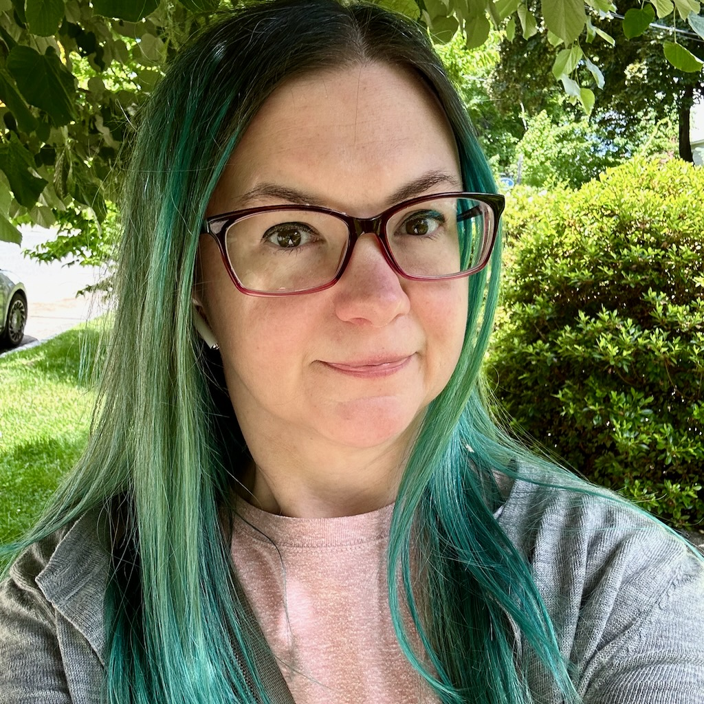

Hi, I&lsquo;m **Aubrey**, a lead front end developer and accessibility advocate living in Massachusetts. I spend my days creating things, whether it be words with pen and paper, CSS and HTML with a code editor, or socks and sweaters with needles and yarn.

I've been making websites professionally since 2006 and personally since 1998, so I've seen a _lot_. ([Remember including standards-compliant CSS on your site with an @import because Netscape 4 didn't support it?](http://www.ericmeyeroncss.com/bonus/trick-hide.html) I certainly do!)

I've been cross-stitching since the early 90s, knitting since 2002, spinning my own yarn since 2007, and collecting fountain pens and ink since 2020. It's rare when I'm _not_ making things. I usually carry my journal and a knitting project with me wherever I go, so I'm never, *ever* bored.

**I love** sushi, tacos, coffee, bright colors, chocolate, craft beer, tea, and fun fountain pen ink. **I’m not a huge fan of** cheese, pasta, and balloons.

## Webrings

<a href="https://webri.ng/webring/cssjoy/previous?via=https://aubreysambor.com/">← Previous Site</a> · <a href="https://cs.sjoy.lol/">CS.Sjoy.lol</a> · <a href="https://webri.ng/webring/cssjoy/next?via=https://aubreysambor.com/">Next Site →</a>

