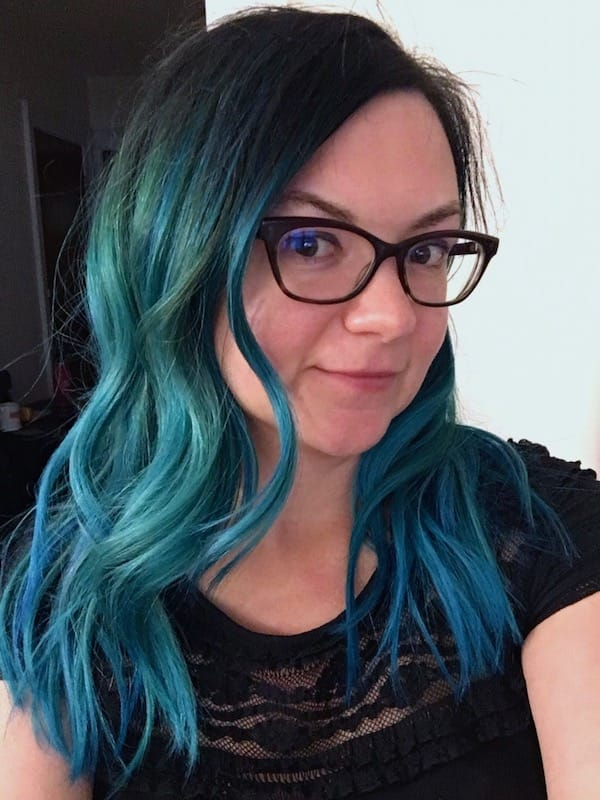

Hi, I&lsquo;m **Aubrey**, a knitter and web developer living in western Massachusetts. I spend my days creating things, whether it be words with pen and paper, CSS and HTML with a code editor, or socks and shawls with needles and yarn.

I've been making websites professionally since 2006 and personally since 1998, so I've seen a _lot_. ([Remember including standards-compliant CSS on your site with an @import because Netscape 4 didn't support it?](http://www.ericmeyeroncss.com/bonus/trick-hide.html) I certainly do!)

I've been cross-stitching since the early 90s, knitting since 2002, spinning my own yarn since 2007, and collecting fountain pens and ink since 2020. It's rare when I'm _not_ making things. I usually carry my journal and a knitting project with me wherever I go, so I'm never, ever bored.

**I love** sushi, tacos, coffee, bright colors, chocolate, IPAs, tea, and fun fountain pen ink. **I’m not a huge fan of** cheese, pasta, and balloons.

## About this site

I registered this domain name in August 2000 as a gift to myself when I finally received my driver&lsquo;s license. Initially I used it to post updates about my now defunct online journal (who remembers _those_ days?), but in December 2000, I started this blog.

As blogging became more popular, I started writing in this blog more than the online journal, and now I&lsquo;ve been writing on here for over 18 years. This blog has been powered by Blogger, Greymatter, b2, Moveable Type, Wordpress, Jekyll, Drupal, and Gatsby, and is currently powered by <a href="https://www.11ty.dev/">Eleventy</a>. Thanks to [Lea Verou](https://twitter.com/LeaVerou/status/1241619866475474946) for the emoji as favicon idea!

## Find me elsewhere
- **Lullabot blog,** [CSS Features We’re Thankful For and CSS Features We Need](https://www.lullabot.com/articles/css-features-were-thankful-and-css-features-we-need)
- **Lullabot podcast,** [Episode 259: Healthy Minds @Lullabot](https://www.lullabot.com/podcasts/lullabot-podcast/healthy-minds-lullabot)
- **Acquia blog,** [The Women of the Drupal Community: starshaped](https://www.acquia.com/blog/women-drupal-community-starshaped)
- **Developing Up podcast,** [Episode 30: Impostor Syndrome](http://www.developingup.com/episodes/30)
- **Death Prattle podcast,** [Episode 72: Getting the call twice](http://deathprattle.libsyn.com/podcast/episode-72-getting-the-call-twice-with-special-guest-aubrey)

## Webrings

This site is a member of <a href="https://cs.sjoy.lol/">CS.Sjoy.lol</a>, a CSS webring! 
<a href="https://webri.ng/webring/cssjoy/previous?via=https://www.star-shaped.org/">Previous Site</a> <a href="https://webri.ng/webring/cssjoy/random?via=https://www.star-shaped.org/">Random Site</a> <a href="https://webri.ng/webring/cssjoy/next?via=https://www.star-shaped.org/">Next Site</a>

Thanks for reading!
