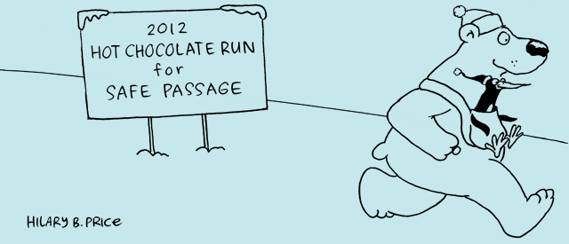
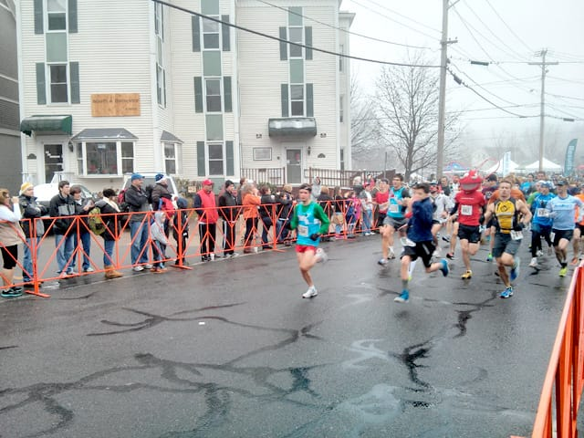
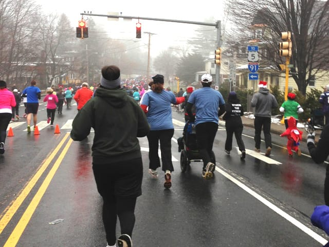
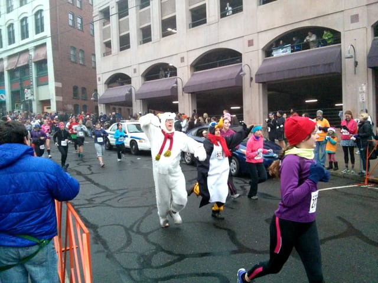
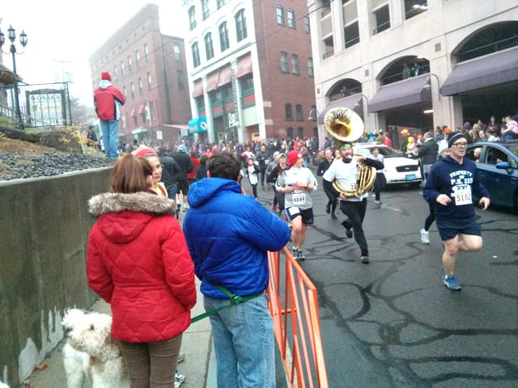
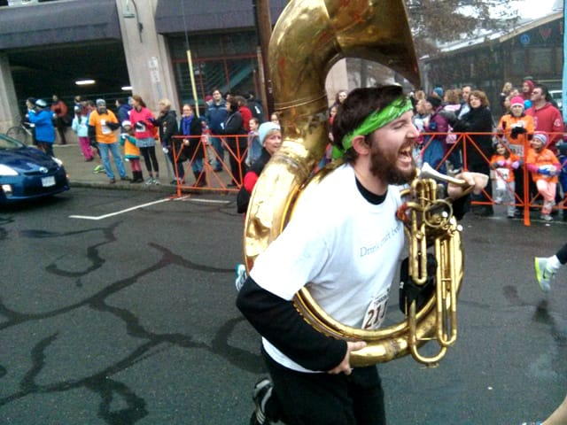
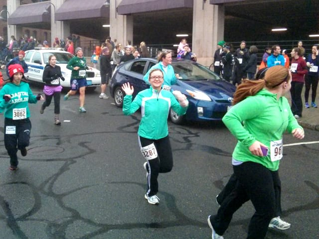

So, I've had a pretty exciting past few days -- I finish NaNoWriMo, then I run a 5k, and not only any 5k, but a 5k with hot chocolate at the end!

This past autumn, my sister told me about the [Hot Chocolate Run for Safe Passage](https://safepass.org/HCR), an annual run in Northampton, Massachusetts, to benefit Safe Passage, an organization addressing domestic violence in the county in which I grew up. The run sounded attractive to me - who doesn't like hot chcoolate? - but I wasn't sure how well I'd be running, especially in December. My sister kept on talking about it, and the more I thought about it, the more I wanted to do it, so last month, I signed up! (To ready myself, I also signed up for a [Turkey Trot](https://www.active.com/5k-race/portsmouth-nh/4th-annual-turkey-trot-5k-2012) here in New Hampshire to practice, and I did pretty well there, too. Surprise, I ran another 5k a week and a half ago!)

I'm going to be honest. I haven't been running as much as I should. After [my 5k in May](/posts/runners-alley-red-hook-5k), I majorly slacked on running multiple times a day. I enjoy running, but I haven't become committed enough to it that I'm doing it on a regular basis. I want this to change, and running more often will be a huge goal of mine in 2013. I'm working on putting my goals / resolutions together, and running will be a major part of them.

However, I still did fine on race day. Ted came to cheer me on, of course, as did my mother, sister, brother in law, and niece! It wasn't too chilly, maybe in the mid to upper 30s, but I felt warm enough in a short sleeved shirt, warm long sleeved shirt, and waterproof jacket. I DO need to buy better pants, as the ones I wore I bought maybe 7 years ago to go to the gym back in the day. I so need a running pants upgrade.

I started waaaaay in the back, around the 11:45 minute mile pace cards. I hope one day I can line up closer to the start! I couldn't really hear the race begin from where I stood, but my family stood right at the start / finish and took great pictures.

Ted took the above picture of the start. The guy in the red with the insect looking helmet (someone tells me this guy's dressed up like Deadmaus - yeah, I'm officially old...) came in second place!

I finally got to the start four minutes after the race began. Then, I ran! I was amazed at all the people lining the streets. I hit a huge hill right at the start but it wasn't an issue. At the top of the hill a high school band played, cheering us on! the amount of people floored me. 5,500 people raced that day, far more than in either of the other races I ran.

I ran and ran and ran, and hit mile 1 without having to stop to walk! I've been able to run the entire first mile in every race I've participated in, but can't ever do it when I'm training on my own. I conk out after four minutes. Must be adrenaline.

The stretch between mile 1 and mile 2 felt the longest, but I still pressed onward. I didn't stop to walk for long at all, maybe about 30-45 seconds, and started booking it again. We were running through a residential neighborhood and a house played the Rocky theme song to pump us up. It worked, and I kept on going!

Mile 2 brought us through Smith College and a few big hills! I ran them for the most part, only stopping to walk for about 15 seconds each time. A few people around me started telling others around them that "after the hills, it's all downhill from here", which made me giggle. Running's the only time when saying things are all downhill from here is a *good* thing!

My family saw so many people wearing cool costumes while watching people finish. They saw this couple wearing full on polar bear and penguin suits! They must have been so hot!

They also spotted this guy running with a tuba around him. I can't even imagine. Looks like he was actually playing it, too, which is even more impressive. (And yes, all these people finished before me...)

He was having so much fun!

Sure enough, the last part of the course was ALL downhill. I loved it. As we drew closer to the end, more people lined the streets and music played! Feeling confident and happy, I picked up my pace a little bit as I rounded the corner to the finish.

I saw my family waiting for me right before I crossed the finish line, so I smiled and waved to them before I booked it to the end! In previous races I haven't felt so hot when I got to the end, but I felt GREAT this day. I crossed the finish line with a huge smile on my face. Crossing the finish line's the best. feeling. ever.

I made my way through the massive crowds to get my hot chocolate. Once I procured the sweet, delicious liquid, I made my way back to my family. I checked the race results while I finished my hot chocolate, and I did about as well as I had done in my two previous 5ks: I finished in **35:35** with a pace of **11:28**. I've finished all three of the 5ks I've run in about 35 minutes, so I'm really hoping to improve on that time once I start running more often. Still, I'm proud of myself for still doing a decent job, even without really training much.

I loved this race and hope to go out to western MA next year and do it again!
