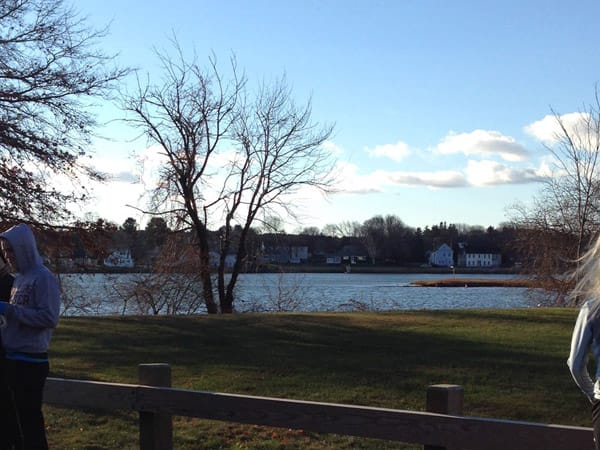
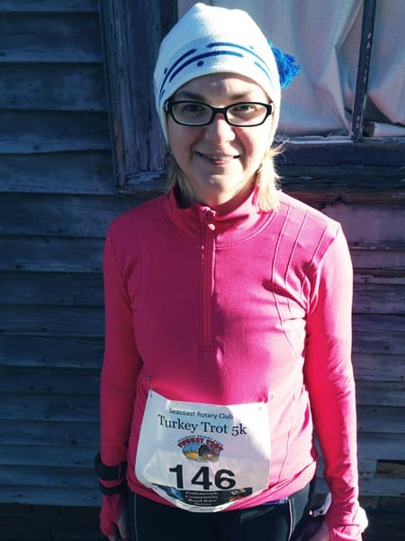

Last year, I started a new Thanksgiving tradition - running a Turkey Trot on Thanksgiving morning! I ran it proudly and felt so happy that I got up and ran in freezing cold temperatures. So, this Thanksgiving, I ran it again. I loved the feeling of running first thing in the morning so I could spend the rest of the day relaxing and preparing for Thanksgiving dinner.

I woke up a little later than I wanted and immediately ate my typical pre-race breakfast of oatmeal with mixed berries and chocolate chips. I downed lots of water to make up for the beer I drank the previous evening. Yeah, like *that's* going to help. I put on my running clothes - three layers of shirts, two socks on each foot, and my hat and mittens - and walked my way to the start. Yep, it was *cold*.

After picking up my bib, I walked to the start line. About **2500** people ran this race, big enough for the organizers to provide pace signs for people to line up with. I lined up with the 9:00 - 10:00 minute mile sign, thinking about how much faster I am now than I was last year when I ran this race. I kept myself warm and listened to the conversations around me, mainly about the frigid temperatures and how they earned their dinners after running this race!

Immediately I knew this wouldn't be my race when I was stuck behind large crowds of people clearly not running 9:00 - 10:00 minute miles. I spent the first half mile hovering at about an 11:00 mile pace only because I couldn't get around the people in front of me. I just wanted to have fun, so I didn't mind much.

Around **mile 2** I started feeling really, really bad. My chest ached and I almost felt sick. I had finished **mile 1** in about 10:20, which isn't my fastest mile by a long shot, but picking up the pace for mile 2 felt absolutely horrible. I tried thinking about happy, good things, but my mind kept on going back to "Holy crap. I just want this to be over. This sucks." Yeah. This *really* wasn't my race. I finished mile 2 in about 10:00.

**Mile 3** felt much better, though not 100% better. I was able to keep it together much easier the last part of the race, and I picked up my pace. I finished mile 3 in about 9:50. I felt so happy to round the corner to the finish!

As I crossed the finish I looked at my watch - **31:17**. Not my best, but *certainly* not my worst. Others didn't have such a great race either, judging by the vomit I observed right after the finish line. I don't think I've ever seen so much vomit after a race!

Even though my race didn't go as hoped, I'm not too upset over it. I'm happy that I once again woke up at the crack of dawn to run a race at 8:30am in November, and I'm happy I finished with a decent time. And, well, I PRed *just* 5 days prior to this race, so I wasn't looking to beat my time again. I **am** looking to run sub 30-minute 5ks more consistently, but that will come with time. Right now, I'm happy with how my race went and look forward to getting faster in the future!

(And, next time, I'm *not* going to drink beer the night before a race. Hello, dehydration!)

