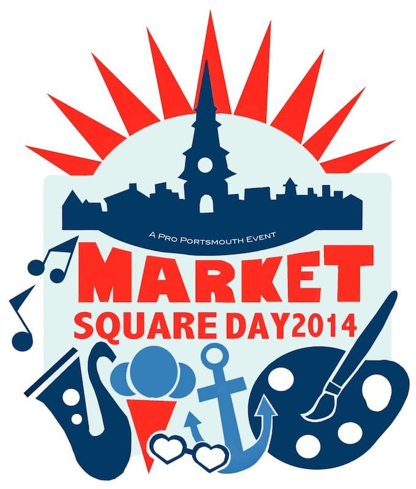
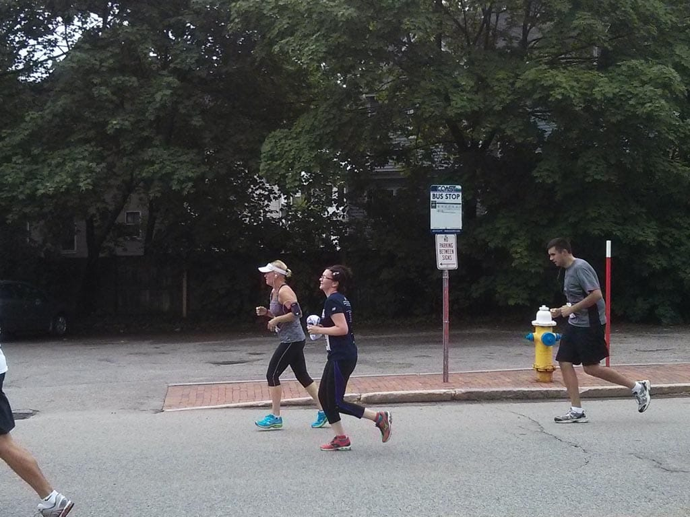
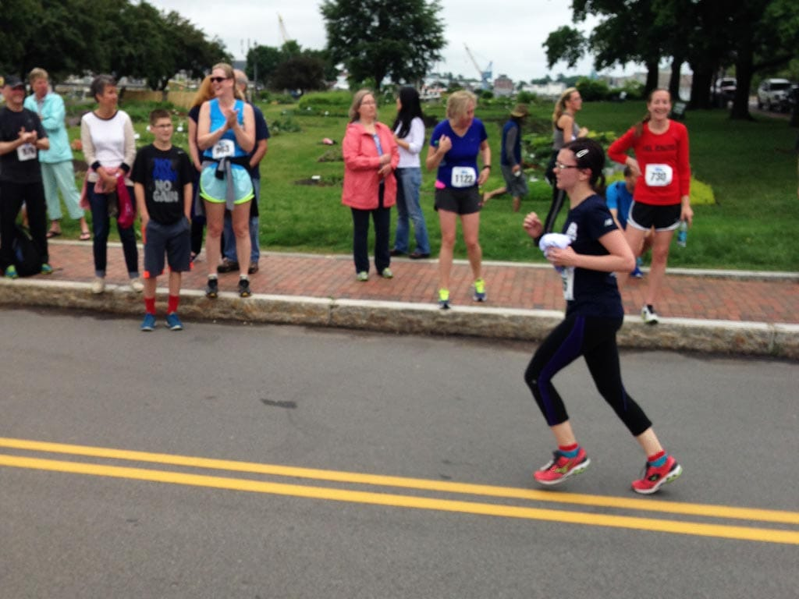

I hadn't yet experienced a terrible race until this past Saturday's [Market Square Day 10k](https://www.proportsmouth.org/MSDRoadRace.cfm).

I blame my sub-par run on my lack of training. Since my [half marathon](/posts/providence-half-marathon-race-recap) a month ago, I've been taking a little break from running. I know I'll get back into it, but my lack of running hurt my chances of running a sub-hour 10k this weekend. Still, I'm not too concerned.

I woke up at 7, ate my oatmeal, and walked to the start around 8:20. I picked up my bib and my free shirt, which I wasn't expecting this year because they had run out of my size last year! So, I had to run with a shirt in my hand the entire race, which, yeah, isn't ideal. I used the port-a-potty, found my friends, and warmed up for the race. Soon, it was time to line up, and we were off!

Right away I knew this wouldn't be my race. I thanked my lucky stars that the sun wasn't out, but temps were in the 60s and a little on the humid side, which causes disaster for me. I ran the first two miles at around 9:30 minutes each, and then... I had to stop to walk.

I know, stopping to walk isn't the end of the world, but when I ran this race last year, I ran the entire time. I was crushed I had to stop to walk, but really, I hadn't been training. My breathing was a mess and I felt like crap, so walking was the best decision. I rode the run-walk train the rest of the race.

After what felt like *forever*, I crossed the finish line at **1:07:00**, not very happy with my race performance. I **know** I can do better with training, and that's what kept me going. Plus, I enjoyed the course and really enjoyed the support, with houses along the route playing "Eye of the Tiger" and the Star Wars theme. All the cheering for the runners also perked me up at times during the race!

This race was my last race before our move to Portland, which makes me a little sad. I'll be sad to miss the [Seacoast Half Marathon](https://www.seacoasthalfmarathon.com) in November, but I know PDX will offer many races this fall. I'm hoping to get back into running the last few weeks we have here, and as soon as we move to the great northwest. I'm confident I will get a sub hour 10k, but I need to put forth the effort. **Running has taught me that the more you practice, the better you get.** I'm still improving.
