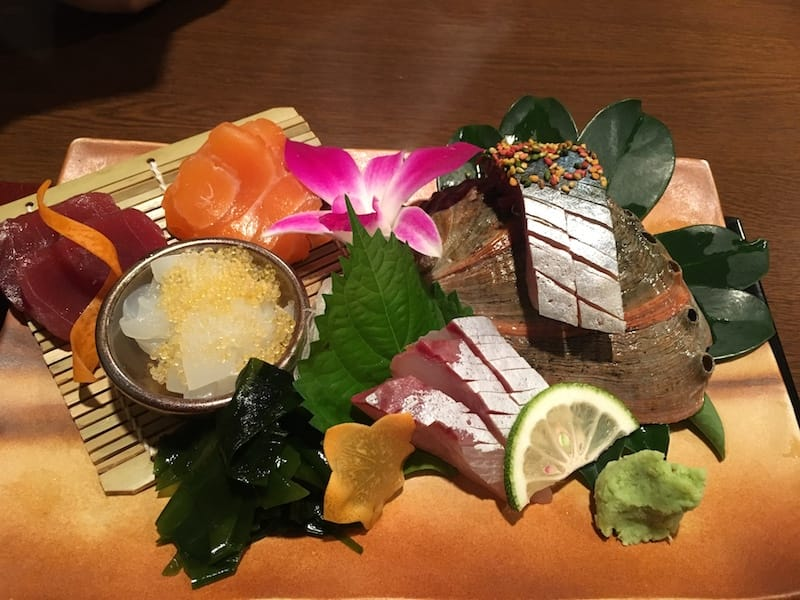

Last year, I started compiling a list of [good things that happened throughout the year](/posts/2017-good-things-list). I enjoyed coming up with good things last year, so I'm doing it again for 2018. Here are some good things from the year:

* I traveled a bunch -- Portland, Oregon for the [Pacific Northwest Drupal Summit](https://pnwdrupalsummit.org/); Fort Lauderdale for work; New Orleans for [VueConf](http://vueconf.us/); and Japan (!!!), a trip high on my bucket list. 
* Naturally, the Japan trip gets its own bullet point! We spent nearly three weeks riding the bullet train across the southern part of the country, journeying to Fukuoka, Beppu, Osaka, Himeji, Kobe, Kyoto, Nara, Kanazawa, and Tokyo. We walked a lot and toured a ton of castles and gardens, and I of course ate some delicious food. 
* My relationship with [Adam](https://phenaproxima.net) still rocks. It's been the easiest and hardest relationship I've ever experienced, but we have more fun times than not. We learned many things from each other, and I hope our relationship continues to grow in 2019.
* I got into electronic music, mainly progressive trance of the Anjunabeats / Anjunadeep variety. I'm happy to be exploring a new to me genre of music and I'm glad to be excited about music again.
* Speaking of music, I saw Smashing Pumpkins in concert, a show I've waited 20+ years to see. Billy, Jimmy, and James reunited to play a set consisting only of their pre-2000 hits, and damn, I was so psyched.
* I also got to see Weird Al, Gabriel &amp; Dresden, Opiuo, and Black Rebel Motorcycle Club (my 5th time seeing them!) in 2018.
* We saw _Hamilton_ in Boston, and while I'm not a fan of musicals, I loved this one. It was phenomenal.
* I bought a bicycle and started riding it on various bike paths in eastern Massachusetts. I did a little bit of riding on the road, too, but I'm still getting used to it.
* I played Dungeons and Dragons for the first time in 16 years. I'm playing a wood elf druid, which should surprise no one who played WoW or EQII with me back in the day. I love me a druid!
* I started learning React and discovered [Wes Bos'](https://wesbos.com) fantastic JavaScript courses. His ES6 course helped me FINALLY understand the newest JavaScript concepts and his React for Beginners course taught me the basics of React. 
* I moved my blog to [Gatsby](https://gatsbyjs.org) because static site generators are the _best_.
* I knit a sweater that actually fits me.
* I read a _lot_ of books. I'm glad to be reading again.

