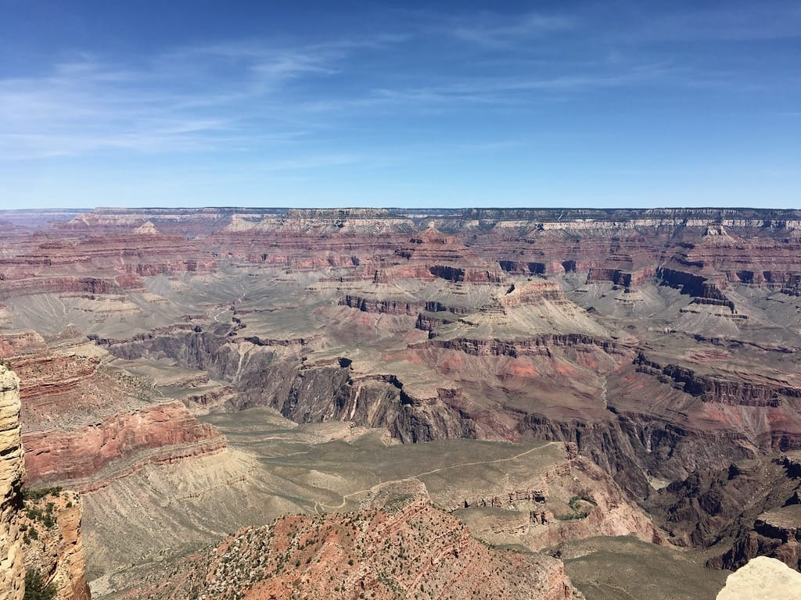

2019, for lack of a better term, *sucked*. It was a hard year full of loss and grief, plus I dealt with my anxiety a lot and that certainly wasn't easy. I spent some of this year in tears, feeling down about myself and the world in general, but I'm trying to stay positive. I'm trying to remember the good things that *did* happen this year, and a lot of good things *did* occur. Here are some of those things!

* I was fortunate enough to go on a few great trips -- Canada to visit Adam's parents, Seattle for [DrupalCon](https://events.drupal.org/seattle2019), a train trip to the Grand Canyon and Zion national parks, Oklahoma for work (my first time in that state!), Philadelphia with my friends, and a road trip to Prince Edward Island. 
* [Just like in 2018](/posts/2018-good-things-list), my relationship with [Adam](https://phenaproxima.net) continued to grow. We learned a lot about each other this year and we continue to teach each other new things. We also challenge each other, which I find incredibly important in a relationship! I hope our relationship continues to grow in 2020.
* On a related note, Adam and I signed a lease to an apartment in 2019! I won't be moving into the apartment until later in 2020 when my lease is up at my current place, but I'm excited to live together.
* For the first time since the late 90s, I lived in the same dwelling for over two years. I have moved SO MANY TIMES as an adult so it was great to stay in the same place for awhile!
* I started working at [Lullabot](https://lullabot.com), a company I respect greatly. I'm so excited to be working at a company I've wanted to work at for a long time, and I'm happy to be working remotely again!
* I spoke at two conferences this year -- [Design 4 Drupal Boston](https://design4drupal.org) and [New England Drupal Camp](https://nedcamp.org) -- giving my talk ["Putting the 'C' Back in CSS: Modern Techniques for Today's Website"](https://nedcamp.org/sessions/2019/putting-c-back-css-modern-techniques-todays-website). I got a lot of great feedback on both talks, and I'm glad to be doing it again after almost 10 years!
* I started volunteering my time at Drupal events, both local and national. I'm on the program committee to select sessions for [DrupalCon Minneapolis](https://events.drupal.org/minneapolis2020), and I'm the Design and User Experience track chair, as well as part of the website team, for the 2020 [New England Regional Developer (NERD) Summit](https://nerdsummit.org). I'm glad to be contributing to both of these conferences, helping a community I love so much!
* We saw a bunch of awesome shows this year -- Bombino, Weird Al (for the second year in a row!), Jody Wisternoff, Caravan Palace, The New Pornographers, and Opiuo (again, for the second year in a row). They were all super fun!
* For the first time in 5 and a half years, I ran a race! I ran a Turkey Trot 5k on Thanksgiving morning. It was my slowest ever 5k but I'm so, so happy I got back out there. One of my 2020 goals is to start running again, so this was a good way to start.
* I knit a bunch of things this year, including 5 pairs of socks for Adam. I love that [he wears everything I knit for him](/posts/adams-awesome-blue-socks), AND that he buys the yarn for the socks I knit for him! He's a keeper.
