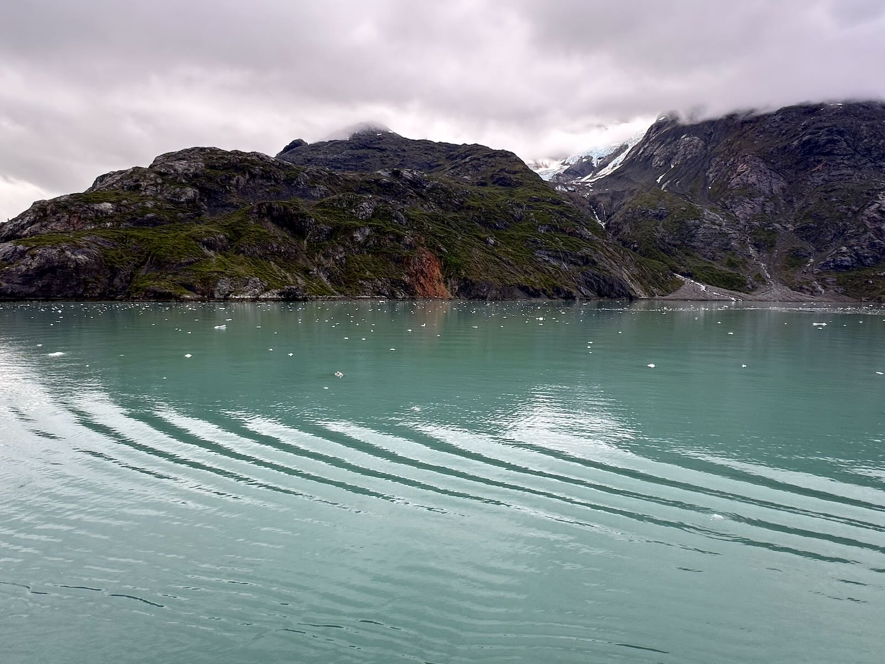

2024 was a year full of ups and downs for me. I traveled a lot, spoke at some conferences, and made a bunch of things. I also dealt with the worst bout of mental health issues I’ve ever had in my life, and that made the last part of the year really, really hard. I already gave an update on the first part of the year [in my last blog post](/back-to-blogging), but here's an overview of the good and not so good things that happened in the second half.

## The good
* **I went on an Alaskan cruise with my family!** I spent a lot of time relaxing, exploring the places we stopped (Juneau, Ketchikan, and Skagway), and getting off the ship for an hour in Victoria, British Columbia to grab a beer and say that I left the country in 2024. The highlight of the cruise for me was our day cruising through Glacier Bay National Park, sitting on the deck under blankets sipping hot chocolate as we passed so many impressive glaciers. 
* As I mentioned in my last blog post, **I spoke at 4 different conferences last year**—[Florida Drupal Camp](https://fldrupal.camp/) in February, [NERD Summit](https://nerdsummit.org/) in March, [Drupal Camp Asheville](https://www.drupalasheville.com/) in July, and [New England Drupal Camp](https://nedcamp.org) in November. I loved giving my talk *"Color in CSS: using new spaces, functions, and techniques to make your site shine"* in 2024 and I’m excited for my new talk *“What a front of the front end developer brings to your team”* that I’ll be giving at Florida Drupal Camp next month!
* **I continued traveling**—I went to Alaska (as mentioned above); NYC with my sister to attend a book signing and see the author speak; upstate New York for Rhinebeck; Providence for New England Drupal Camp; and North Carolina to spend the holidays with my brother.
* **I worked on 3 different projects at work** in 2024, each teaching me new things. After working on the same project for 2 and a half years, working with 3 different teams in a year was a change for sure!
* **I saw a few musicals in 2024**—*Hadestown* in NYC, *Wicked* in Hartford, and *Six* (my second time seeing it) in Hartford. I never thought I’d like musicals, but here I am!
* I also **attended one concert**, *New Kids on the Block*, and **saw one movie**, *Wicked* (hey, I had to after seeing the musical for the first time earlier in the year!) Looks like I’m keeping up my trend of one concert and one movie a year!
## The not so good
* As mentioned above, **I moved across the state to a town north of Boston**. About a month into the move, I realized this area is Not For Me. I live in an area with the not-so-great combination of lots of traffic and no walkability, which turns out to be a combination that I do not like! I’m figuring out ways to make this better but it’s taken a considerable amount of effort to stay positive about this area while I still live here. Still, I know it will work out.
* **My mental health took a turn in the fall of 2024** and while it’s much better now, I had a rough couple months. I’m grateful for the people in my life who helped me through a difficult time, but it wasn’t fun. 
* **I didn’t blog nearly as much in 2024** as I did in 2023, but I’m hoping to get back to it in 2025. I love blogging and I miss it, so I’ll be making it a priority in the new year.
* Of course, I have to mention **the election**. Awful. Just… awful. I’m not looking forward to 4 more years of that man being our president and I’m still so crushed that Harris lost. The worst.

## Wrapping up
As always, 2024 had its share of highs and lows. I experienced a lot of fantastic things in 2024, and I also dealt with some difficult things. All in all, not a horrible year and I look forward to what 2025 brings.
