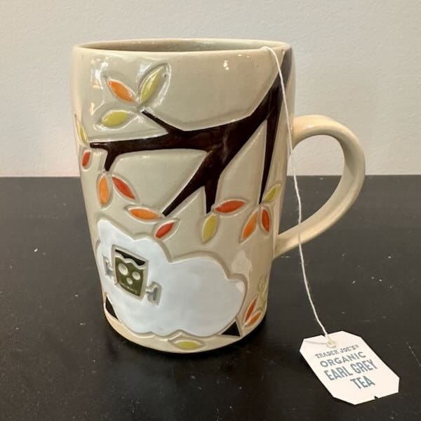

Today, B wrote a post called ["Trying to Blog More Often"](https://binarydigit.city/trying-to-blog-more-often/) and I really, really identified with it. I haven't been writing because I feel like I need to have a 'topic' like B says, but I'm trying to write little things that come to mind as well, like the [posts I wrote](/weekend-break-from-social-media/) [last weekend](/writing-about-non-tech-things/). 

Casual blogging sounds pretty appealing to me right now because it's how I live my life--I knit, write in my journal, update my planner every week, run and do yoga, treat myself every so often to food at restaurants--and that's what I want to capture on this blog. And maybe, just maybe, I *will* write a tech thing or two, like how I switched my blog to use [Vento](https://vento.js.org) instead of Nunjucks for my 11ty templating system. Anything goes!

I'll leave you now with a photo of one of my favorite mugs, a Frankensheep mug from [Jennie the Potter](https://www.jenniethepotter.com) that a friend picked up for me at [Rhinebeck](https://sheepandwool.com) a few years ago. I use it only in the fall and usually when October hits, because October's when it finally starts feeling like fall here in New England.

