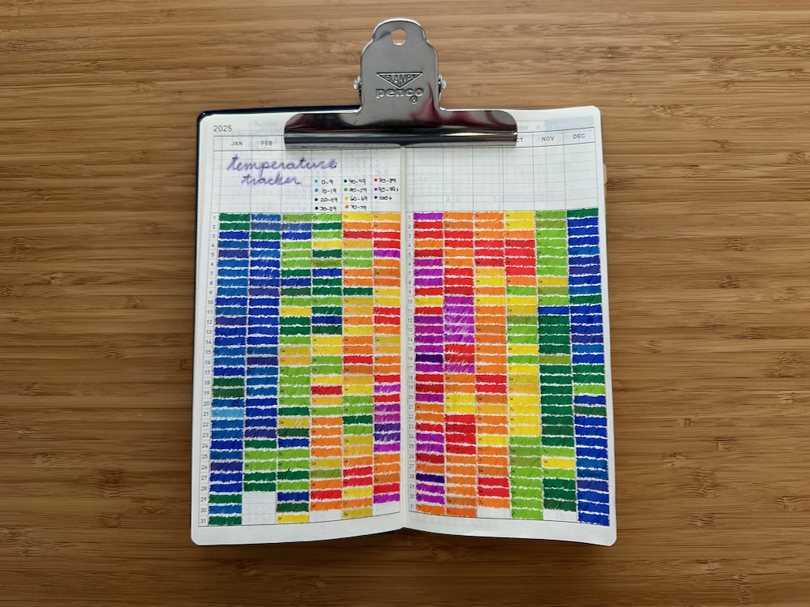

**December 29 - January 4**

I'm going to try to keep week notes again so that I write something every week, at least. I'm not sure what they'll look like this time around, but I want to stick with writing these every week so I can start being more consistent with blogging. Here we go!

---

**I spent New Year's Eve...** knitting, [watching a documentary on the Dust Bowl](https://www.pbs.org/kenburns/the-dust-bowl/), and going to bed at 10:30. I know how to party. But wait, I also cleaned and filled some fountain pens! I've never been a huge New Year's person, clearly.

After a good New Year's Day run on the treadmill, **I sat down and filled out my [YearCompass](https://yearcompass.com) for 2025/2026**. I reflected on a difficult year but also remembered the good times I experienced in one of the hardest years of my life. I then wrote about what I wanted 2026 to look like and how I wanted to grow and heal.

**I started my 2026 Hobonichi Weeks in full force this week!** I always love the feeling of starting a new planner in the new year. I've been using a Hobonichi Weeks as my planner since 2023 and I track everything in there, from how much I journal to the daily temperature. It's a fun hobby and a good excuse to use my fountain pens, stickers, and washi tape.

**I ran on the treadmill 3 times this week and did yoga twice.** Winter's in full force here in Massachusetts, so outdoor running won't be a thing that happens again for another couple months. I miss it, but I'm so happy that my apartment complex has a fitness center with treadmills I can use when the weather is bad.

---

## Media this week

**Watching:** I finished _The Amazing Race_ season 6 (not my favorite) and started _The Amazing Race_ Season 7 (LOVE this season so far!). It's fascinating seeing people calling airlines and booking tickets on the phone, which I must have done at some point back before the ability to book tickets online. I can't remember now.

**Reading:** I'm almost finished with [_Between Two Kingdoms_ by Suleika Jaouad](https://app.thestorygraph.com/books/99ad3359-3fd3-48b9-b12f-aca99ee9e9f6). It's been an interesting book, both hard to read at times and hopeful in others.

**Listening:** Hey, I started listening to music again! I'm listening to the [BIRP! December 2025 playlist](https://www.birp.fm/playlist/2025/december-2025) nonstop in my car and at home. It's been nice to listen to new music again.

---

That's about it for this week! In the future, I'm hoping to post links I find interesting at the end of every entry, but since I'm posting this week's notes so late, I'll start it next week. Hope everyone has a good week!
