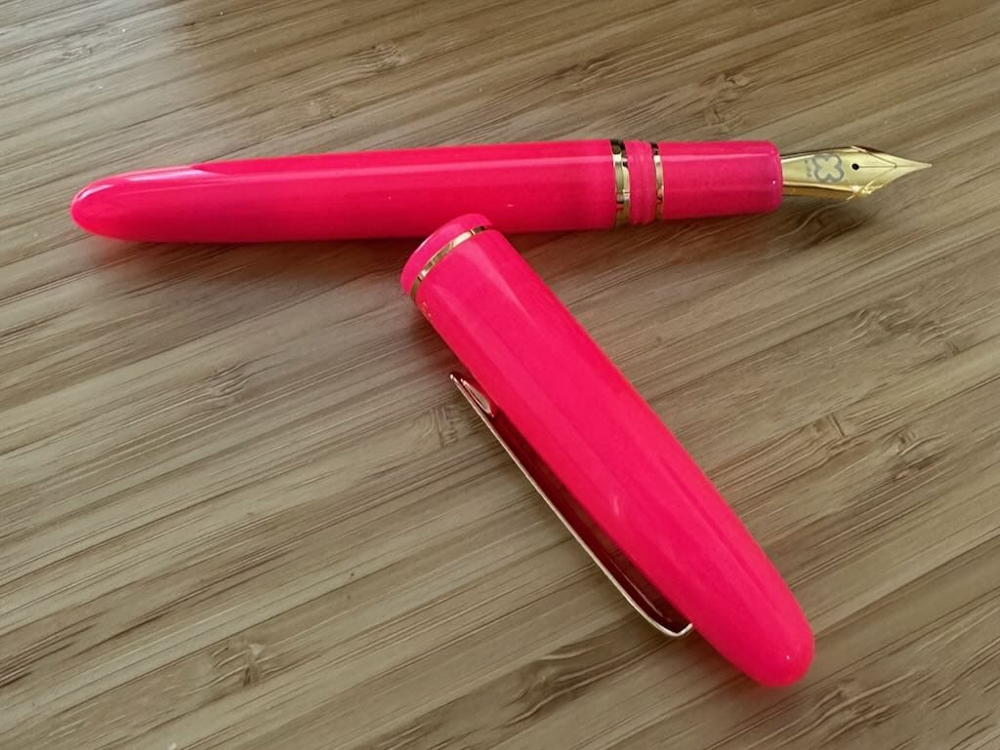

**March 30 - April 5**

Well, so much for writing more in 2026! I haven't written since January and here it is, the beginning of April and I'm sitting down to write more week notes. I need to start *somewhere* again, at least.

***

**Last week I went to Chicago for a conference**, but my favorite part of the trip was going to [Atlas Stationers](https://www.atlasstationers.com) and treating myself to an [Esterbrook Funky Town hot pink, glow in the dark pen](https://www.esterbrookpens.com/products/funky-town-estie?variant=47785262022906)! When I got home I immediately inked it with [Sailor Ink Studio 431](https://www.gouletpens.com/products/sailor-ink-studio-431-20ml-bottled-ink), my favorite hot pink, and I've been using this pen nonstop.

**Got back to my exercise routine this week** after traveling last week, running three times, yoga-ing twice, and taking an outdoor walk twice. It's been cold and rainy here in Massachusetts this spring, so getting outside has been hard. I'm hoping for more outdoor time (and seeing the sun!) this coming week.

**I finally did my taxes!** I put them off because they were a bit more complicated this year due to the layoff last year, but I got them done. This is the latest I've done them in recent years--usually I do them in March but this year I wasn't looking forward to it. They're done and hopefully next year's won't be as complex!

**I got my hair touched up this past Saturday** (I do love my blue and purple hair!) and after my appointment, I got lunch with a friend. It was great to catch up and we talked about motivation and getting things done, and she told me about [Finch](https://finchcare.com), which I remember hearing about at some point last year. I'm looking for a way to not mindlessly check social media during the 'workday' and this app seems like a fun and cute way to do it! If any of you use Finch, let me know and I'll add you as a friend!

**It's been a few weeks since I've knit** because I hurt my left thumb. This is the longest I've not knit in at least 20 years, if not longer, so it's been *weird*. I've been spinning instead, mainly because I use my right hand for most of the spinning work and my left hand just holds the fiber, so I'm able to do something at night while watching TV or listening to podcasts. Still, I can't wait to knit again and I'll give it a try during next week's knit night.

*** 

That's it for this week, hopefully I can keep up with this or at least, you know, blog more often. Fingers crossed!
