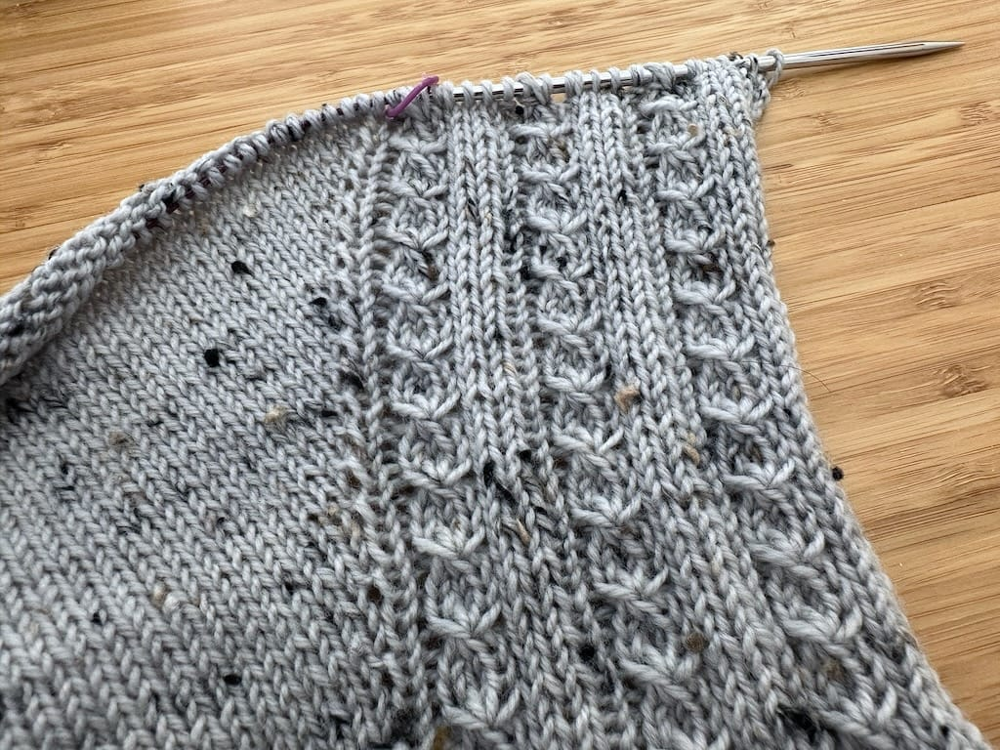
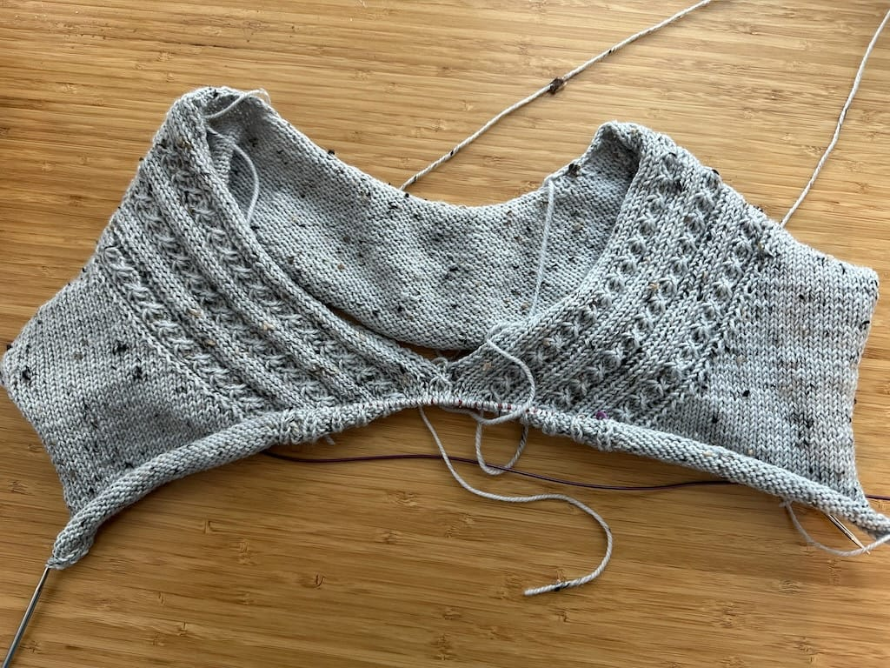

*Welcome to my first Work in Progress (WIP) Wednesday, where I post progress on my crafty endeavors! I want to get back to tracking my knitting, spinning, cross-stitch, or whatever I'm making at the moment, so I'll be writing about it every Wednesday.*

***

Hey, I'm actually writing about my knitting! I haven't posted about anything I've made in years, mainly because I forget to take pictures of my progress and before I know it, I finish the sweater. Oops. This time, I remembered to snap some pictures of my sweater in progress, so hopefully I'll keep up with it as I knit.

As I mentioned a few days ago, I'm knitting the [Lillesol Sweater](https://www.ravelry.com/patterns/library/lillesol) by Isabell Kraemer. I've knit a few of her sweater patterns before and they are my favorite patterns to both knit and wear, so I'm happy to knit yet another pattern of hers.

For the yarn, I'm using [Sea Change Fibers](https://www.seachangefibers.com/) Fjord Tweed Fingering in the Driftwood colorway. Sarah, the dyer behind Sea Change Fibers, uses the best non-superwash yarn in fantastic colors, so I always love knitting with her yarn. (She also just opened a yarn shop in the Portland, OR area if you want to shop in person!)

This sweater is knit in pieces and then joined together by picking up stitches. This is the top right part of the sweater, and the cool stitches are where the neckline is. It's hard to envision it with just this picture, but after a day or so, I made decent progress.

I'm just about to the point where I'll be knitting the body, which will just be around and around until I get to the bottom. I'll then pick up stitches for the sleeves (knitting sleeves always takes longer than I think!) and then, finally, pick up and knit the neckline. 

I'm excited to actually document knitting something in progress, something I haven't done in over 10 years. I haven't even posted about knitting in 10 years, so I'm glad to be back to it!
