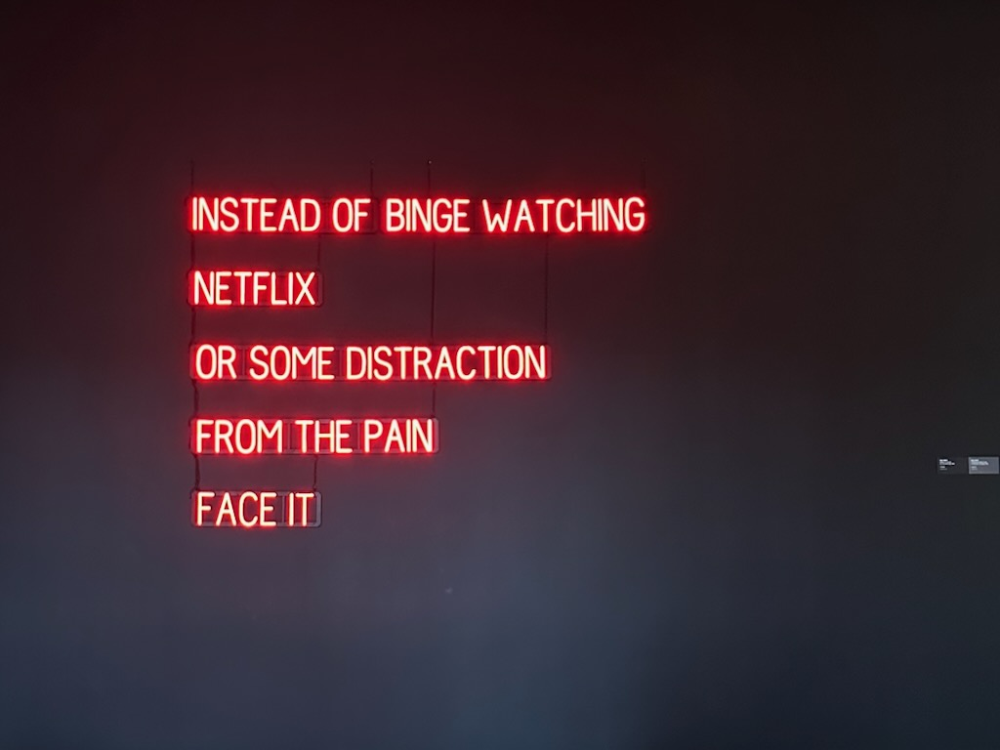
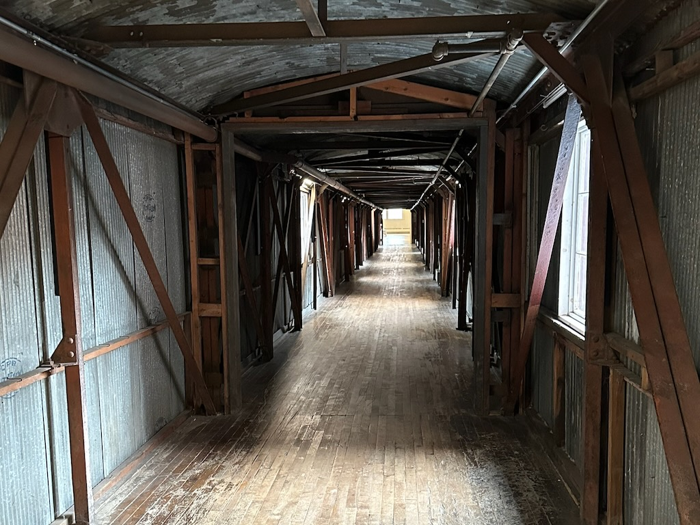
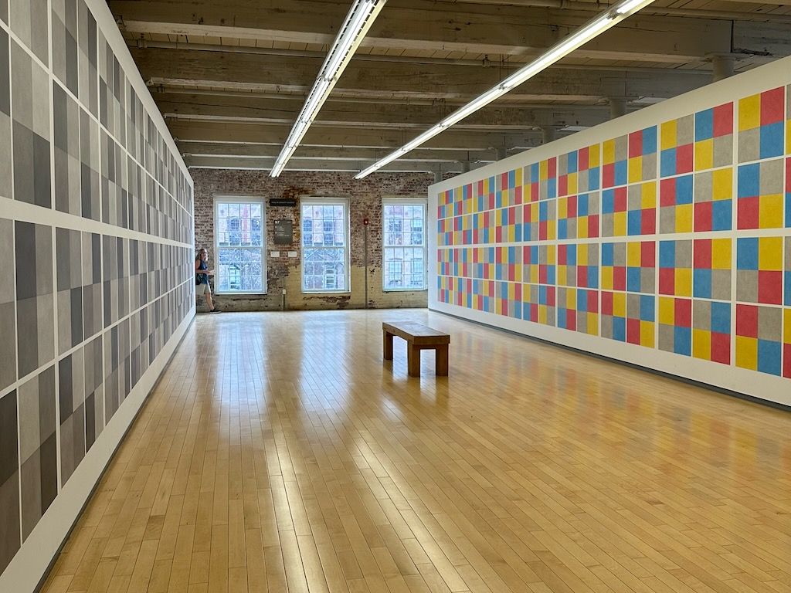
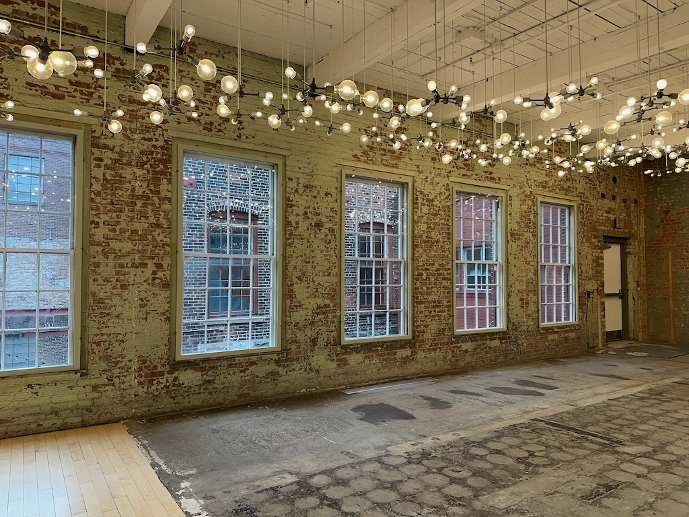
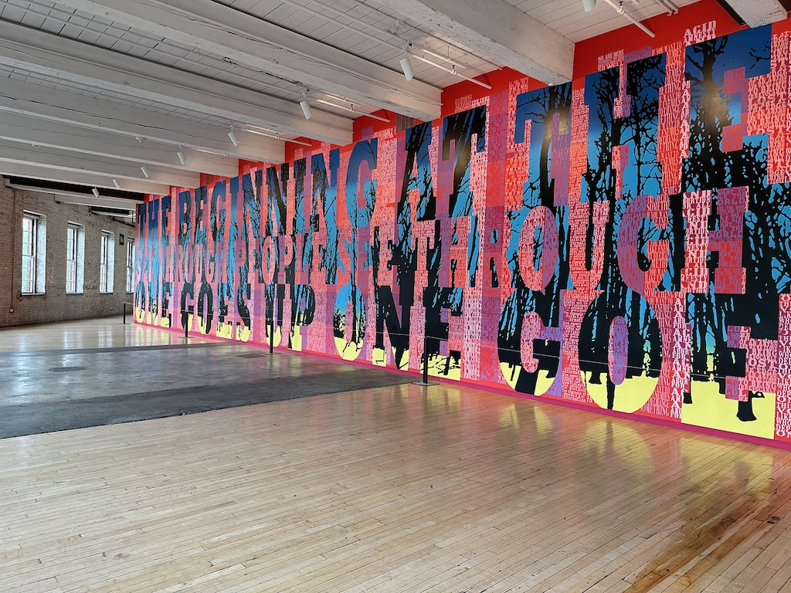

A couple weekends ago I spent the morning / early afternoon with a couple friends at [Mass MoCA](https://massmoca.org), a contemporary art museum in extreme western Massachusetts. I took a few photos of art I enjoyed.

I'm trying to take more pictures of my day to day life as I've gotten out of practice with just taking out my phone and snapping what I see. I feel self conscious taking pictures when I'm out in public even though it's not strange for people to be taking pictures while out and about. I don't know what my particular hangup is in regards to photos--maybe I think my photos aren't good? Maybe I feel like I'm being pretentious when I try to take a 'good' picture? I don't know.

Either way I'm hoping to post more pictures I take in the future, so this is a good start.

All in all it was a fun time and I hope to go back sometime soon!

