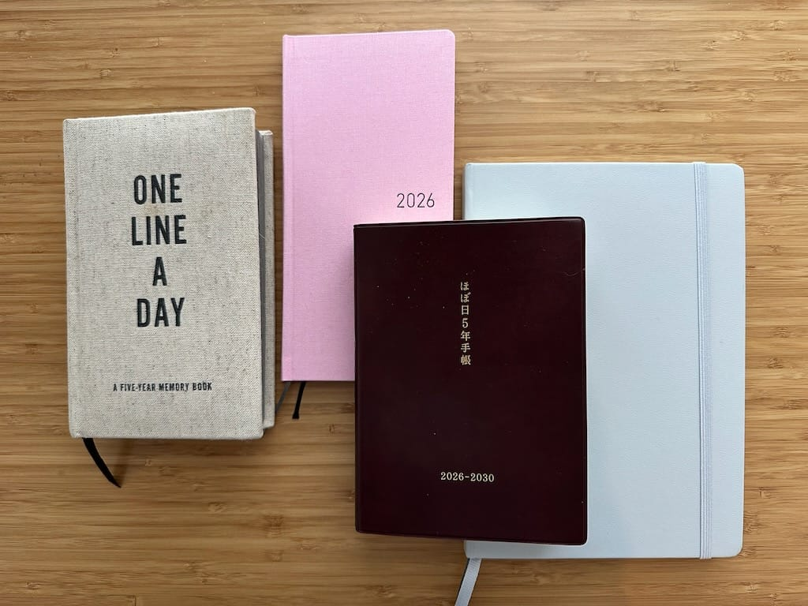

Blaugust is getting hard, folks! I've had a busy couple days with barely enough time to sit down and write a blog post, so I'm just now getting around to my post for August 11th at 5:30pm. I knew it would get tougher as the month progressed, but I'm still all in on writing every day!

I HAVE been writing in my paper journal more consistently than I have in years, though, so why don't I talk about the journals and planners I'm using this year? I meant to write this post at the beginning of the year and I took the picture at the beginning of the year, but nothing's changed except for the color of my journal (my current journal is purple instead of gray).

* [2026 Hobonichi Weeks in Strawberry Milk](https://www.1101.com/store/techo/en/2026/pc/detail_cover/wb26_colorssmilk/) I've been using a Hobonichi Weeks as my day to day personal planner since 2023 and I love it because of its size! It's tiny and easy for me to carry when I need to bring it somewhere, and it's fun to decorate the monthly and weekly pages. I also track the daily temperature and daily habits and I enjoy it so much.
* [Hobonichi 5-Year Techo (A6)](https://www.1101.com/store/techo/en/2026/pc/detail_cover/fb26_s_jan/) I finished a [Midori 3-Year Diary](https://www.midori-japan.co.jp/english/products/multi-year-diary-gate/) at the end of 2025 so I knew I'd want to purchase a new daily journal. I write a brief summary of my day every day and it's cool to read about what I've done in previous years! I'll be finishing this journal not long after my 50th birthday, which... how is that only 5 years away? Time is weird.
* [Leuchtturm1917](https://www.leuchtturm1917.us/products/hardcover-notebook?variant=48072862236917) hardcover dot grid journal in Lilac (the picture is in Light Grey but I finished that one at the end of July). I've been using Leuchtturm as my long form journal for a few years now and I'll never use anything else. I love the paper, love the size, and my fountain pens write like a dream. 
* **A random 5 year journal that my sister picked up for me**. My sister found this journal and knew I liked keeping a daily journal, but since I already purchased a daily journal, I decided to use this one as a question a day journal and wrote a different question for each day at the top of the page. This has been fun to fill out as well, but the original Q&A book I got the questions from was published over 10 years ago so some questions are out of date, such as "what was the last video you rented?". Either way, it's still been amusing.

I've always loved planners and stationery and pens and stickers, so I love this hobby and love that it actually helps me plan my days and weeks! I'll probably stick with a similar setup next year, but I may switch out the Hobonichi Weeks for a Traveler's Notebook, or use both next year to see what I like better. I'm happy with my choices this year, but I'm not opposed to changing things up, either.
