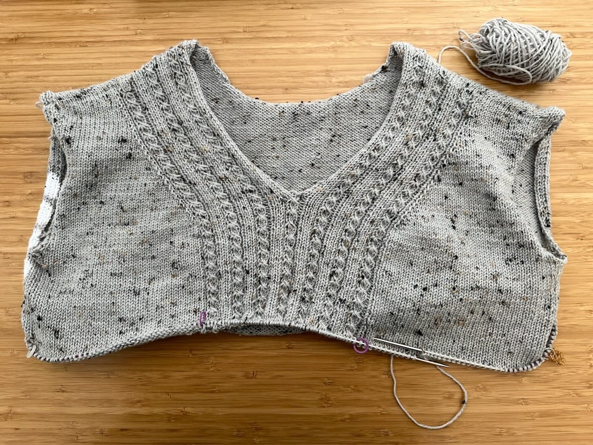

_Welcome to Work in Progress (WIP) Wednesday, where I post progress on my crafty endeavors! I want to get back to tracking my knitting, spinning, cross-stitch, or whatever I'm making at the moment, so I'll be writing about it every Wednesday._

***

I've made a lot of progress on my [Lillesol sweater](/wip-wednesday-lillesol-beginnings/)! I joined the front and back of the sweater so now I'm knitting it in the round, which makes it go much faster (no purling for the most part!). I'm loving it so far and it's at the point where it's easy to knit at my knit nights.

I've had a challenging week for reasons I don't want to get into on this blog, so I've been spending a lot of time knitting this sweater and listening to podcasts. I'm glad to have knitting and journalling and running and exercise in general to help me get through a tough week, and I hope things improve. 
