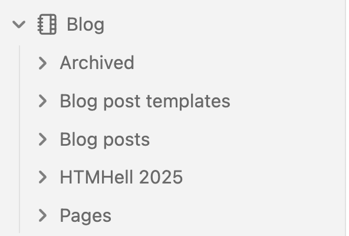
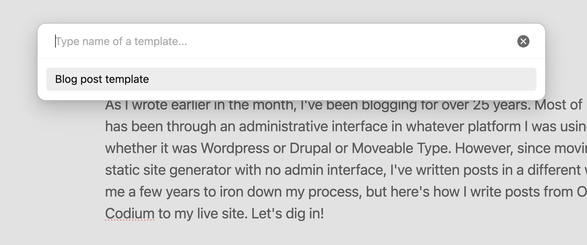
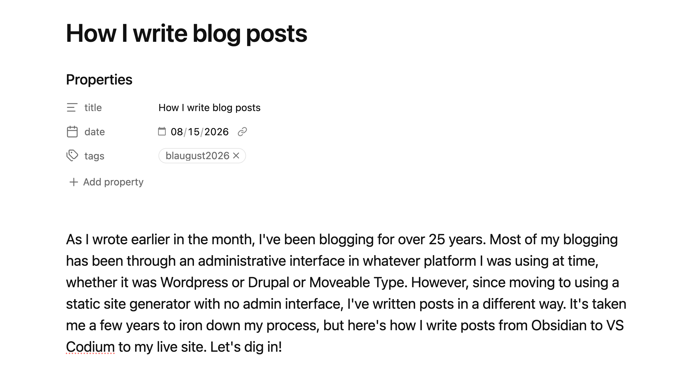
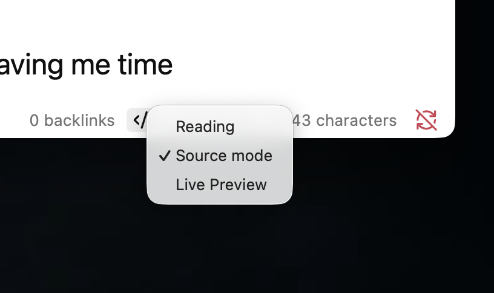
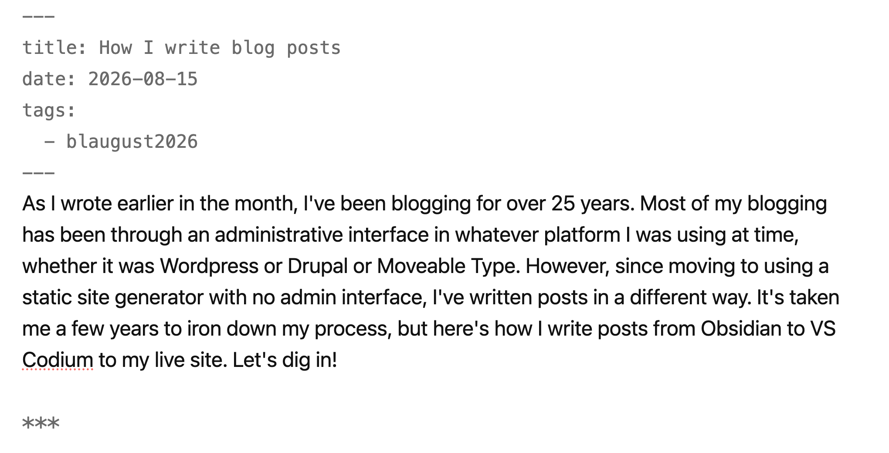
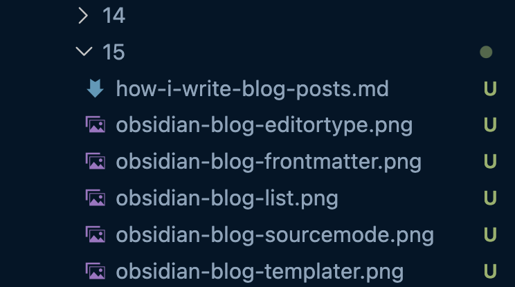
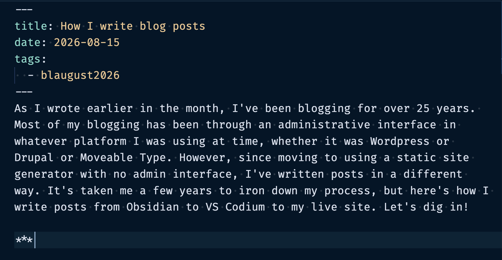

[As I wrote earlier in the month](/my-blogging-history/), I've been blogging for over 25 years. Most of my blogging has been through an administrative interface in whatever platform I was using at time, whether it was Wordpress or Drupal or Moveable Type. However, since moving to using a static site generator with no admin interface, I've written posts in a different way. It's taken me a few years to iron down my process, but here's how I write posts from [Obsidian](https://obsidian.md) to [VSCodium](https://vscodium.com) to my live site. Let's dig in!

***

First, I create a new note in Obsidian in the `Blog` category, under `Blog posts`. I also have a `Blog templates` folder within `Blog`, and that's where I keep my Frontmatter template for my posts. 

I use the [Templater Obsidian plugin](https://community.obsidian.md/plugins/templater-obsidian) to insert the Frontmatter into each post, saving me time copying and pasting the same Frontmatter over and over again. I'll sometimes start writing the post before I insert the Frontmatter, sometimes not. It depends on what I feel like doing.

Then I continue writing the post! I make sure that Obsidian's format in the bottom task bar is set to `Live Preview` which is still using Markdown to format text, but it looks pretty and makes it easier to write.

When I finish writing the post, or I get to the point where I want to start adding images (which I add once it's in my editor), I switch Obsidian's format in the bottom task bar from `Live Preview` to `Source mode` to get the Markdown code for the post I just wrote.

Next, I fire up VSCodium and create the post in my editor! I arrange my posts in year, month, and date folders with the Markdown file and any images for the post in that folder. For example, I put today's post and images in the `2026/08/15` folder and I named the file `how-i-write-blog-posts.md`.

I open the `.md` file I just created, copy the `Source mode` version of my post in Obsidian, and paste it in VSCodium. Hooray!

Now, I'll update the image placeholders with a snippet of code to call each image. I'll format the post a little bit and add new lines between items to make the entry more readable in VSCodium, then I'll add the files and commit to my repository. 

Currently my site is hosted on Netlify which has built in deployment scripts for when I push code to my main Git repository, so my entry automagically appears on my site as soon as I commit. (Yes, I write my entries directly on the `main` branch--I could create a new branch for each entry I make, but that would take more time than what I do now so I don't.) I'm planning on moving to a different host such as [statichost.eu](https://www.statichost.eu) to host my site, but when I do that, I'll have to write a deployment script to push my code to the repository. Thankfully [FlamEd has a blog post detailing how to do this](https://flamedfury.com/guides/11ty-homepage-neocities-2026/) which I will be following as soon as I want to make the move!

Once my code is committed, I wait for the deployment scripts on Netlify to run. It's usually less than a minute from when I commit my code to when it appears on my live site, and once it's live, I give the post another read. Sometimes I find typos and correct them, or I'll swap some images, but for the most part, the post looks good.

Lastly, I copy the url of the post and paste it into Mastodon! I've set up an `og:image` to be displayed every time I post on Mastodon and it's fine, but I want to work on making it look better. (I should have listed that on [the things I want to do to my blog](/website-ideas-and-inspiration/)!)

And that's it! This is how I go from an idea on Obsidian to a full fledged post on my website. It's not the most sophisticated process, but it gets the job done and I'm happy with it.
