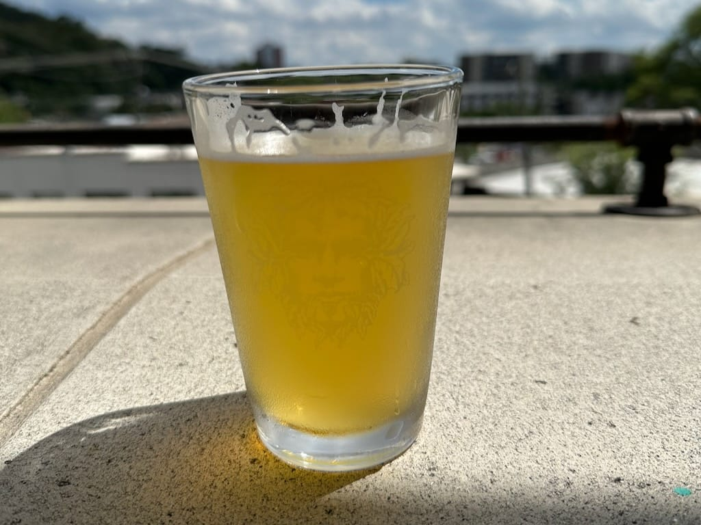
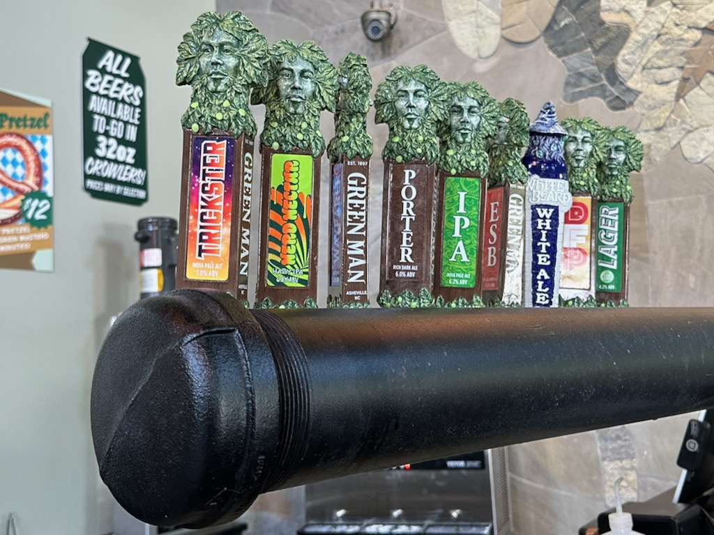
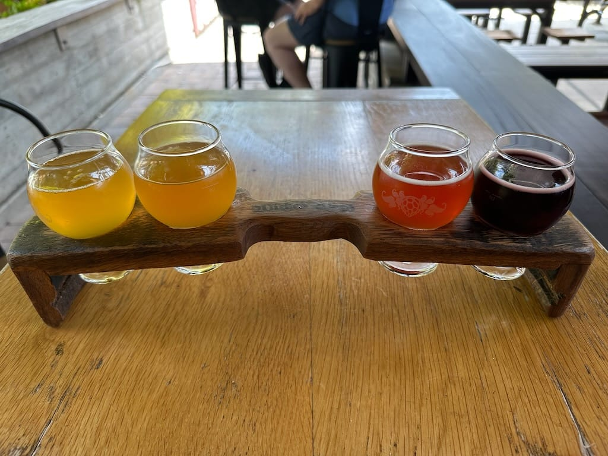

A little over a month ago I traveled to Asheville, North Carolina for a conference. I flew in a couple days before the conference began, and I spent an afternoon checking out a couple breweries I hadn't tried. I enjoyed these two breweries in particular and would totally visit them both again!

***

I first traveled to the [Green Man Brewery](https://www.greenmanbrewery.com) after reading some great reviews. I ended up ordering a pint of Nerd Nectar, a hazy IPA that hit the spot on a hot summer day.

I thought the taps looked cool so I had to take a picture of them.

I then walked a little way up the street to the [Wicked Weed Funkatorium](https://www.wickedweedbrewing.com/location/funkatorium/), an offshoot of [Wicked Weed Brewing](https://www.wickedweedbrewing.com) specializing in funky, sour beers! I don't drink as many sours as I used to but these were so tasty. 

I ordered the "Death by..." flight, which consisted of a watermelon sour, peach sour, cherry sour, and boysenberry sour. I loved the boysenberry sour the most, but sadly when I got up to use the restroom, the servers cleared my table and didn't get to finish my last beer. Guess that means I'll have to go back at some point...

***

All in all, I enjoyed my little brewery tour of Asheville. I love checking out new breweries when I travel, and this trip did not disappoint.
