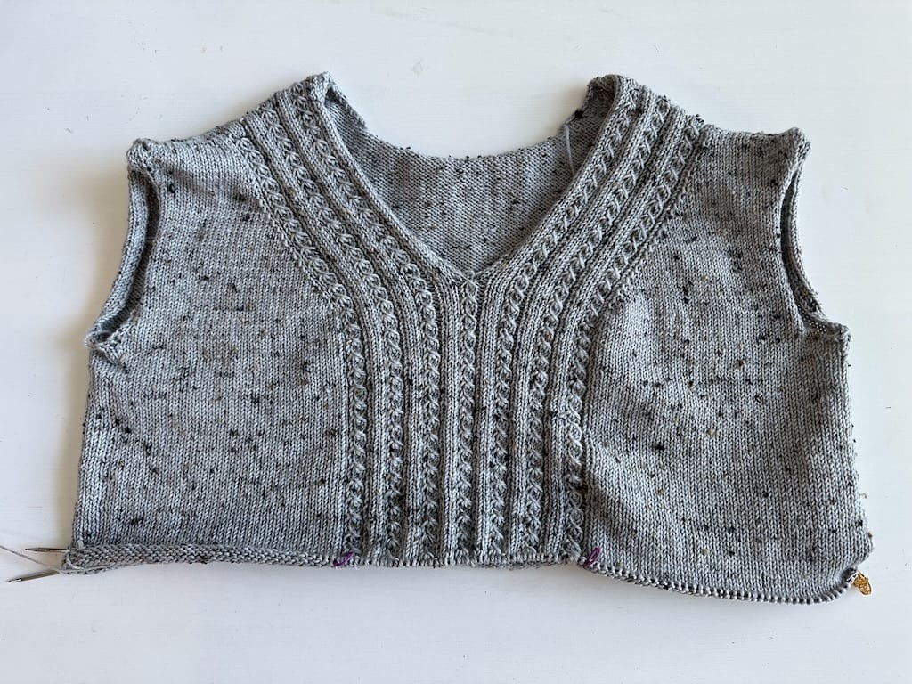
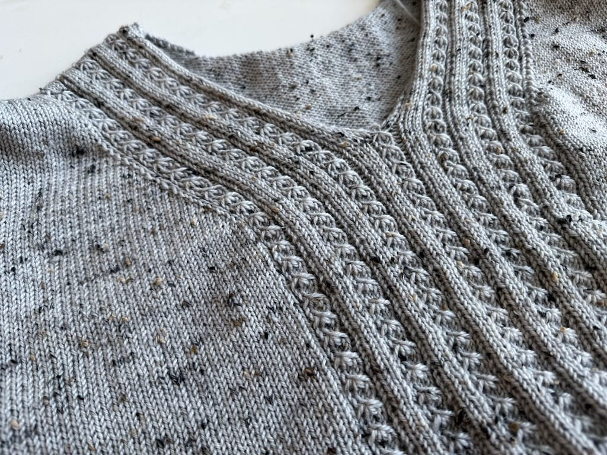

_Welcome to Work in Progress (WIP) Wednesday, where I post progress on my crafty endeavors! I want to get back to tracking my knitting, spinning, cross-stitch, or whatever I'm making at the moment, so I'll be writing about it every Wednesday._

***

This will be a short post due to the fact that this update isn't the most interesting, but I'm still trucking along on my [Lillesol sweater](/wip-wednesday-lillesol-progress). I'm still on the body, which never seems to be done until the day it IS done, but I still have awhile before that happens.

I'm still enjoying knitting this pattern, though, and that's all that matters.

