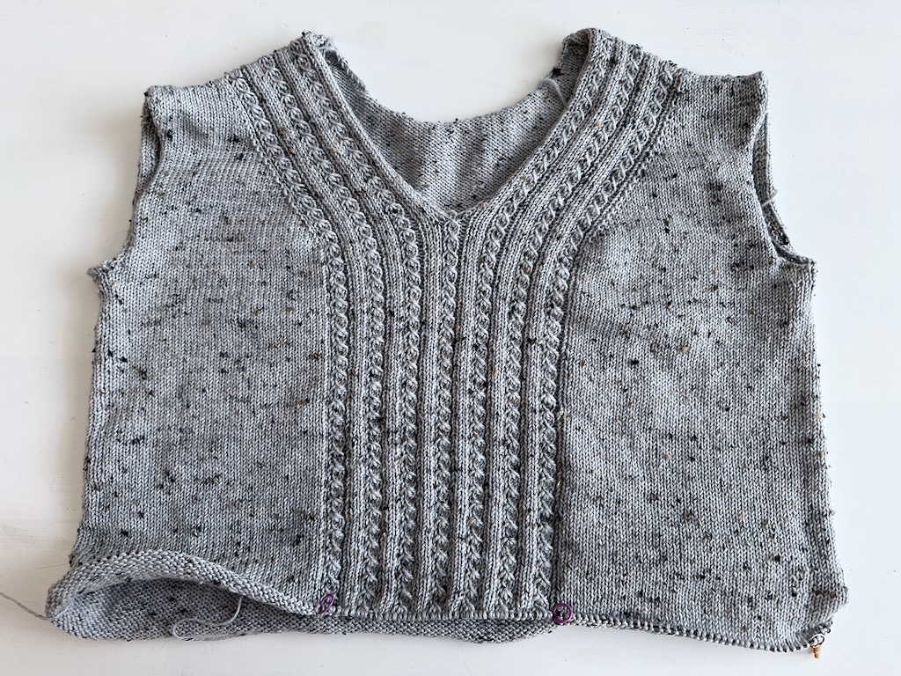

I don't have much to write in regards to my work in progress today because, well, it's the same sweater I've been knitting all month! I'm very happy with [the progress I've made on the Lillesol sweater this past week](/wip-wednesday-still-going-strong/) even though it doesn't look like I've gotten much done.

I do see progress, though, if I compare it to the picture from last week:

At some point I'll start another knitting project or I'll start a different crafting project altogether. I want to spin some more yarn but I'm actually out fiber, so that's been on hold until I buy more.

Still, I'm happy with my progress.
