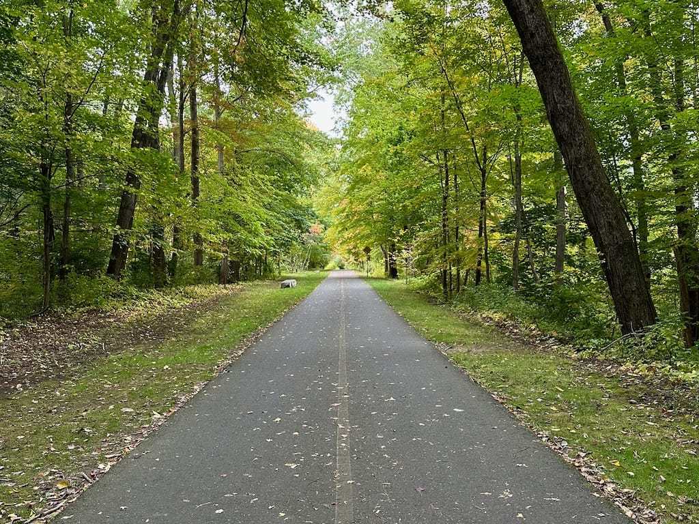

Every day I tell myself that I'll write first thing in the morning. Then, every evening I'm sitting here wondering, "Why haven't I written my Blaugust post yet?". I don't know, but I do know that I need to make a more conscious effort to write in the mornings. I'm over writing these posts at night when I don't really want to be on my computer.

In the meantime, here's a picture of the bike path in the area I used to live. I used to take walks here almost every day, and I miss taking walks in a quiet wooded area. I need to find that again.

