This past Saturday, a couple friends and I went to [the Paper Mouse](https://www.thepapermouse.com) in Newton, Massachusetts, to attend the [Hobonichi 2027 Preview Exhibit](https://www.1101.com/store/techo/en/magazine/contents/y27_event/gz5oxw2hr.html). Only four stationery shops in the US and eight shops throughout the world held these exhibits, so I feel grateful that one of the locations was only a 35ish minute drive away from me!

***

We arrived at the Paper Mouse at around 1pm and checked in at the shop to get our tickets to the event. We had to wait for our number to be called to enter the exhibit space, but thankfully it was a beautiful, sunny day with zero humidity!

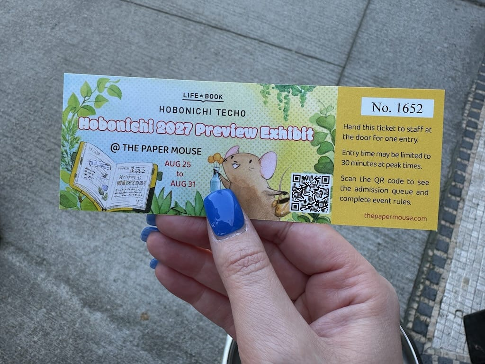

A new coffeeshop, [Moments](https://www.momentscafema.com), opened just a few doors down from Paper Mouse and they gave Hobonichi Preview Exhibit attendees 20% off when showing an exhibit ticket, so we all bought delightful tiramisu lattes and sat outside, enjoying the weather.

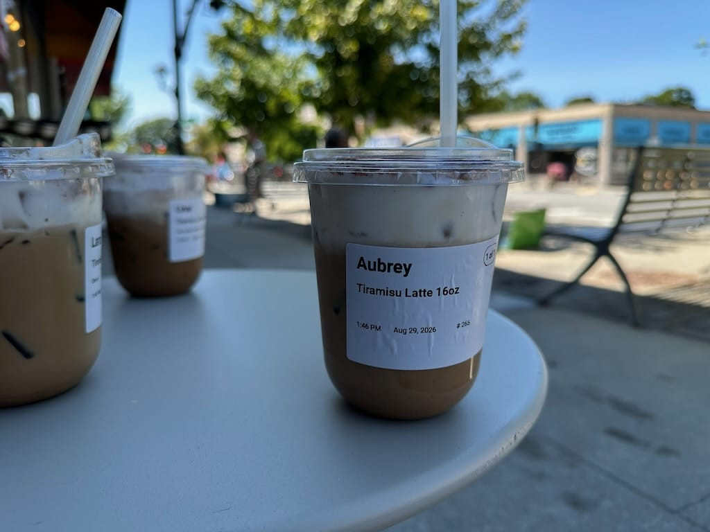

We didn't have to wait a really long time to get into the exhibit, but finally, our numbers were called and we entered the space. 

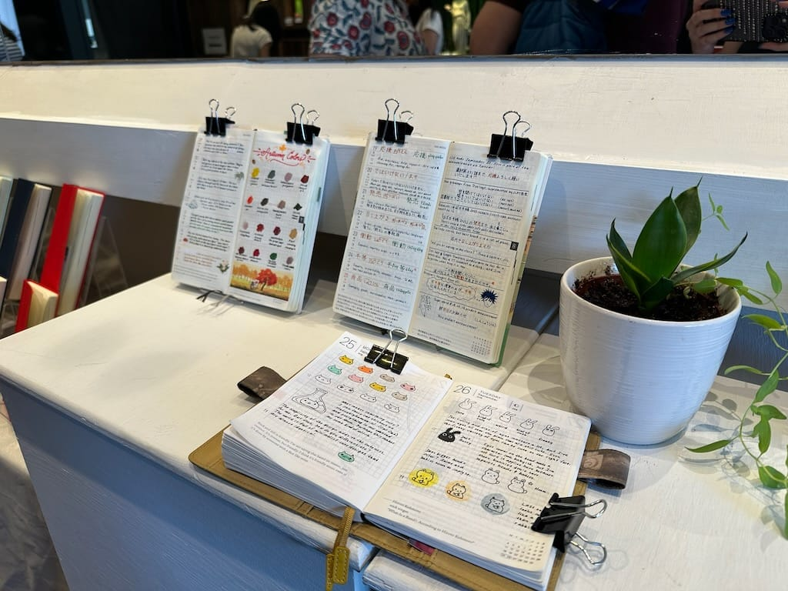

It was so, so cool to see all of 2027's Hobonichi offerings all in a single place, laid out on tables and in shelves around the space. I took a picture of my favorites and neat little things I saw.

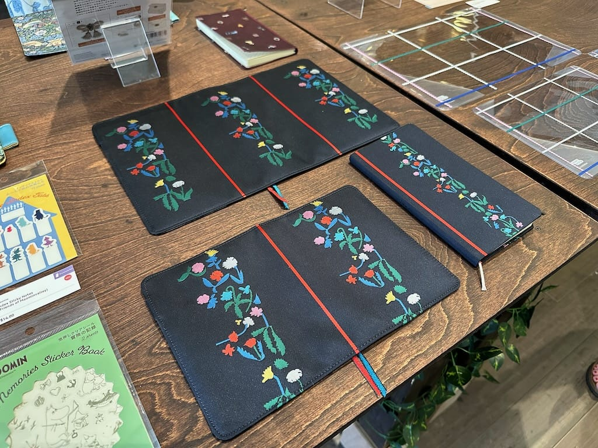

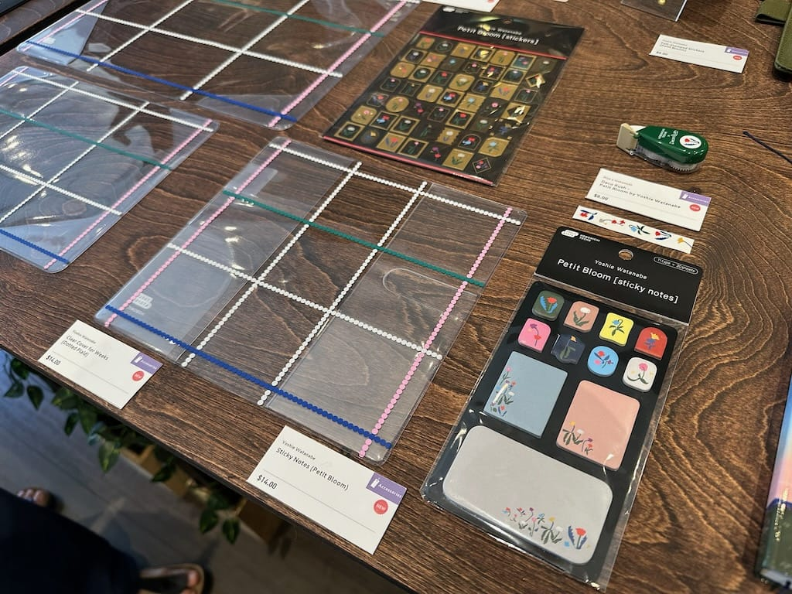

Of course I had to take a couple photos of the planner line I want to buy this year, either [the Weeks or the Weeks clear cover from Yoshie Watanabe](https://www.1101.com/store/techo/en/magazine/contents/y27_watanabe/2rkyvmhlr.html). I'm so glad I was able to see both in person and I might end up buying both so I can use the clear cover on a solid colored Weeks in the future.

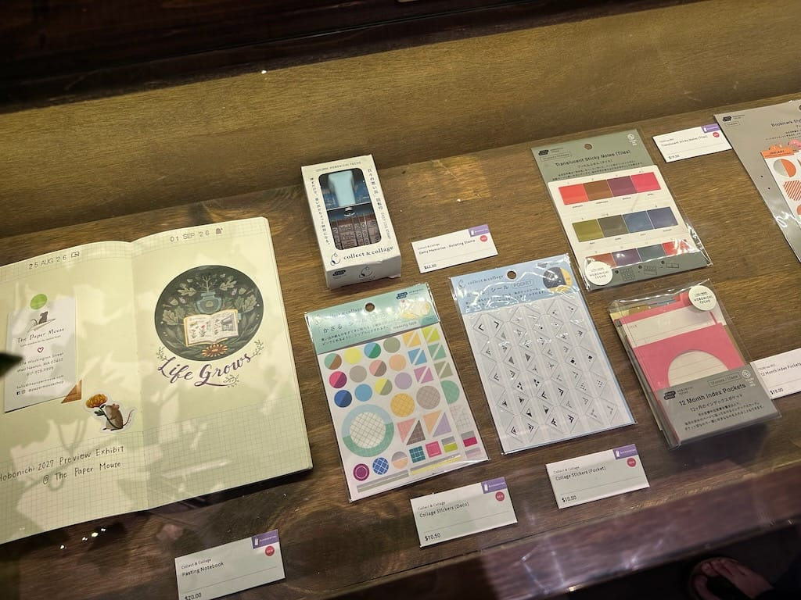

I've been really excited about [the collect & collage series](https://www.1101.com/store/techo/en/magazine/contents/collectandcollage/b6e71e6s2.html) that Hobonichi's releasing this year. It consists of a pasting notebook with some fun sticker accessories to use for pasting ephemera into the notebook. This is Hobonichi's way of getting into the Traveler's Notebook world, and I was surprised to see the pasting notebook being Traveler's Notebook size and not Weeks size!

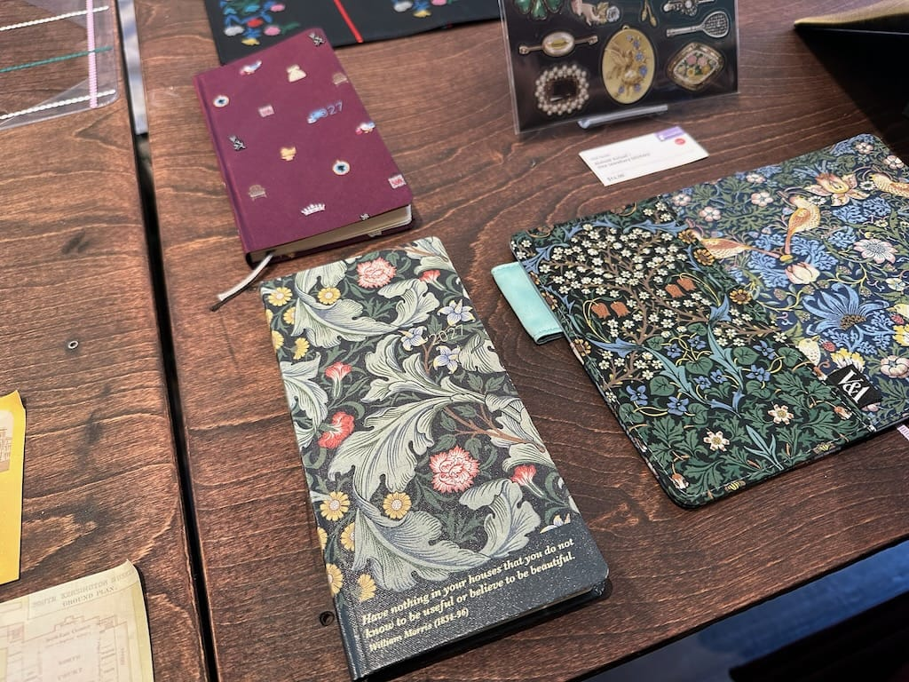

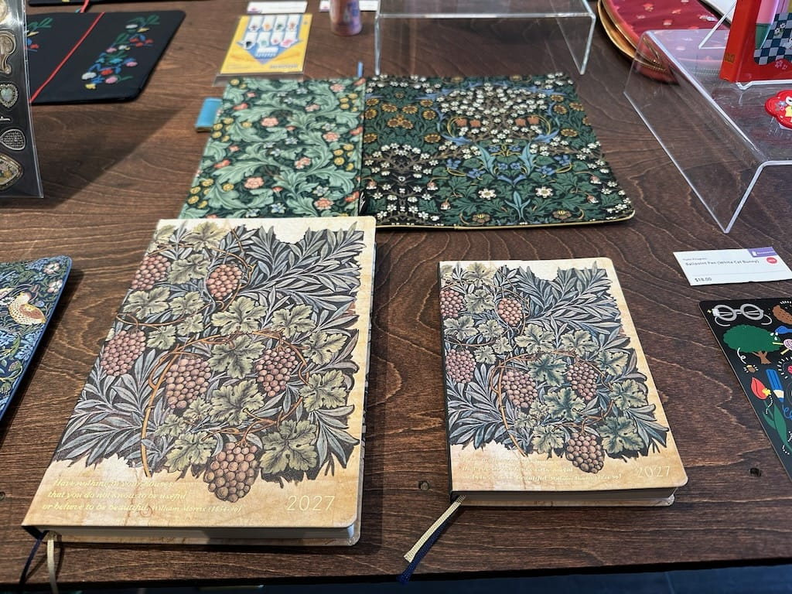

Here's a couple pictures from [the V&A Series](https://www.1101.com/store/techo/en/magazine/contents/y27_va/2rkyvmhlr.html) being released this year. I thought these planners were beautiful as well--not my typical style, but worth noting and taking photos.

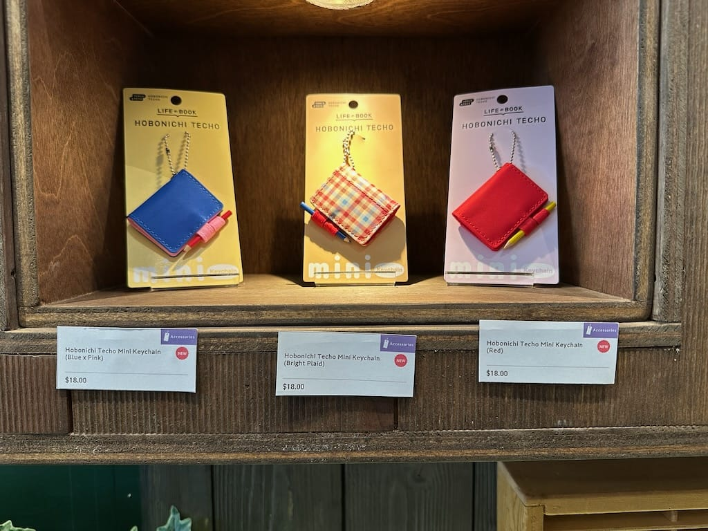

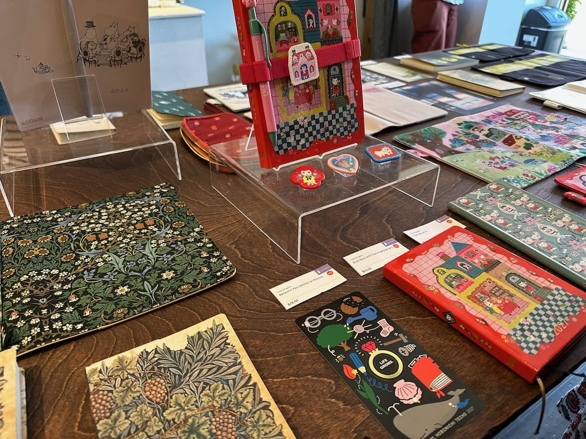

At the very end, before exiting the exhibit, there was a fun interactive area set up for people to punch out stickers and stamp a piece of paper or a planner to commemorate the day. Each preview exhibit was supposed to have their own special stamp to give away, but sadly the Boston stamp was stuck in customs and couldn't make it all the way across the country from Anchorage. Paper Mouse rolled with the punches and came out with their own stamp sticker that they gave out instead.

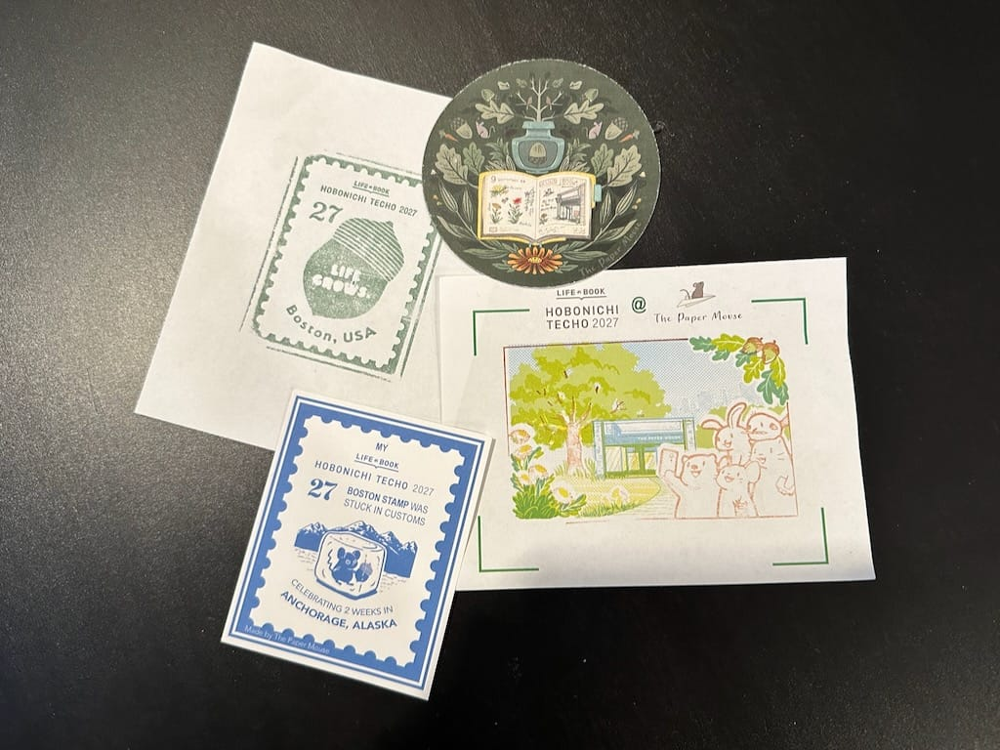

All in all, it was such a fun day! I'm always happy to spend time with my friends and I'm so glad we all made the trip to Newton to attend the exhibit. I'm excited to place my order with Paper Mouse tonight at 10pm and I can't wait to use it next year!

***

(Also, before you ask, I am still interested in trying a Traveler's Notebook in 2027 too! One can't have *too* many planners...)
