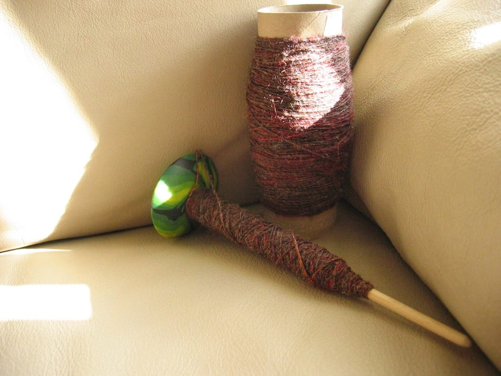
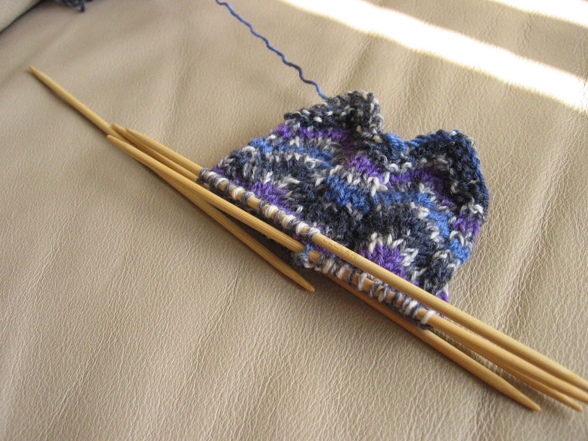

Nope, I can't get enough of posting my crafty stuff these days.

I'm spinning myself some laceweight yarn (I hope) to knit the Branching Out scarf from Knitty. I've wanted to try my hand at lace knitting for awhile, and what better than to do it with homespun yarn? I'm hoping this turns out well so I can use it. I LOVE spinning this yarn; it's nice and soft and much, much easier to spin than the purpley yarn I spun right before this. I'm maybe 1/3 of the way through the ball and I hope I have enough for a scarf after plying it.

I've had this sock yarn since 2004 when I first taught myself to knit socks; I knit one back then and promptly forgot about knitting another. I still have that first sock, but I may end up unraveling it to make an identical pair. I liked the Broadripple sock pattern I used for my last pair of socks so much that I'm using it again for these, and I hope I finally use up this yarn. I do like the pattern so far.

