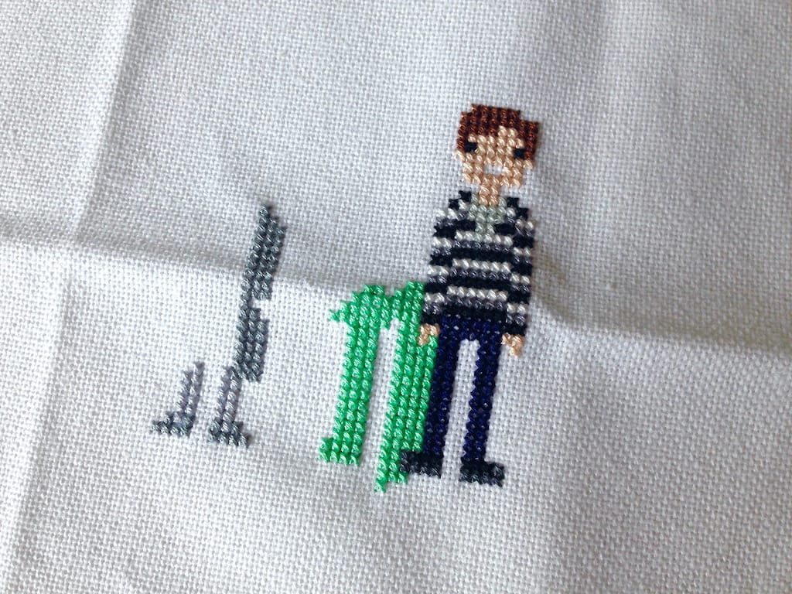

Happy Tuesday, everyone! I kind of dropped off the face of the earth last week. I blame it on the holiday and on things going on in my personal life that I don't really want to get into here. I haven't been doing much crafting, so I haven't been writing or taking pictures of what I've been working on.

That changes right now.

I started the cross-stitch I received in a swap package a few weeks ago and it is so much FUN. I've been on a huge Harry Potter kick recently, so this sampler's been super up my alley. However, I forgot how slow going working on a cross stitch project can be, especially a cross-stitch project with a ton of colors. I also haven't worked on a cross-stitch project for about 8-9 years, so I'm needing to get back into the groove. I'm working on it.

I am hoping to get more of this done now that the weather's getting cooler. It's been rainy and in the 60s the past couple days too, so I've wanted to craft all the things. The apartment is comfortable enough to knit and spin again, so I'm very happy.
