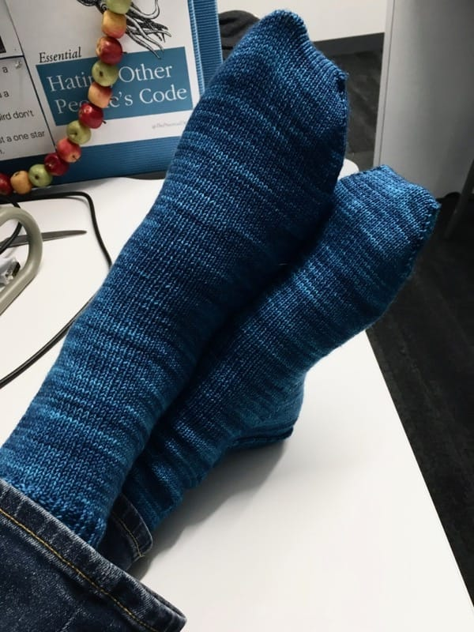

Since I've learned that [Adam loves wearing handknit socks](/posts/blueberry-socks), I've fallen into a pattern of alternating between knitting a pair of socks for me and a pair of socks for him. I knit him a grand total of four pairs of socks last year, which is a grand feat (ha!) seeing as his feet are way bigger than mine. Thankfully he loves bright colors, so knitting socks for him is an activity my eyes look forward to.

I cast on these socks at the end of December, right before we flew to Canada to visit his parents for a week. I wanted an easy project to work on while I relaxed and enjoyed the cold Canadian winter, and these socks brought a bit of cheer to my evenings.

The first sock knit up so quickly that it practically jumped out of my hands, but progress faltered on sock number two. As soon as the calendar flipped to 2019, I started thinking of all the other projects I wanted to knit in the new year, so Adam's socks stayed in the corner as I cast on new and exciting things. (Maybe you'll see those here sometime soon!) Nevertheless, I finished the socks a couple days ago and gave them to him at work the next day, and he proudly wore them around the office. I love that he loves handknits.

## Details

* Yarn: [Madelinetosh Twist Light](https://madelinetosh.com/collections/twist-light-solid) in the Baltic colorway
* Needles: US size 1, 2.25mm
* Pattern: Same as I used for [the last pair of socks I knit for him](/posts/blueberry-socks). I'm psyched to have figured out a sock recipe for him!

What color socks will I knit him next? Well, you'll just have to see! He bought four (yes, FOUR) skeins of sock yarn in Canada, so many more pairs of socks will be knit for him. I can't wait.
