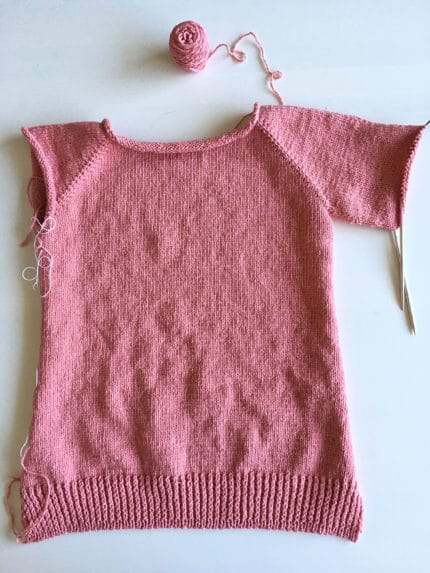
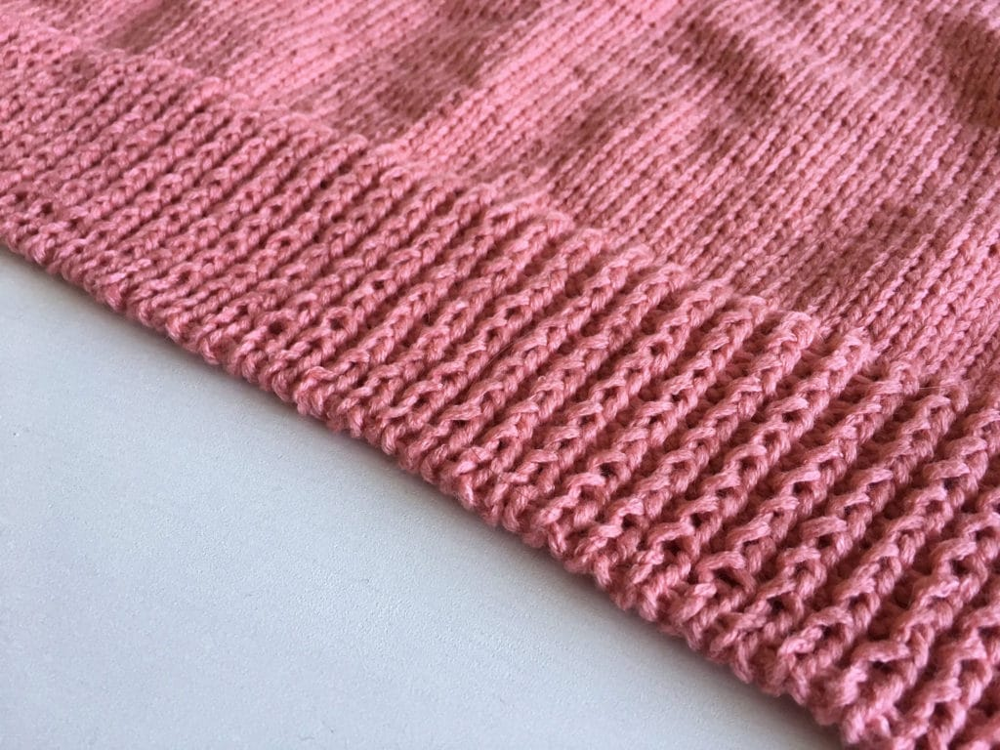
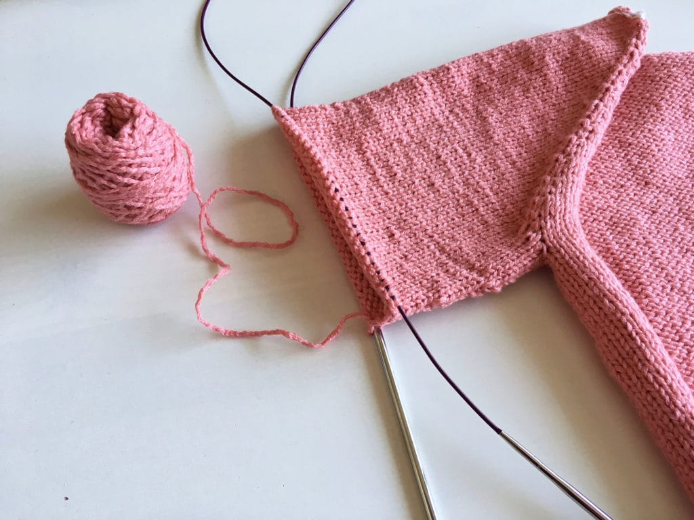

One of the items on my [35 in 35](/posts/35-in-35) list? Knit my first real sweater! I've tried sweater knitting for years but they've never turned out quite right. I attempted my first sweater way back in 2003, using a few balls of dark green yarn. It looked terrible and I never wore it. I don't even know what I did with it, honestly. I tried knitting another sweater at some point, maybe in 2008 or 2009, but that one didn't fit well either. Frustrated, I gave up trying to knit a sweater that'd actually fit me... until this year.

I cast on [Mama Vertebrae](https://www.ravelry.com/patterns/library/mama-vertebrae) back in March. I'd been talking about knitting a sweater for the past couple years, and I finally swallowed my fears and cast on this year. I'm using yarn that I bought at Webs back in 2009 or so - yeah, that's how long I've wanted to knit a real sweater! Sadly, I have two other sweater quantities of yarn I bought around that time frame, hoping that that would motivate me to knit a sweater. Nope.

It took me forever to finish the back of the sweater. It's knit from the top down, casting on a certain amount of stitches and increasing until separating the sleeves by putting the stitches on two holders, continuing to knit the back. I finished most of the back in about a week, but it took me a month to work up the nerve to try the tubular bind off, a new to me bind off. I finally bit the bullet and bound it off the other night, and while it doesn't look perfect, I still like it. I like the rounded edge it gives the piece!

After finishing the back, I picked up the stitches for one of the sleeves! I picked up some stitches around the underarm and after a few rounds, I started cruising along. I'm decreasing two stitches every 8 rounds or so, adding some semblance of shaping to the arms. I'm planning on knitting this as a full length sweater, because I prefer long sleeved sweaters over 3/4 or short sleeved ones.

I'm pretty happy with my progress so far. I'm hoping to get this done before it gets any hotter here - it's supposed to be in the 80s and 90s here the next week or so, and I don't have AC, so I'd rather not be slogging away on a sweater in this weather! We'll see how I do.
