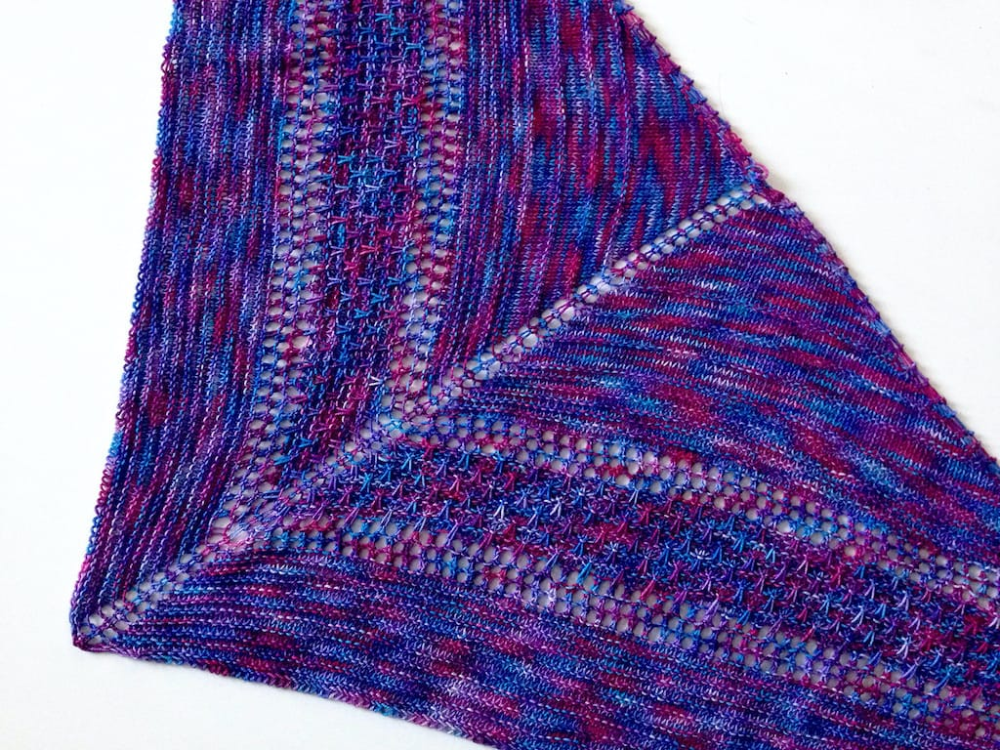
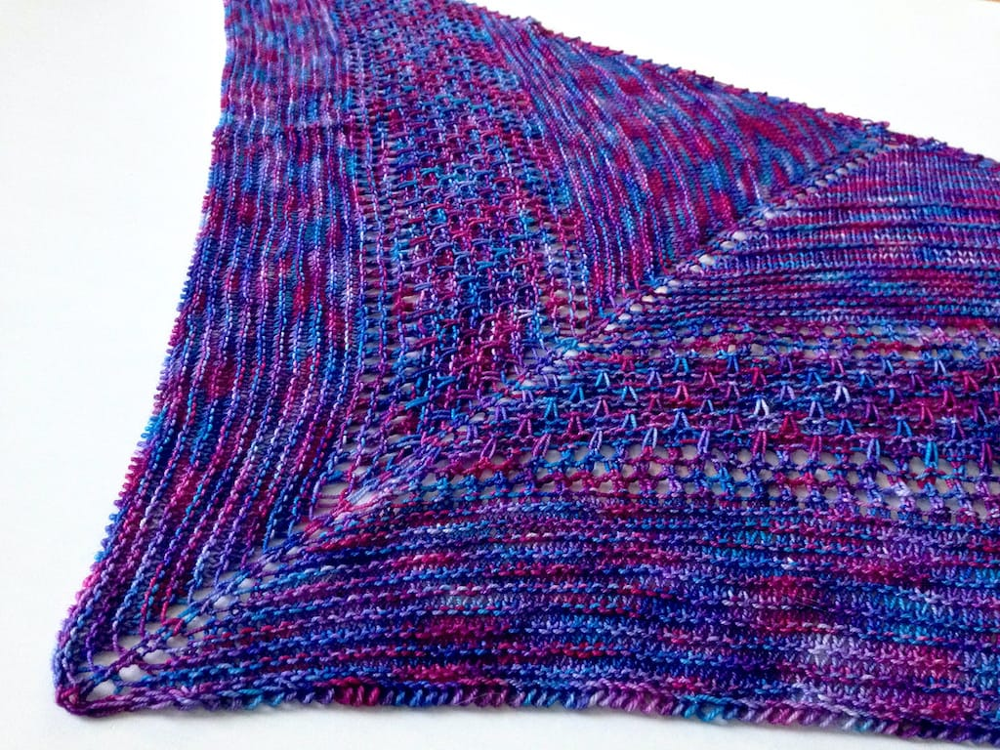
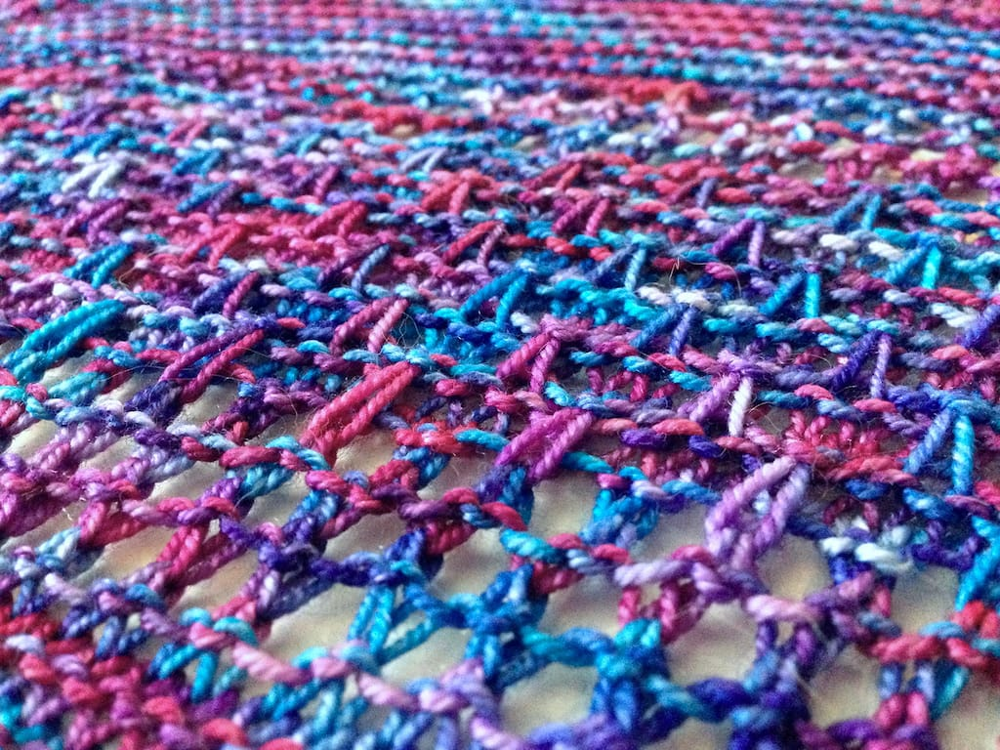
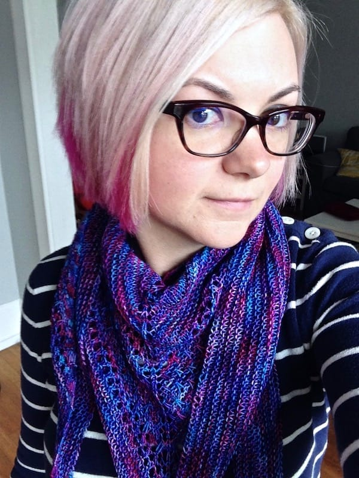

Hey look, I finished a shawl! Well, I finished knitting it last year, but I finally got around to blocking it last week, so technically I just finished it.

* **Pattern:** [Aila Grace shawl](https://www.ravelry.com/patterns/library/aila-grace-shawl) by Jennifer Lassonde
* **Yarn:** Araucania Huasco in the '3' colorway (such an original colorway name)
* **Needle:** US 5 - 3.75mm

This shawl was so much fun to knit. I love all the different textures - garter ridges, eyelets, slipped stitch patterning -- it kept me excited to move to the next section.

The yarn was perfect for the pattern, too! I got it from a dear friend of mine at our knit night's Christmas party a few years ago. She knows me and my color palette well. I love all these colors together and since I wear a lot of pink and blue, this goes with a lot of my clothes. It also goes well with my hair!

<drupal-entity alt="Modeling the Aila Grace shawl" data-embed-button="media_browser" data-entity-embed-display="media_image" data-entity-embed-display-settings="{&quot;image_style&quot;:&quot;large&quot;,&quot;image_link&quot;:&quot;&quot;}" data-entity-type="media" data-entity-uuid="53531700-79e5-4ad6-9e81-530bf2246697" title="Modeling the Aila Grace shawl"></drupal-entity>

I'm also happy it's getting cool enough here to wear shawls again! I have a couple more shawls I knit earlier in the year that I still need to block, so hopefully I'll be posting about those here soon too. I love shawls.
