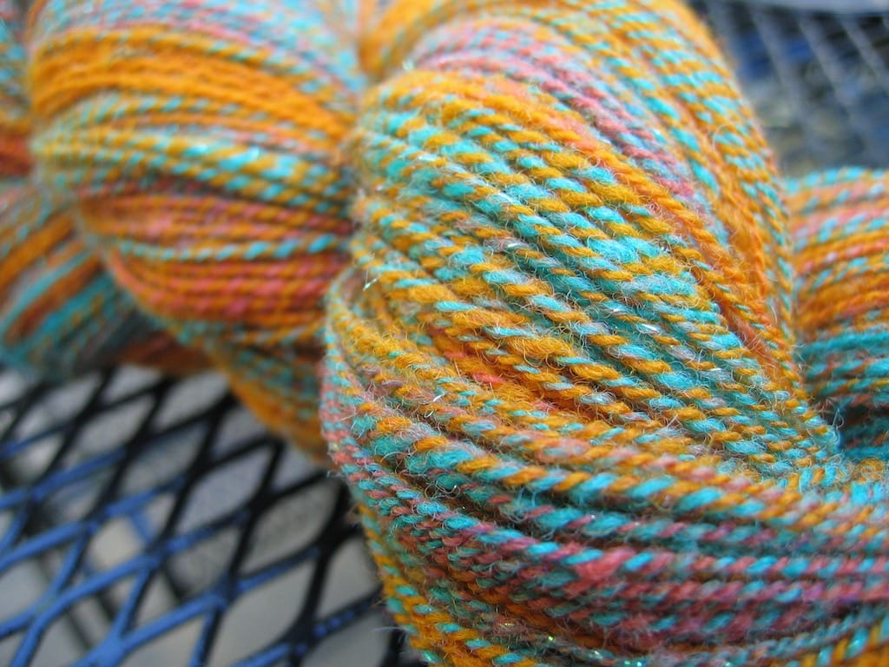

Look what I finally finished!

I’ve decided to call this bundle of yarn love Pumpkin Candy, because it reminds me of candy corn and those little pumpkin candies that seem to never disappear around Halloween. (Unless, of course, I’m eating them.)

Unfortunately, I don’t have many details about this yarn. I got the ball from [Michelle](http://avocadofever.blogspot.com) when I bought my wheel; Michelle, do you happen to know what kind of fiber is in this and how much there was? I’m guessing about 6 ounces. I also don’t know the yardage due to the fact that I still don’t own a niddy noddy and I didn’t feel like counting all the loops I made wrapping it off the bobbin onto my kitchen table, but I’m guessing I have about 600 yards total.

I also experimented with plying techniques with this yarn. I ended up with two skeins of this stuff, from me greatly underestimating how much singles to put on each bobbin so I could ply from two seperate bobbins. The bigger skein is from the two bobbin plying I’ve done in the past. The smaller skein, however, I wound into a ball with my winder and plied by taking the center pull and the outside and plying those together. Surprisingly, it wasn’t as hairy as I thought it would be. I’m happy with how both turned out.

Currently I’m spinning some purple Shetland lambswool. I think the wool felted a bit when it was dyed and it smells of the dye, but I still like the colors. I figure any experience I get is good experience!
