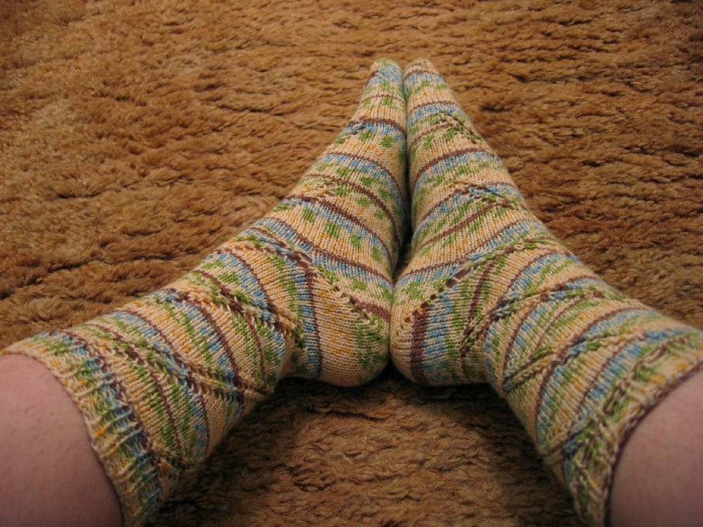

At long last, I’ve completed a knitting project; the [Anastasia socks](http://www.pepperknit.com/patterns/anastasia.html) by [Pepperknit Patterns](http://www.pepperknit.com). I started them roughly sometime in November, and it took me forever to finish the first sock! I flew through the second, knitting most of it while on vacation last week. I’m wearing them right now; they’re very comfortable and I love how they turned out. I used Plymouth Sockotta yarn in colorway #6673; I’ve never knit with blues, yellows, greens, and browns, but I’m glad I took the plunge and experimented!

I’m still knitting away on my stole. I’m halfway through part 5 on the second side, so I don’t have much left! I’m hoping to finish it before the end of the month, and at the pace I’m going, it looks like I may reach that goal!
