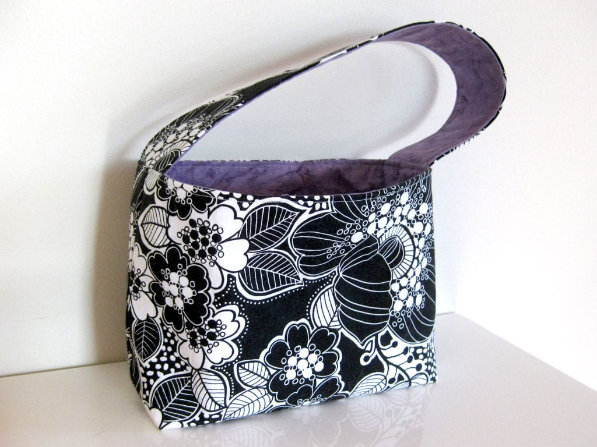
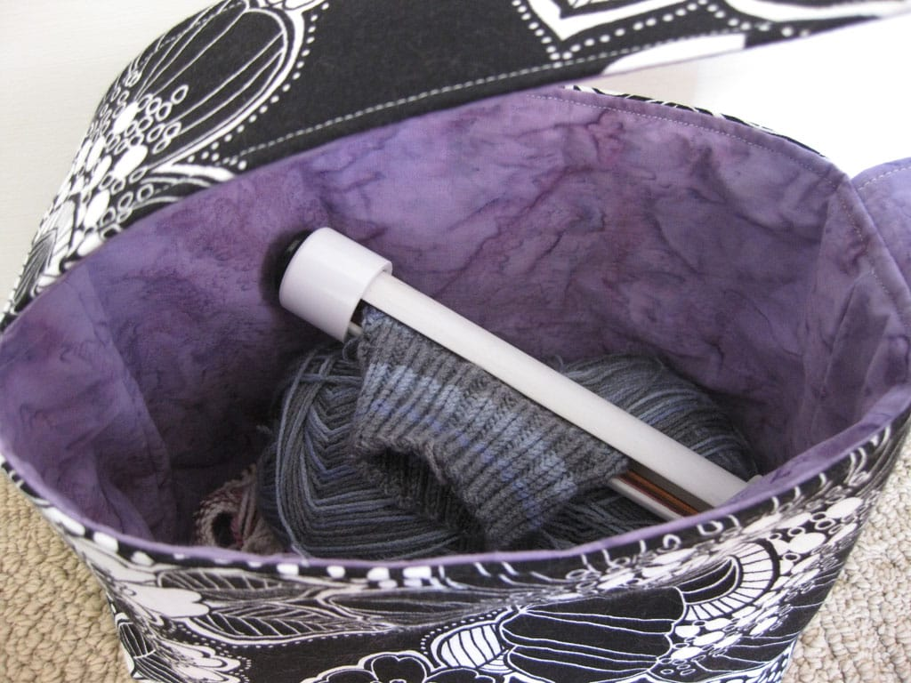
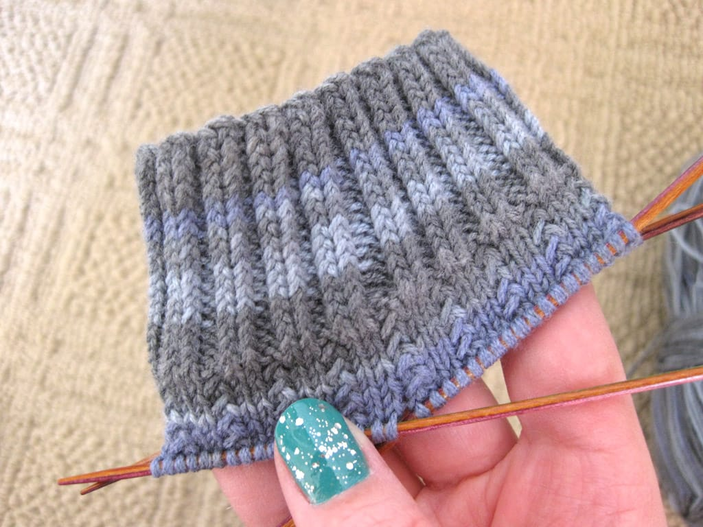

I love to sew.

I've dabbled in sewing here and there, but I've never spent quality time with it. I'll set up my machine, make a little bag or quilt something small, and I'll put the machine away for another 7-8 months. Knitting will always be my first love, of course, and spinning my second, but I've learned you can't have *too* many loves. So, sewing, you will now be third in my list of crafts I love.

I kind of winged it with this pattern, finding a picture of the shape I wanted, then figuring out measurements and such on my own. I originally made this bag with two straps, but I changed it to one when I got home from my sewing day with my friends. I'm also pretty happy to have used up some fat quarters I bought in Kentucky waaaaaaaay back in 2007! Louisville has great quilt shops.

See that awesome knitting project in the bag? I'm knitting a pair of socks for Ted, also a pattern I'm making up as I go. It's a version of the [Charade socks](https://www.ravelry.com/patterns/library/charade), only I cast on 72 stitches to make it fit a man's foot. I'm not sure what I'll do for the heel yet, but I have a few more inches left on the leg before I get there, so I'm sure I'll think of something. So far, I'm digging the striping pattern so far, and I think Ted will like them too.

I love making things.

(Also, side note: happiest of birthdays to my awesome sister, who turns 30 today! And, to my kickass friend Linda, who is one of the best people ever! All the birthdays!)
