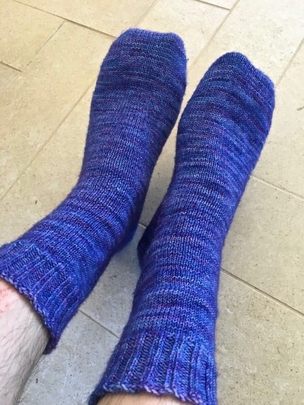

For the past few years, I've focused my knitting on socks. I can easily throw myproject in a backpack or purse, I don't need to carry a lot of yarn, and they don't make my hands break out in a sweat when I knit them in the summer. Plus, I get a functional article of clothing in the end and they keep my feet warm in the winter!

Thankfully, my boyfriend also likes hand-knit socks. I knit him his first pair last summer, and while they didn't quite fit him comfortably, he was a hand-knitsock convert. And yes, I now knit him socks that fit. Plus, he loves bright colors, so what's not to love?

Behold.

The knitty-gritty (see what I did there?) details, for those of you who are knitters and want to know more:

* Yarn: [Knit Picks Hawthorne](https://www.knitpicks.com/yarns/Hawthorne_Fingering_Multi_Yarn__D5420251.html) in Goose Hollow colorway
* Needles: US size 0, 2mm
* Pattern: A version of my tried and true toe-up sock pattern. I started with 36stitches using [Judy's Magic Cast-On](http://knitty.com/ISSUEspring06/FEATmagiccaston.html) and increased every other round until I reached 72 stitches, and then I knit in the round for about 5.5 inches. Then, I started increasing for the gusset until I reached 72 stitches on one of the needles. I turned the heel and then knit the heel by decreasing every round until I was back to 72 stitches again. I knit the leg and knit 20 rows of the cuff using k2tbl p2 ribbing, and cast off using [Jeny's Surprisingly Stretchy Bind-off](http://knitty.com/ISSUEfall09/FEATjssbo.php).

I love how they turned out and he loves wearing them, so we're both pretty happy. Now, to cast on my next pair of socks...
