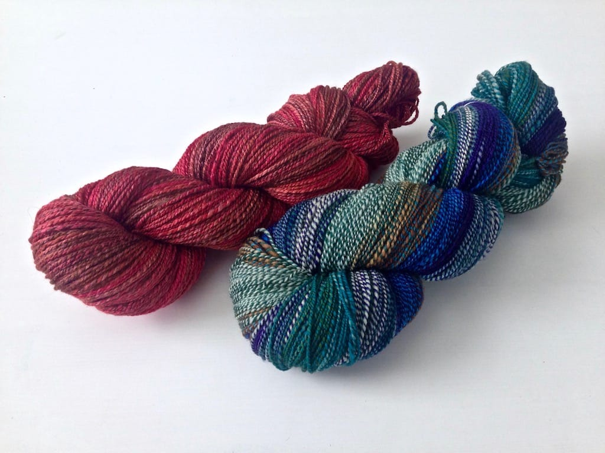
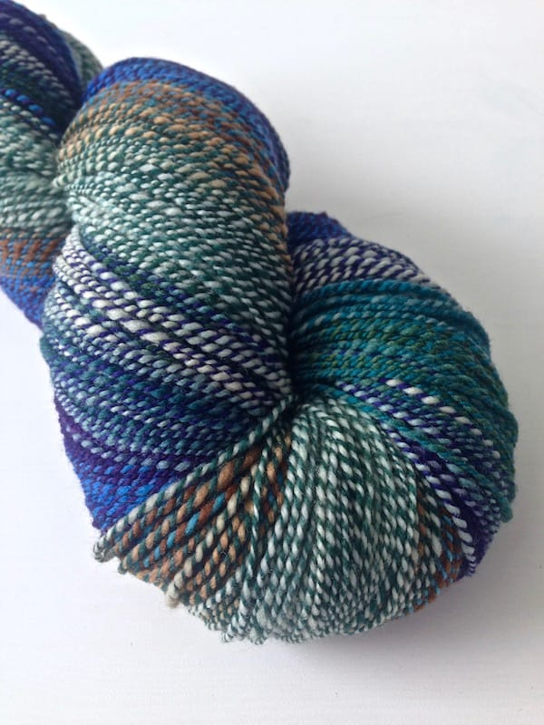
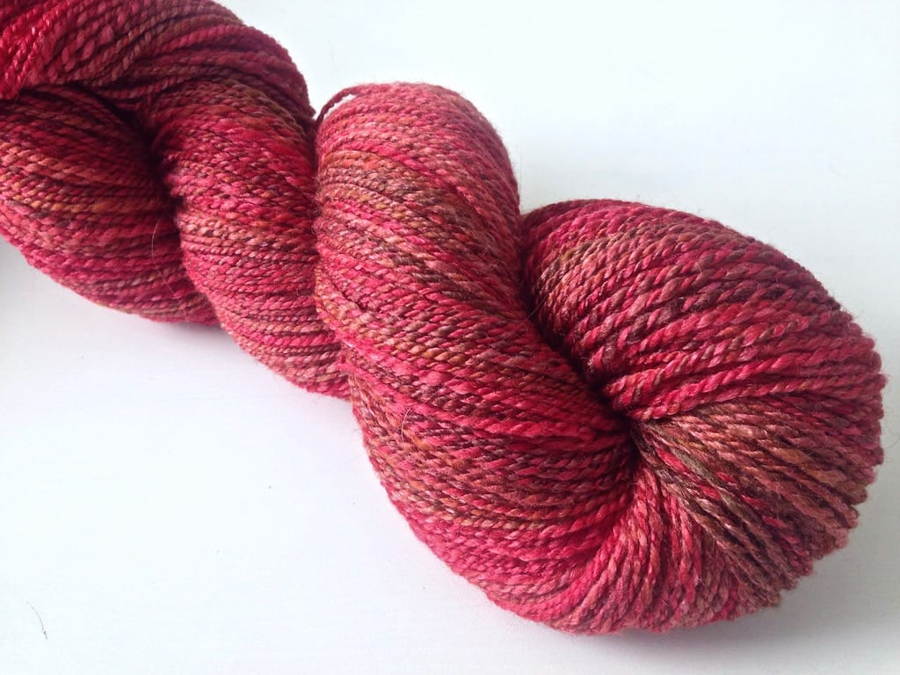
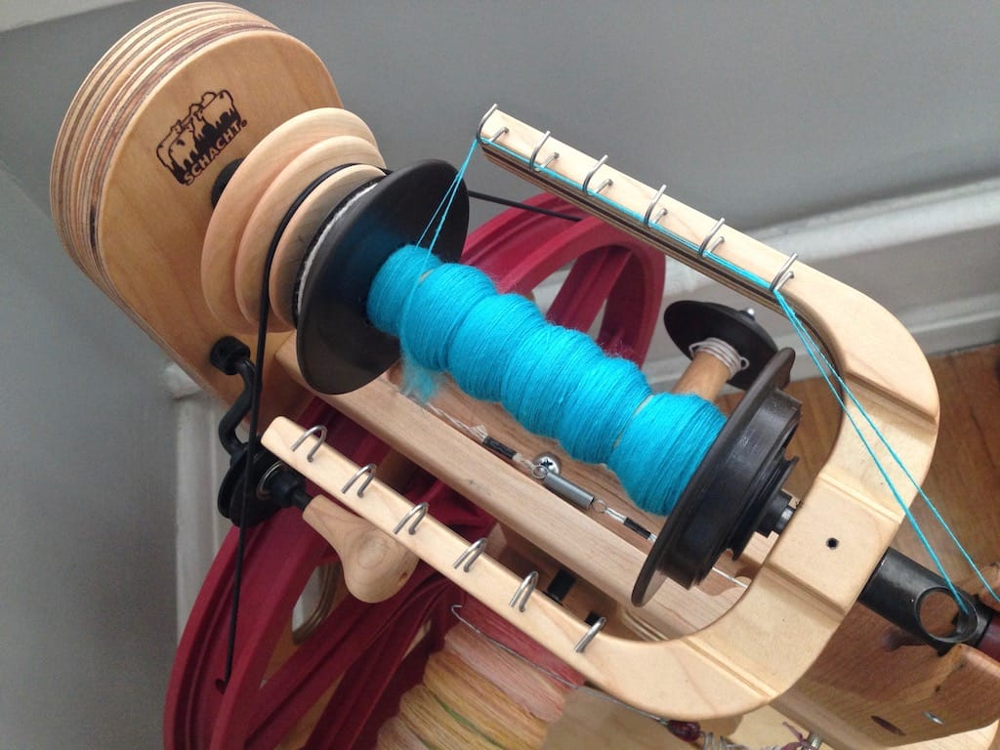
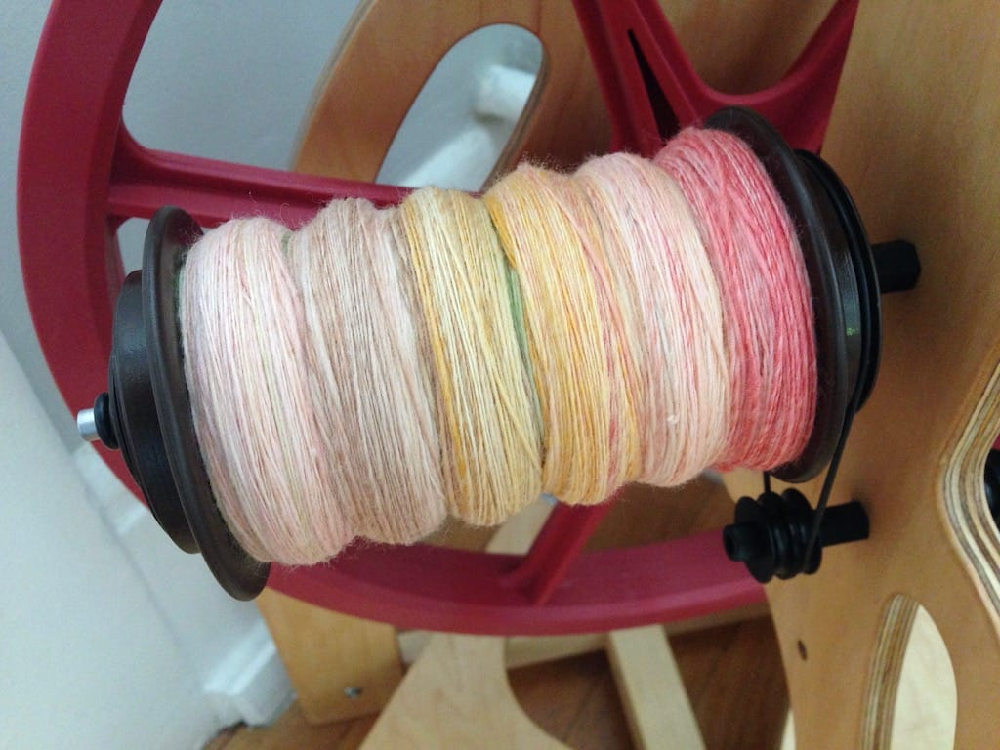

It's been a tough summer for spinning here in the Pacific Northwest, with temperatures in the 90s and 100s for most of the season! Plus, our apartment doesn't really have air conditioning, so the last thing I really wanted to do most of the summer was hold a bunch of wool in my hands. Sweaty hands are fun for no one.

I *have* been able to spin from time to time the last couple months, however. Here's what I've finished recently, and here's a couple spinning projects I've had on the wheel now that the weather's finally cooling down.

These two yarns are some of the favorites I've ever spun. Want to hear more about them?

Back in March, I signed up for [Moonrover](https://moonrover.bigcartel.com)'s three month fiber club. I loved the different colors I saw in her shop, and I'd never joined a fiber club prior to this one, so I signed up right away. This is spun from April's club colorway, and while the browns and greens aren't usually my wheelhouse, the blues and purples kind of pull it together.

I spun and plied this on my brand new Schacht Ladybug, the first yarn spun on my new wheel! I received it right around the time the April shipment arrived in the mail, so of course I spun that colorful bit of fiber right away. I ended up getting around 480 yards of 2-ply fingering weight from the 5-ounce braid of 85% superwash merino, 15% nylon. I'm thinking this will become socks someday.

Next up is an oldie but goodie! I thought I bought Michigan Autumn way back in 2007 at the [Michigan Fiber Fest](/posts/michigan-fiber-fest), but I don't see a picture of it in my festival recap. Time to rack my brains to remember what fiber fests I attended when I lived in Indiana!

I love the colors of Michigan Autumn, and find the name to be pretty apropos, but spinning this wasn't incredibly fun. Kids, don't leave your fiber hanging around for 8 years before spinning it! I'm a glutton for punishment and am attempting to spin all my old 2006-2008 era fiber, but it takes a ton of prepwork and predrafting to make it do what I want.

Either way, I got a few hundred yards of 2-ply sport weight yarn out of this bad boy, which is a merino / bamboo blend. I'm thinking I'll knit a hat out of it eventually, but I'll probably sit on it for a bit. I love looking at pretty fiber.

Speaking of old fiber, I'm spinning this beautiful thing right here. I love this blue so much, even though this stuff is also a pain to spin. This is another braid that's getting the prep and predrafting that Michigan Autumn received.  It's 4 ounces, but I have no idea the fiber content, though I'm guessing it's merino of some sort. I'm spinning this kind off thin and I'm planning on chain-plying it.

Last but not least, it's sushi yarn! The fiber is Sushi from [Fat Cat Knits](http://stores.fatcatknits.com) and it was dyed up as part of the [#sushiquestyal](https://instagram.com/explore/tags/sushiquestyal) and named after the [Sushi Go!](https://boardgamegeek.com/boardgame/133473/sushi-go) game. I love both the game and the food, so spinning this made me happy!

This my first time ever spinning with Targhee, and I wasn't too impressed. It was more grippy than I expected it to be, and I actually had to predraft it a little to loosen it up. I think the singles spun up pretty well, and I'll try Targhee again, but this braid surprised me. I'll eventually chain ply this, but probably after I chain ply the blue yarn so I can get more practice.

***

I'm so excited to be spinning again. I'm looking forward to the fall so I can sit by my wheel and drink delicious tea and chocolate and not worry about it being eleventy billion degrees outside.
