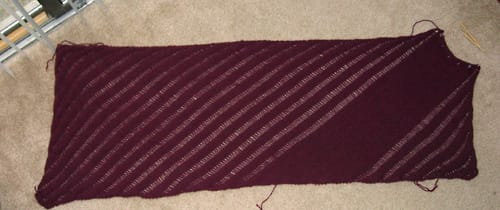

I am annoyed. Want to see why? (Ignore the decidedly bad picture quality; it's cloudy outside and couldn't get sufficient lighting, even with flash.)

See that unfinished bit at the upper right hand side of the picture? Yeah, it's going to stay unfinished until I find more of the Cascade 220 I used to knit this. I can't believe I ran out of yarn with just a few rows left to go. For those of you who have knit [Clapotis](http://knitty.com/ISSUEfall04/PATTclapotis.html), I'm on the last iteration on part 4 and then have maybe 10 rows of stitching after that, and now I have to buy a huge skein of yarn to complete this thing. What makes it worse is that I bought this yarn over Christmas when I was in Massachusetts, so I may have to give [WEBS](http://yarn.com) a call to see if they have any more in a specific dye lot. I knew I should have bought one more skein.

Still, I'm happy with how it looks. I knit this thing faster than I've knit most, though I still don't know what I'm going to do with it. I'm not sure shawls/wraps are my style, and it seems too big to be used as a scarf. Eh, either way, I'll find a use for it.
