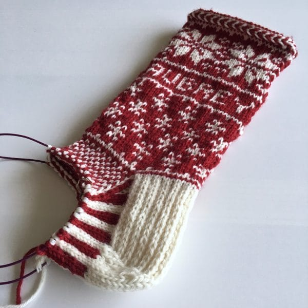

This past weekend was excellent. Much like last Saturday, I spent this Saturday in New Hampshire with some of my knitting friends. I hadn't seen a couple of them since 2014! We ate delicious food, caught up on our lives, and crafted all the things. I got home just after 9pm and I spent the rest of my evening knitting some more. A crafty weekend is the best kind of weekend.

I've spent most of my weekend knitting this project, the [Falling Snow Stocking by Jennifer Hoel](http://www.ravelry.com/patterns/library/falling-snow-stocking). I had initially started a different stocking, but the pattern called for sport weight yarn and I bought worsted, so the stocking was way too big. Nope. This one's a much better size so far. I don't have anything going tonight, and since we received a few inches of snow today, I'm hoping to finish this bad boy!

***

Here's a sneak peek at the other thing I worked on this past weekend:

This is a craft I haven't done in a long, long time, and I'm so excited I pulled out my tools this weekend! These will be for my NH knitting group's swap in a couple weeks and I'm looking forward to seeing my friends again. I have been to NH so many times this month, but since I'm seeing friends, I don't mind!

Sunday was filled with some of my favorite things -- tea, knitting, podcasts/vlogs, and Christmas music. I felt so productive and creating makes me so happy. There's not enough hours in the day for all the things I want to do, I swear! Hopefully tonight I create even more. I also need to wrap presents and I hope to make that creative, too. I love living a creative life.

