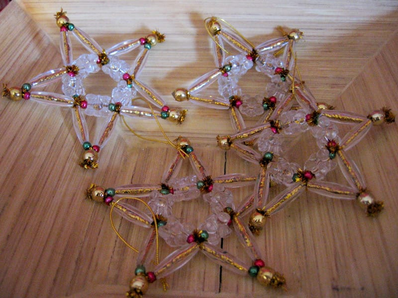
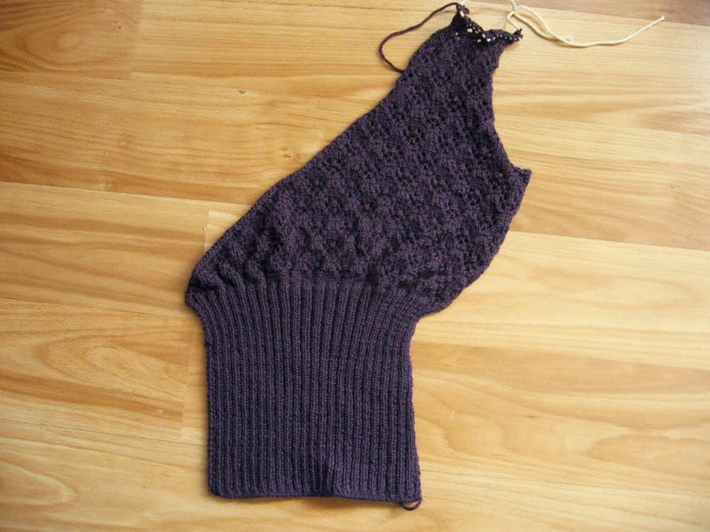
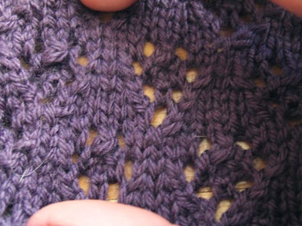
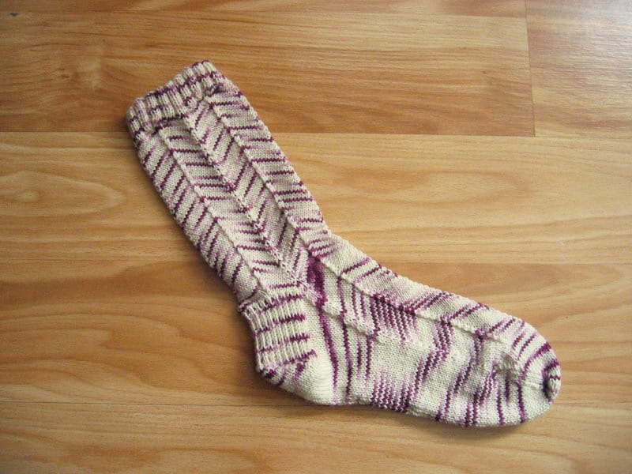

I've been quiet this week, mainly because I've been so tired after a day of work. Today's been a good day, mainly because I've been able to relax, get a few things done, and take time to update Wordpress to the 2.5 release candidate. (Which I'm digging so far. I really like the new look of the admin interface.) I love weekends.

***

I finished the left side of [Arisaig](http://knitty.com/ISSUEfall05/PATTarisaig.html) the other day. As I predicted, as soon as I finished the ribbing from hell, it took me maybe three days of casual knitting to get the top part done. The shaping on the top part of the left side differs slightly from the right; I decreased a little earlier on the left side than I did the right, but I don't think it will be too noticeable. We'll see what happens.

My biggest worry throughout this project is that this thing's going to be way, way too small for me. I keep on forgetting that this is a lace project, knit on tiny needles; therefore, once I block the pieces, they'll look a bit more normal in size.

***

I also finished my first [Jaywalker sock](http://www.magknits.com/Sept05/patterns/jaywalker.htm) a couple days ago. I met up with a new (to me) group of people in town on Wednesday and the sock flew off my needles as I sipped my hot chocolate and chatted with the new people I met. All in all, good times, and I'm halfway done with a cool looking pair of socks! It fit me perfectly as well, though due to the lack of stretch in the pattern, I had a difficult time putting the sock on and taking it off. Still, I'm looking forward to getting the second sock done.

***

Much to my dismay, we received a few inches of snow here yesterday and today. Even though I've lived in places that get considerable amounts of snowfall each winter, I still dislike it. I hate clearing off my car, driving in slush, and slipping on ice. I had hoped winter was over, but no. Not just yet. Hopefully now we won't get much more snow, but knowing this area, we'll have a blizzard in April. Winter, I'm so over you.

