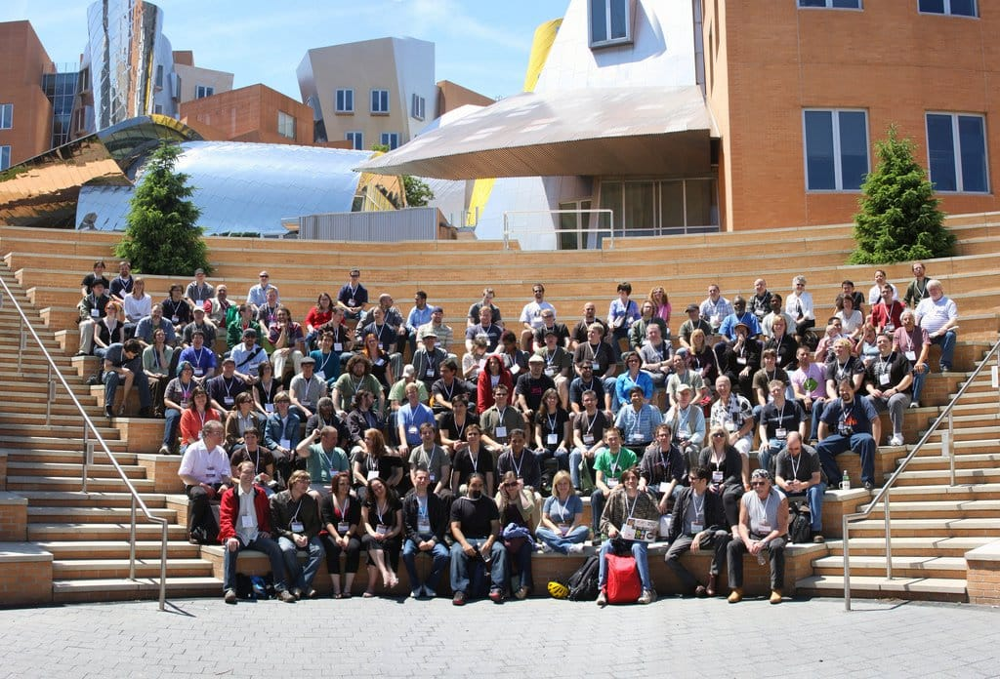

This weekend I attended my first ~~nerd~~ Drupal camp; [Drupal Design Camp Boston](http://boston.design4drupal.org)! When I first heard of this event I figured only locals from the New England area would make the trek to Cambridge, but as more and more people signed up, I found that people and companies from all over the country (and world!) were willing to make the trip to this area to meet up with fellow Drupal geeks. This made me think about just how community oriented this framework really is...

I've not been working with Drupal for long; I built a couple sites using it about a year ago, but I followed no set standards or practices. (My coworkers now would absolutely cringe over some of the things I did. I know better now, guys. But don't worry; even back then, I didn't [hack core](http://drupal.org/node/144376)!) When I started my current job about a month ago, I knew I needed to get up to speed on the system. I know CSS, I know PHP; I'm just not familiar with Drupal functions and the theming system. I figured this camp would be a perfect opportunity to learn more about this CMS and to meet a few people in the community. I was not disappointed.

On Saturday morning I woke up at 6:45 (yes, in the morning); way, way too early for this late riser, to make my way down to Boston from my apartment in New Hampshire. After debating taking the train, I decided to drive, only because the commuter rail I wanted to take wouldn't have gotten me to the conference in time. "I've driven around Chicago tons of times," I thought to myself as I loaded my things in the back of my car, "Boston shouldn't be much different."

Oh, how I'd eat my words (thoughts?) just an hour later as I circled the same stretch of road multiple times, anxiously searching for the correct exit after getting off the *wrong* one more times than I could count. I took one too many wrong turns and ended up driving over the Tobin Bridge to Chelsea, cursing as I paid the $3.00 toll for my mistake.

Somehow, after aimlessly driving around Cambridge for 45 minutes, I came across MIT and the venue, parked my car, and made it in time to converse with my coworkers for a bit before the keynote. Whew.

On to the camp. I attended a few great panels during the day on Saturday, my favorite being [mortendk](http://twitter.com/mortendk)'s "[Mothership: To End All Bloated HTML](http://boston.design4drupal.org/session/mothership-end-all-bloated-html)" session. I am a huge, huge proponent of clean, minimal HTML and CSS, and one thing I've noticed since starting with Drupal is that everything gets its own div. Everything. Nested divs make me want to throw things across the room and curse repeatedly. (Well, maybe not that extreme, but close.) Morten's Mothership theme interests me mainly because he strives for the same thing I do; for yummy CSS and HTML and nothing extraneous. In his words, his goal is to "to get so clean html you can wipe youre ass in it!" I like that. And I liked his presentation.

I also enjoyed my coworkers @sethcohn and D's session on "[Adding Wow, Bam, and Poof to your Design](http://boston.design4drupal.org/session/adding-wham-pow-and-boof-your-design)". I'm glad I came to work at a company with so many talented and intelligent people, who also like to have a good time!

Speaking of a good time, Drupal geeks love their beer. Just sayin'.

In all, I'm happy I attended my first of what I hope to be many more Drupal meetups. I met a few new people, including @zarabadoo, @thescaryclown, @timeril, @mortendk, @bedsheet, and at long last, after years and years of being friends through our blogs and other online forums, I met @nikkiana in person for the first time! The Drupal community consists of a lot of funny and intelligent people, and I look forward to meeting more of them in the future.
