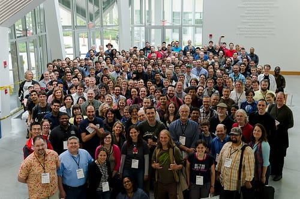

Last Saturday, I attended [Drupal Design Camp Boston](http://boston2011.design4drupal.org), an event I've been going to for the past few years. Throughout the years, I've participated, both as an attendee and as a [speaker](http://boston2010.design4drupal.org/sessions/theming-search-results-how-make-your-search-results-rock)! This is the first Drupal event I ever attended, so it holds a special place in my heart.

I'd been on the fence about going; I haven't been working with Drupal as much since I left my job as a Drupal themer/developer last year. I also hadn't even touched Drupal 7 and knew I needed to stay current for fear of really falling out of the Drupal loop.

I am so, SO glad I attended this year! I had forgotten just how much I love the Drupal community and meeting new people. I caught up with my old buddies [@bymiche](http://twitter.com/bymiche), [@himerus](http://twitter.com/himerus), [@susanmacphee](http://twitter.com/susanmacphee), [@lisarex](http://twitter.com/lisarex), [@finkatronic](http://twitter.com/finkatronic) and met up with a few new people, including [@geekgirlweb](http://twitter.com/geekgirlweb)! I had a great conversation with [@nikibrown](http://twitter.com/nikibrown) at the afterparty and hung out with New Hampshire Drupallers [@kbaringer](http://twitter.com/kbaringer) and [@hak42](http://twitter.com/hak42). So, so much fun!

I also attended a few great sessions; [@evolvingweb](http://twitter.com/evolvingweb)'s session on [how they built Travelocity's Allhotels CMS in Drupal](http://boston2011.design4drupal.org/sessions/building-travelocitys-allhotels-cms-drupal), Peter Farrow's [presentation on jQuery Mobile](http://boston2011.design4drupal.org/sessions/jquery-mobile-and-you-building-mobile-web-app-scratch-using-drupal), [@kenwoodworth](http://twitter.com/kenwoodworth)'s talk on [CSS3 and preprocessors](http://boston2011.design4drupal.org/sessions/css3-preprocessors-faster-easier-more-powerful-css), focusing on [Sass](https://sass-lang.com) (which I REALLY need to start using!) and lastly, [@himerus](http://twitter.com/himerus)' talk on [his Omega theme and responsive layouts](http://boston2011.design4drupal.org/sessions/adaptive-responsive-grids-html5-css3-future-drupal-theming-location-auditorium). Jake, your presentation rocked my socks off and I now want your madd Keynote skillz.

I came home from the day inspired and rejuvenated, eager to dive into Drupal 7 and some of the other technologies I learned about. I'm so excited, even now, and I'm so happy I braved the massive thunderstorms last Saturday morning to meet up with a bunch of talented, intelligent, friendly people. Thank you, #d4dboston!
