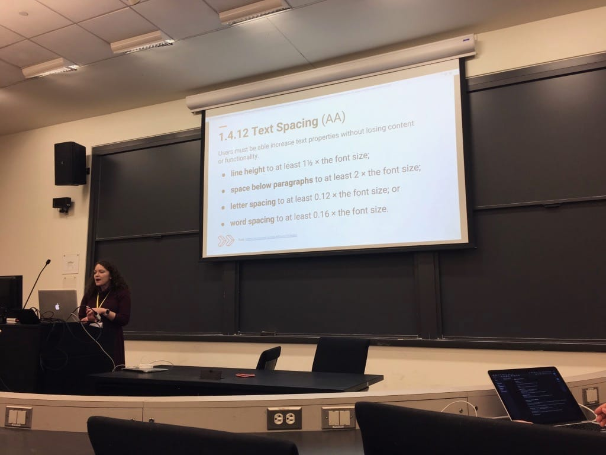
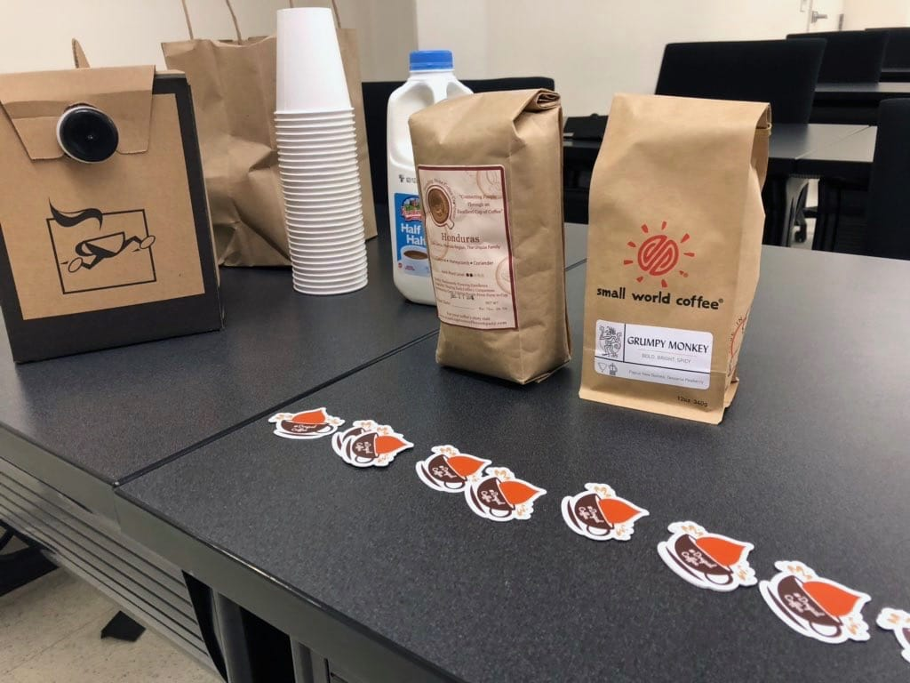
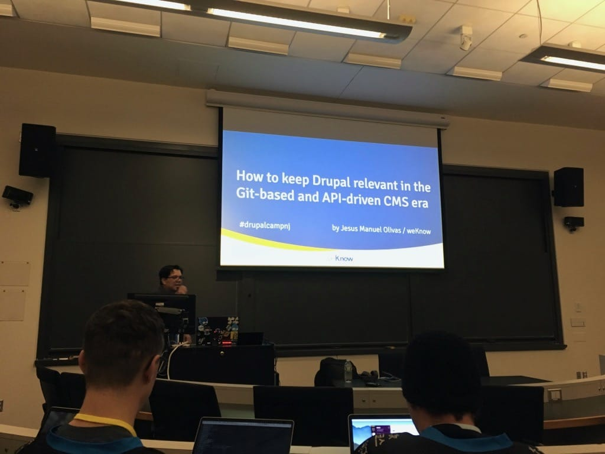

A few weeks ago, [Adam](https://phenaproxima.net) and I rode a bus, a subway, and a train to attend DrupalCamp New Jersey, my first time attending this camp at Princeton University. It's an _excellent_, excellent camp, and I hope to attend for many years to come.

We arrived on Friday evening after a day of travel. Who knew that taking a bus to New York City, taking a brief subway ride to Penn Station, then hopping on the NJ Transit to Princeton would take all day? As soon as we checked into our hotel, we were ready to see some of our Drupal buddies! We ended up getting a beer and some food at a place called the Ivy Inn, where we conversed with our friends and drank tasty brews. It was a nice, low-key way to kick off the camp.

The camp started bright and early Saturday morning. We hitched a ride with a couple other Drupalists who were also staying in our hotel, and we chatted with a few more people before heading off to the day's sessions. Signs labeled all the session rooms, the sprint room, and signs even directed people to the restrooms. I loved all the signage!

## The sessions

It wouldn't be a camp without attending a couple sessions! I ended up attending four, spending the rest of my time in the sprint room working on fixing this blog. Let's just say I've learned a lot about ESLint over the last few weeks...

### What’s new in WCAG 2.1 by Kara Gaulrapp

I want to learn more about ensuring the sites I work on are accessible, so this session on new things coming to WCAG 2.1 was right up my alley. Kara went over 17 new rules, including **orientation**, which means sites must be usable in both portrait and landscape, **reflow**, which means a website must be responsive without loss of content, and, my favorite, **content on hover or focus**, which means if a user triggers content, ensure that the content should be dismissed. A very excellent and informative session!

### Accessibility: Making your websites more inclusive by Christine Hickey

This session was also very informative and I loved the speaker's badass pink hair! She went over many different easy wins for making a website more accessible, including putting a background color on images so that if a user turns images off, the text and background still contrast well. She also discussed different accessibility tools such as WAVE and aXe. I'll be putting these tools to use for sure!

### Drupal Coffee Exchange

I belong to a little community called the Drupal Coffee Exchange, in which I'm paired with someone else and we send each other local coffee. At some conferences, real life coffee exchanges occur as well, and this camp was no exception. Sadly, I forgot to bring coffee to exchange, but Adam Bergstein (better known as [nerdstein](https://www.drupal.org/u/nerdstein)) bought a box of coffee from a local NJ coffeeshop to share with the participants. It was very tasty!

### How to keep Drupal relevant in the Git-based and API-driven CMS era by Jesus Manuel Olivas

I'm always a sucker for sessions that talk about Gatsby, so of course I attended this one! Jesus discussed using [Boina](https://github.com/weknowinc/drupal-boina), a Drupal 8 distribution that makes Drupal and Gatsby work together with very little effort. It looked pretty cool and if I ever wanted to play around with decoupled Drupal, I may reach for this.

### The new Layout Builder: Unleash the Power! by Ted Bowman

I hear a lot about Layout Builder, yet the concept never really made complete sense to me... until this session. Ted demonstrated the capabilites of Layout Builder, and seeing it live made me realize how _easy_ building site-wide layouts and layout one-offs will be once this becomes stable in Drupal 8.7. Care has been given to make Layout Builder as accessible as possible, and the usability is a lot better than I thought I'd be as well. Even I might start using Layout Builder in Drupal projects once it lands!

---

After the sessions ended, we headed to a nearby building to enjoy some food and delicious beers while talking more about the day, and after _that_, I headed out with a few friends to enjoy brews at [Triumph Brewing Company](https://www.triumphbrewing.com/). I always enjoy local beers at a local brewpub, and this place did not disappoint! I particularly enjoyed their Winter Wonder, a winter warmer that felt great to drink on a cold winter night. It was a fantastic time.

On Sunday, we spent a few hours at the sprint day, working on a few Drupal issues. I fixed my blog issues and ate some delicious NJ pizza before we had to catch our train back to NYC, and then our bus back to Boston. We were psyched that the Super Bowl was going on while were on the bus back home, as the roads were _empty_ and we got home earlier than expected! It's the only time I'll be happy about the Super Bowl.

All in all, I _loved_ this camp. Excellent sessions, excellent company -- I really want to attend again next year. I'm also excited about a couple other conferences coming up this spring, including [NERD Summit](http://nerdsummit.org/) in western Mass... and [DrupalCon Seattle](https://events.drupal.org/seattle2019) in April! I'm excited about all the conferences I'll be attending this year, and I'm happy I added DrupalCamp New Jersey to my conference shelf.
