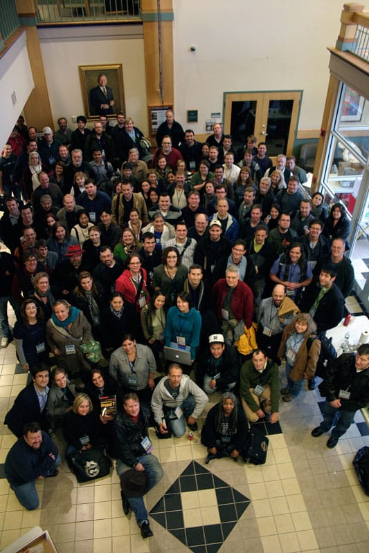

I've been in and out of the [Drupal](https://drupal.org) community for the past couple years. I worked extensively with the CMS from mid 2009 to mid 2010 when I changed jobs, and since that point, I've been playing with it here and there. I haven't been focusing on it as much as I should; I keep on seeing new technologies and think 'ooh, shiny!' However, every time I attend a DrupalCamp, I'm reminded how much I love the CMS, the community, and the awesomeness, and this time, I really want to make my way back to the community I love.

Anyway.

I woke up at the ungodly hour of 5:30am to drive to Manchester last Saturday morning. Yes, 5:30. I am surprised I not only woke up, but dressed myself accordingly and packed my overnight bag in almost complete darkness due to not wanting to wake poor Ted up. Sidenote: Ted's on off hours support sometimes. Last weekend was one of those times. He received a phone call at 12:30am about an issue, and he was on that call for THREE AND A HALF HOURS. He went to bed at around 4, so with me waking up an hour and a half later, I wanted to make sure he slept soundly!

Oh, another thing.

Weather stations in the area predicted a rare winter snowstorm for Saturday night, and on Thursday, I sucked it up and booked a hotel for the night. I did NOT want to chance driving the hour drive from Manchester to Portsmouth in a snowstorm. I wondered if I had made the right choice. Long story short? Yes, I did.

Back to the camp.

I arrived in Manchester at around 7:15, along with my fellow volunteers. Throughout the morning we set up the tables, talked to early arrivers, picked up coffee, and when the badges arrived, set them up on the registration table and started doling them out to registrants who arrived. It was hectic, but well worth it! I got to see many of my old friends — [Jake Strawn](http://twitter.com/himerus), [Michelle Lauer](http://twitter.com/bymiche), [Erich Beyrent](http://twitter.com/ebeyrent), [Chris Pliakas](http://twitter.com/cpliakas), [Kenny Silanskas](http://twitter.com/webkenny), [Jeannie Finks](http://twitter.com/finkatronic), [Susan MacPhee](http://twitter.com/susanmacphee), [Lisa Rex](http://twitter.com/lisarex), [Ryan Price](http://twitter.com/liberatr) — and talked to some new folks in the area as well. I also met [Diana LeRoi-Schmidt](http://twitter.com/criana) for the first time in person after being Twitter friends for a long time! I loved being a volunteer, for sure!

I attended a few great sessions. My favorite of the day was Erich Beyrent's session [Hack-Proof Your Drupal App](http://drupalcampnh.org/sessions/hack-proof-your-drupal-app), in which I learned most Drupal vulnerabilities lie in the theme layer! This made a perfect talk for me to attend, as honestly, I'm not great with security practices and the talk gave me some great ideas to protect my themes from unwanted attacks. I also attended Chris Pliakas's talk on [Why Drupal Projects Fail](http://drupalcampnh.org/sessions/why-drupal-projects-fail-breaking-down-barriers-successful-drupal-adoption), and I loved hearing his insight and I've always loved his talks!

I also ended up helping Michelle with her [Ask the Experts: Site Building](http://drupalcampnh.org/sessions/ask-experts-site-building) session on a pinch! I wasn't very well prepared for actually speaking at the camp this year, so hopefully I wasn't too terrible last week! I made my speaking debut at DrupalCampNH last year and [I spoke at Drupal Design Camp Boston in 2010](http://boston2010.design4drupal.org/sessions/theming-search-results-how-make-your-search-results-rock), so I'm at least not new to the speaking in front of others thing. Hopefully next year I'll present again, now that I'm becoming more involved in the community again!

The rest of the camp went off without a hitch. However, at around 3:30, snow started falling, and by the time the camp ended at 6:30, the roads were awful. (However, I did win a copy of the awesome [Definitive Guide to Drupal 7](http://definitivedrupal.org), signed by none other than [Ben Melancon](http://twitter.com/mlncn)!) I've never, ever seen this much snow so early in the season, and I'm always nervous about driving when the first snowfall of the year comes. Still, I wanted to hit the afterparty at Milly's Tavern, so 15 minutes later after driving about 20mph through unplowed side streets in Manchester, I arrived.

I love Milly's beers, especially their Pumpkin Ale! I'm not big on pumpkin beers for the most part, but I enjoyed this one. I enjoyed the cinnamon on the rims, until the cinnamon started running down the sides of the glass, making my hands sticky. Still. Awesome beer! Even more awesomely, all the beers were free. One of the best parts of this DrupalCamp, though, of course, it's still second to talking Drupal with people at the party.

After a long, fun day of Drupal, I made my way down to my hotel. This drive was especially awful, punctuated with bright flashes of light either from lightning or transformers exploding. My car slipped and slid throughout the drive, and I felt relieved when I reached the hotel. My car got stuck in the parking lot, but I finally managed to secure a space. Whew.

When I finally made it to the front desk, though, I was greeted with unfortunate news; the hotel had lost power. "There's another hotel with power right down the street off of the major interstate," the woman at the front desk told me. "I'm not going back out there tonight," was my reply. NO WAY was I driving out there again, so I sucked it up and stayed in a powerless hotel that night. Let me tell you, walking down a pitch black hotel corridor with nothing but a flashlight to light your way is just a little on the creepy side!

I went to sleep when I got to my room, and woke up the next morning to sunlight. Who needs power?

Thankfully my drive back to Portsmouth a few hours later was uneventful. I made a good call waiting until the next day to drive back, as the road from Manchester to Portsmouth was pretty much plowed. And, of course, when I arrived home, I found that we'd never lost power at our apartment and all the snow was almost melted. I was amazed at the difference!

All in all, DrupalCampNH kicked ass! It's reaffirmed what I already knew; I need to get back into Drupal. I need to change this blog back to Drupal and I really want to attend DrupalCon Denver in March. I'd love to get back into the community and start doing more to help! This time, I really want to stick with it.

