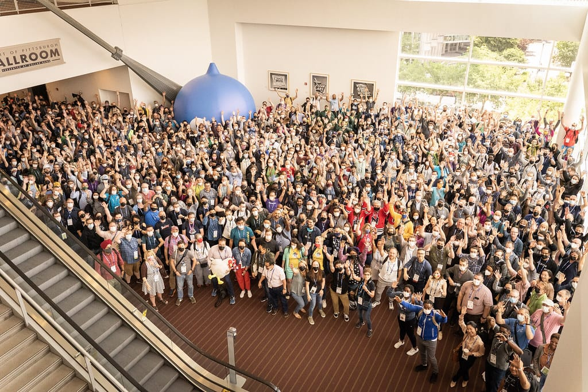

A couple weeks ago I attended DrupalCon Pittsburgh, a conference I look forward to every year. I had never been to Pittsburgh before this conference and I dug the bridges and rivers and hills! I only wish I had explored the city more than I did.

This year’s DrupalCon felt different than last year’s due to sessions occurring only on Monday and Tuesday, with contribution day on Wednesday and training and summits on Thursday. I went home on Thursday so the conference felt way too short to me—next year, I want to arrive a day earlier and leave on Friday so I get the full conference experience.

Even though I didn’t get to see all the sessions I’d like (that’s what the [recordings](https://www.youtube.com/playlist?app=desktop&list=PLpeDXSh4nHjTZrlCUtl_xp87F3plT7czE) are for!), I still enjoyed my time in Pittsburgh.

## Sunday: Pre-conference
I woke up bright and early at 3am to catch a 6am flight to Baltimore and then Pittsburgh. I arrived in Pittsburgh at around 12:30, caught an Uber with some coworkers, checked into the hotel, then headed down to the expo hall to help with booth setup! I always love the Lullabot booth and our DrupalCon T-shirts are always the best. I’m not biased or anything!

After setup, a few of us ventured to The Standard, and that became the place for the rest of the ‘Bots to gather as our group eventually expanded to take up multiple tables! I’m so glad we all got together at the same place and I enjoyed some tasty wings and brews.

## Monday: Conference Day 1
I woke up bright an early on the first day of the conference and after a delicious coffee and pastry from La Prima Espresso, we headed to the conference center. I felt so happy to be back in my element, with all my favorite people, walking around the conference center and seeing so many people I knew. I loved it.

I also attended a few sessions on Monday:

### [Playing as a Team: Strategies for Better Communication](https://events.drupal.org/pittsburgh2023/session/playing-team-strategies-better-communication)
Overall, I think this was the best session I attended at DrupalCon this year! I loved hearing more about non-violent communication and radical candor and I look forward to digging into these topics more. In all, trust and psychological safety is important in a team and the two speakers demonstrated this beautifully.

### [Driesnote](https://events.drupal.org/pittsburgh2023/session/driesnote)
It’s not DrupalCon without a Driesnote! This year’s felt different than other years, as it started with a Q&A session with members of the Drupal Association (including the new CEO, Tim Doyle) and ended with a vote on which Pitch-burg projects to fund. I always find the Driesnote fascinating, but this one really didn’t have a Drupal roadmap like in previous years. Either way, I enjoyed it.

Other sessions I attended on Monday:
* [Wartime remote work. A superpower that we learned while being under unique circumstances](https://events.drupal.org/pittsburgh2023/session/wartime-remote-work-superpower-we-learned-while-being-under-unique)
* [Beyond WCAG Compliance: Next Steps in your Website’s Commitment to Digital Inclusion](https://events.drupal.org/pittsburgh2023/session/beyond-wcag-compliance-next-steps-your-websites-commitment-digital-inclusion)

### The Lullabot party
My company, Lullabot, threw Monday night’s conference after party and it was a blast, and not only because I won at duckpin bowling! Arcades, tasty food (I want those shrimp fritters again sooooo much), plenty of outdoor seating, and great conversations with so many awesome people—what’s not to love? I had such a good time and I hope we always throw our party at the end of DrupalCon’s first day!

## Tuesday: Conference Day 2
I started off my day with a delightful breakfast at Alihan's Coffee and Breakfast with a few of my Lullabot colleagues. So tasty and the company was obviously great too! 

We headed to the convention center after finishing and started our day. Here’s what I attended on Tuesday:

### [Designing Content Authoring Experiences](https://events.drupal.org/pittsburgh2023/session/designing-content-authoring-experiences)
I got to hear my colleague Greg talk about content authoring experiences and give a preview of his upcoming book (which I can’t wait to read!). I love attending my colleague’s talks because it reminds me over and over again that I work with such amazing people. Greg’s talk makes me want to learn everything I can about content authoring experiences so I can help my clients with theirs.

### [Keynote: Women in Tech and Tech Leadership Today](https://events.drupal.org/pittsburgh2023/session/keynote-women-tech-and-tech-leadership-today)
For lunch, I attended a Women in Drupal talk. I ended up getting to this talk late because it took forever and a day to walk from the expo hall to the area were the sessions were held, plus I might have gotten a little lost! I really enjoyed being in a room with a bunch of other women in the Drupal community and I’m glad I attended.

### [Habits of an Effective Drupal Contributor](https://events.drupal.org/pittsburgh2023/session/habits-effective-drupal-contributor)
Apparently I couldn’t get enough of my colleague’s talks, so I attended Matthew Tift and Owen Bush’s talk on being an effective contributor to Drupal. They both have years of experience contributing, so they bestowed their knowledge on the rest of us (and added ~~a bit~~ a lot of humor, too)!

### The CivicActions party
After a delicious Thai dinner with the team, I attended the CivicActions party, held on a rooftop deck with amazing views of the city. This party was a LOT of fun because the weather was perfect, the drinks were great, and I didn’t have to walk very far to get there. I was glad to attend a lower key party than our party had been the previous evening, and I really enjoyed conversations with fellow ‘Bots.

## Wednesday: Contribution Day 
I got a later start to the day on Wednesday, but I started my day by attending the Drupal Association membership breakfast. I missed the opening remarks, but I enjoyed a tasty breakfast with fellow members!

Since Wednesday was mainly a contribution day, I only attended one session, which was the [Drupal Initiative Leads Keynote](https://events.drupal.org/pittsburgh2023/session/drupal-initiative-leads-keynote). It was cool to hear more about Single Directory Components and Admin UI improvements, and I’m excited to help Cristina with the latter.

I spent the afternoon… well, not contributing as much as I wanted, mainly because I was tired and didn’t really know where to start. Instead, I conversed with a few coworkers. Hopefully at next year’s DrupalCon I contribute more!

I didn’t end up attending an afterparty on Wednesday night, but I DID lead a large group of 15 people around the block to find dinner, eventually ending up at a taco place we originally discussed. Hey, we all got a walk around the block, at least! 

We then continued onward to Aslin Beer Hall, where we met up with a group of Drupallers and we all conversed into the night. I spent a few minutes in the lobby before heading to bed, as I was flying home the next morning.

***
In all, I enjoyed this year’s DrupalCon, though looking back, I wish I had done more contributing (and I wish I had taken pictures to fill out this post!). My favorite part of the conference, as always, was seeing friends and coworkers, and I cherished every single conversation I had with my favorite people. Well, the contribution room is always there, so Portland, I’m coming for you in 2024!
