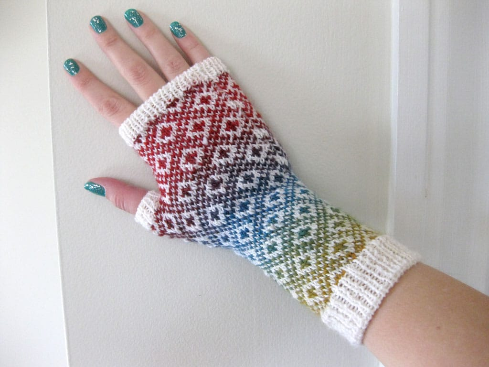
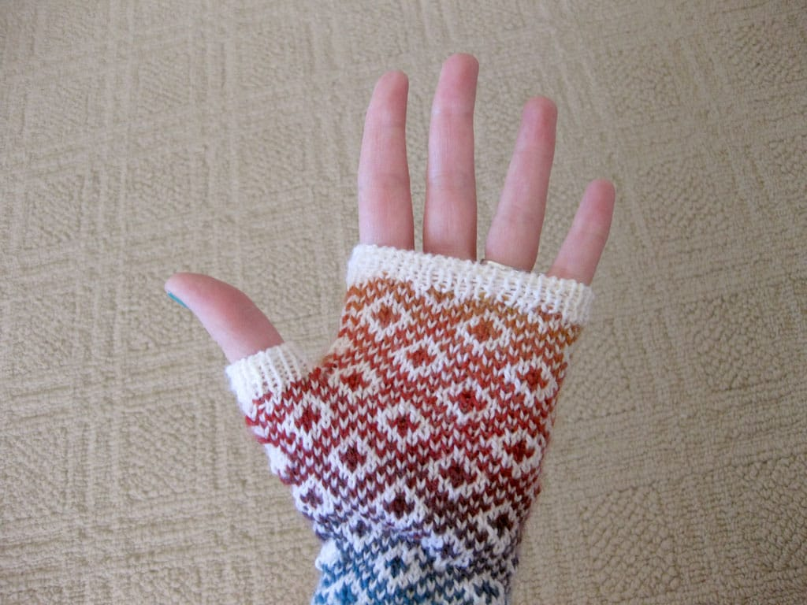
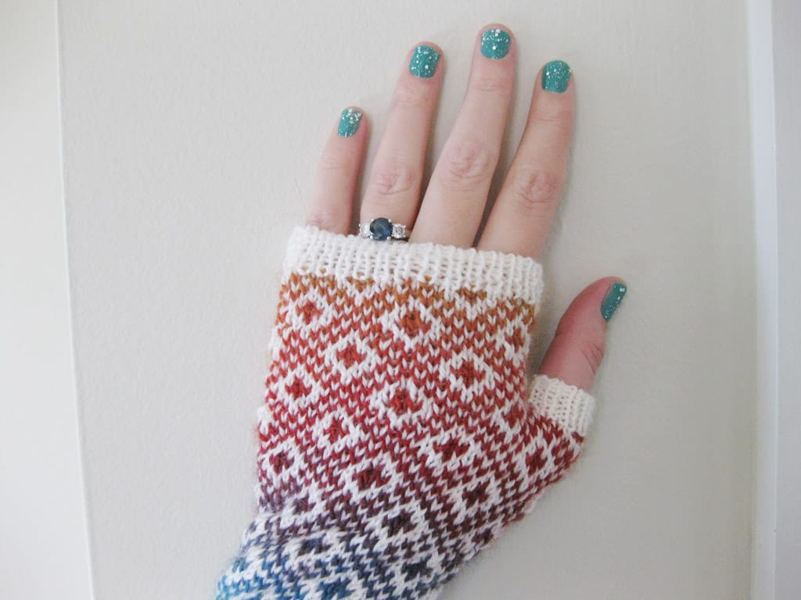

Hey, look! A post that's not about running!

I've wanted to knit my own pair of [Endpaper Mitts](https://www.eunnyjang.com/knit/2006/11/endpaper_mitts.html) for years. In 2011, I finally figured out a color combination when I received a skein of rainbow [Mini Mochi fingering weight yarn](https://www.ravelry.com/yarns/library/crystal-palace-yarns-mini-mochi) during a yankee swap. Add a skein of white yarn to *really* show off the rainbow-ness of the Mochi? Yes. I was sold.

I knit these bad boys faster than anything else I've ever knit. Seriously. I went from none to done in *two weeks*. For me, the slowest knitter ever, finishing anything in two weeks is an exercise in futility. I think I just liked the pretty rainbow color changes as I knit.

This project forced me to learn a new cast on method - the [Italian tubular cast-on](https://slowknits.com/2006/07/tubular_caston_without_the_was_1.html). As a left-hander who also knits left-handed, new techniques can be a little... hard to learn. Thankfully I came across [a video showing how to do this cast on as a left hander](https://www.youtube.com/watch?v=C5LlqImwQVM), and I'm eternally grateful because there is NO WAY I could have done this without a video. Yikes.

Also, one mitt ended up larger than the other because I switched up my stranding method after finishing the first one. Since the difference isn't really noticable, I won't redo them. I'm too happy with them to ever want to frog them, anyway! Now, I just need to block them...
