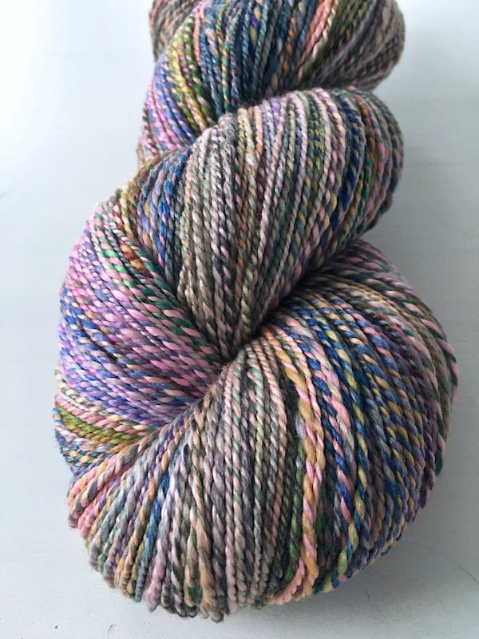
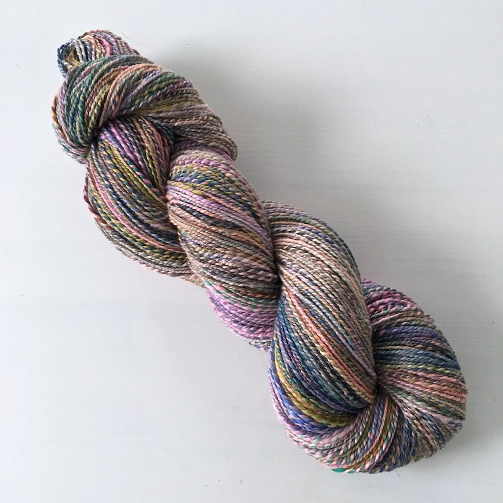

Hooray, I've completed my first spin of 2016, and I am in *love* with it!

I wasn't sure what to expect when I started spinning the September 2015 club colorway from Hedgehog Fibres. I loved all the colors - the bright shots of magenta, splashes of navy, vivid hints of chartreuse - but I wasn't sure how those colors would look spun up, especially after I plied it on itself.

I'm pleasantly surprised.

The fiber, a merino-silk blend, wasn't the easiest to spin. I dislike spinning silk because I find it too slippery, but I do like the sheen it adds to the finished product. I have about 342 yards of a fingering weight yarn, so I'll probably make a shawl out of it at some point. I'll have to think about what this will become.

I'm so happy to be spinning more again. I've missed spinning so much.
