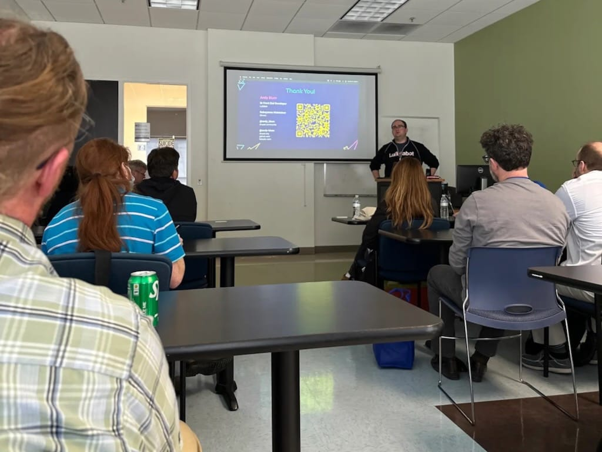
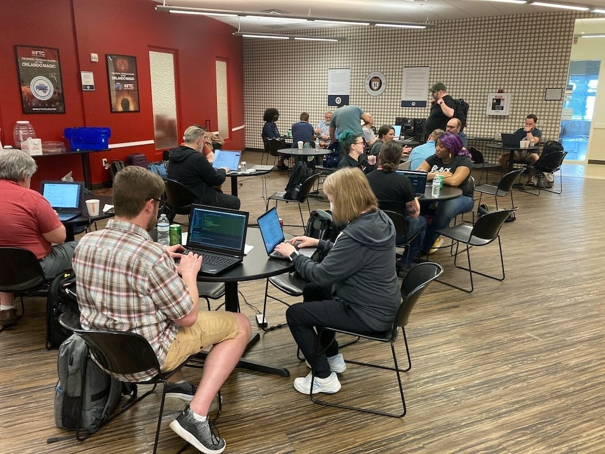

A couple weeks ago I finally attended [Florida DrupalCamp](https://fldrupal.camp/), a camp I had wanted to attend for years! Not only was it the first time I attended, but it was my first time speaking at this conference and my first time speaking at *any* conference since [New England Drupal Camp in 2019](https://www.star-shaped.org/nedcamp-2019/)! It was such a fun camp and I got to see some of my favorite people in the Drupal community.

## Thursday: Arrival
I flew in on Thursday afternoon and immediately got drinks to kick off the camp—it was great to catch up with some people and enjoy a tasty Florida beer in a low key environment! After a couple other coworkers arrived, we all made our way to a Korean BBQ place and we enjoyed so much delicious food and sushi. I ended the evening by going to the same ‘low-key’ bar I had gone to when I first arrived, but it turned into a college student drink haven at night! We shouted at each other over music too loud for this old lady and got back to the hotel at a reasonable hour.

## Friday: Training and contribution day
I didn’t attend any trainings on Friday, but I did want to attend the camp to work on my session, learn how to contribute code to Drupal using merge requests, and of course, talk to people! I ran errands with my old pal and former coworker [Mike Herchel](https://herchel.com/), and he showed me and my current coworker / session co-presenter [Adam Varn](https://adamv.micro.blog/) the ways of the merge request! I finally got the hang of it after Mike showed me, and it came in handy on Sunday during the contribution day. We ended the day with a couple drinks and great conversation.

## Saturday: Session day!
After a fun couple days hanging with coworkers and Drupal friends, it was time for the camp to officially start! After picking up my badge and attending the opening announcements, I attended a lot of fantastic sessions.

### Working with Layout Paragraphs: an Easy-to-Use, Drag-and-Drop Content Editing Tool for Drupal by Justin Toupin

I’ve used Layout Paragraphs in a project before and I’ve liked it, so I was interested to hear how others used the module and any best practices to follow. To be honest, I don’t remember much about this session because this was right before our session, but from what I can recall, I thought this session was pretty informative.

[Read more about Justin's session and watch the recording.](https://fldrupal.camp/session/working-layout-paragraphs-easy-use-drag-and-drop-content-editing-tool-drupal)

### New things we love and more things we want in CSS by Adam Varn and… me!

I had so much fun giving this talk and nerding out about CSS with Adam and the people attending the session! We talked about awesome new CSS goodness such as container queries (supported in all modern browsers as of February 14th, 2023!) and :is and :where, and things we want such as subgrid and color-contrast. We ran into a technical difficulty with our slides, but we recovered (fairly) gracefully and continued on with the session. I’m so glad to be back in action speaking at conferences!

[View our slides and watch the recording!](https://fldrupal.camp/session/new-things-we-love-and-more-things-we-want-css)

### Accessible JavaScript In Action by Andy Olson

I met Andy a few years ago at Design 4 Drupal Boston and he started working on my client team the week of the camp, so of course I wanted to check out his session on accessible Javascript! He talked about accessible navigation and modals and I really want to use his navigation techniques on our project.

[View Andy's slides and session recording.](https://fldrupal.camp/session/accessible-javascript-action)

### Next Drupal admin UI improvements by Cristina Chumillas

Cristina spoke to a full house about new improvements in Drupal’s UI and ways to contribute! She discussed an initiative to create a new dashboard for the Drupal admin pages and urged people to help out with the CSS modernization initiative. It was a great session and I came away from it excited for the future of Drupal.

[Watch Cristina's session and find out how you can help!](https://fldrupal.camp/session/next-drupal-admin-ui-improvements)

### The 10 Most Useful Libraries in Drupal 10 Core by Andy Blum

Andy’s a great speaker and I always enjoy attending his talks! In this talk, he listed some useful libraries in Drupal core such as once() and debounce(). I absolutely loved his slides, too, and it was a great session to attend at the end of the day.

[Learn about all the libraries by watching Andy's talk.](https://fldrupal.camp/session/10-most-useful-libraries-drupal-10-core)

### Lightning talks

We ended the day with lightning talks! People who wanted to participate wrote their name on a whiteboard and each person spoke for about 10 minutes about pretty much anything. One person talked about ChatGPT, another showed off a cool robot, and Mike Anello discussed his grievances with Drupal. It was funny and fast paced and I really enjoyed it!

### Afterparty!

After the lightning talks, we all headed over to the afterparty, a venue with bowling, axe throwing, corn hole, beer pong, and many other games! After a few hours of fun, we ended the night by checking out a dive karaoke bar in what felt like the other side of town. It was a great way to close a pretty fun day.

## Sunday: Contribution day
On Sunday morning I got up, checked out of the hotel, and made my way to the venue. I spent the majority of the day participating in the [CSS Modernization Initiative](https://www.drupal.org/project/drupal/issues/3254529), updating Drupal’s 10’s CSS to be more modern after dropping IE11 support. Now we can use CSS custom properties, logical properties, and even nesting with the magic of PostCSS! I was super jazzed to be refactoring code and using some of the techniques I had discussed the previous day.

After a long, fun day of coding, chatting, and eating pizza, I flew home, returning to a harsh New England winter after a few days in sunny Florida. I’m so glad I finally attended Florida DrupalCamp and I hope to attend (and speak!) again next year!
