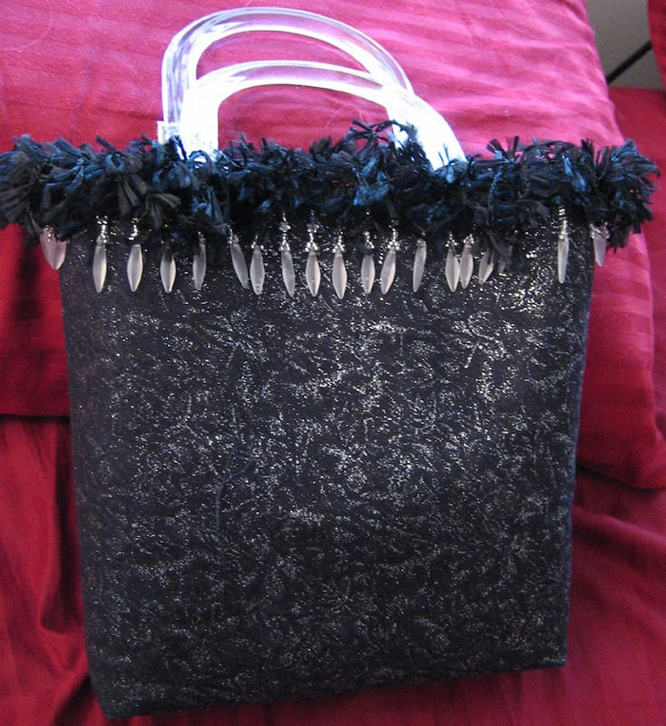
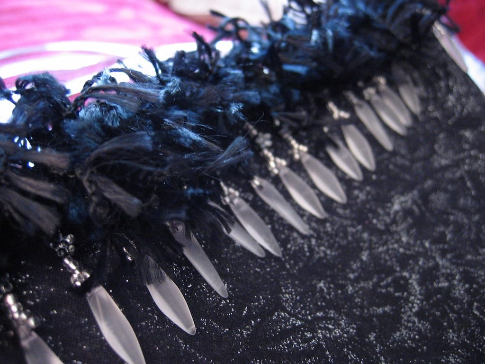
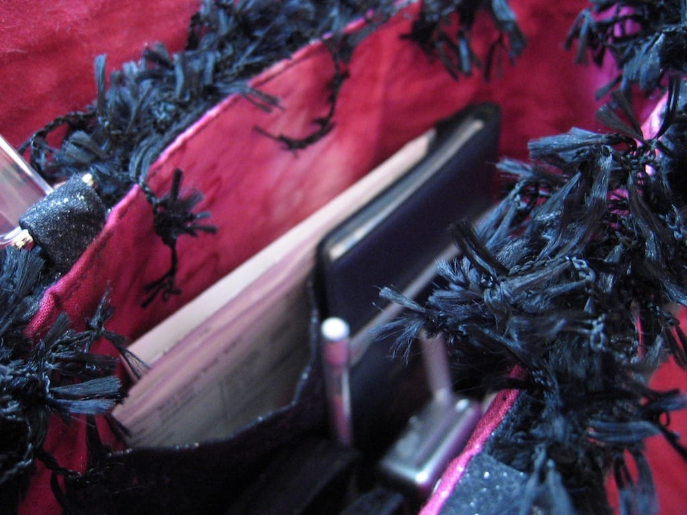

Scott and I spent the weekend at his parents' house; I brought my sewing machine over per his mother's request and learned how to sew a few things.

I've needed a new purse for a long time; I wanted to craft my own instead of buying one to add my own personal touches to it. Scott's mother's always making herself a new bag and I liked the look of them, so I asked if she'd teach me how to make my own. A few hours and scraps of fabric later, I completed my new purse.

It holds much more than my old one but is not bulky or too big, and I can use it either as an everyday bag or as one to bring out for a night on the town. I'm very pleased.

I'm loving this thing so far, and I love knowing that I'll be able to fully make my own the next time I need a new purse!
