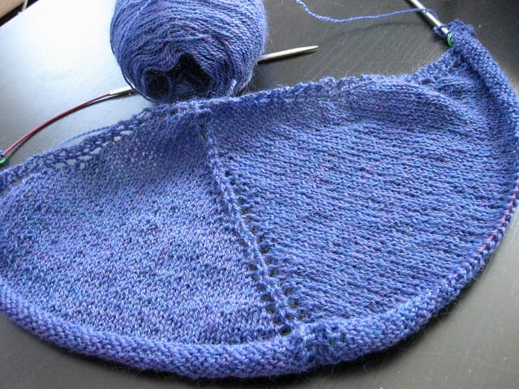
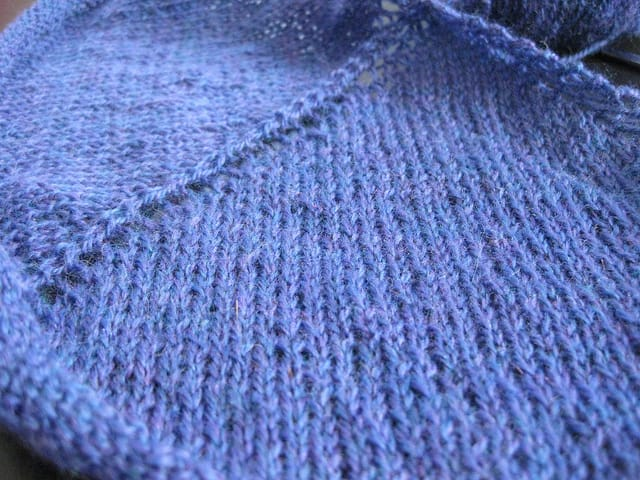

I haven't really been posting much about my knitting these days. Suffice it to say, I'm still making things.

I'm making the [Ginkgo shawl](http://www.southernselkie.com/blog/2011/01/ginkgo-shoulderette-shawl-free-knitting-pattern/) for Ted's mother for Christmas. I'm fairly certain she does not read my blog, as she doesn't really frequent the internets, so I'm safe to post it here. (If not, hi Ted's mom! Hope you like the gift I'm knitting for you!)

I found this pattern through my friend Kelly, who emailed myself and another knitting friend a question about the chart. I believe I forgot her question when I set eyes on the shawl! I knew I needed to knit it, but I'm still having a hard time rocking the shawl look. I need to learn how to artfully drape a knit shawl around my neck so I can wear them that way. Hopefully I can learn this art sometime soon. For now, I'll knit shawls for other people, mainly those I like a whole lot.

So far, this pattern's been a breeze. It looks pretty boring right now, but I'm fine with boring knitting if I can get this thing done before Christmas! I've been knitting on it here and there, whenever I have a spare minute or two, and I'm making decent progress. I can't wait until I get to the end.

