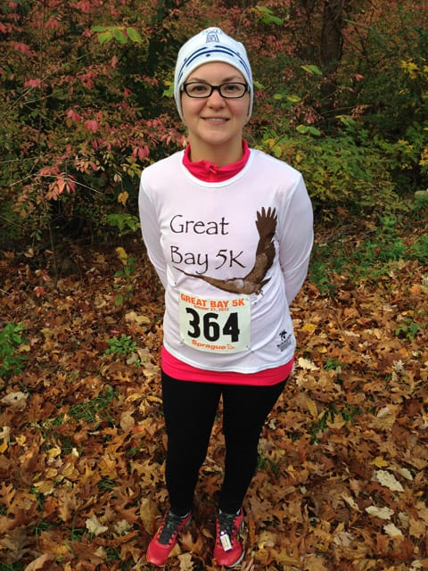
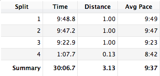

I recall thinking, [after running the Great Island 5k two weeks ago](/posts/great-island-5k-race-recap), that I'd need to postpone my dreams of a sub-30 minute 5k to 2014, as no way could I run a fast (for me) 5k so soon after my ankle healing.

After yesterday's race, **that goal is alive and well**.

I awoke yesterday morning to below freezing temperatures. 28 degrees? Really? I pulled on a pair of tights I haven't worn since the early spring and added a long sleeved shirt, and brought along my brand new Great Island 5k hat to keep myself warm before the race.

The race started just after 9am, and while I felt cold when I started, I didn't feel terrible. I didn't feel terrible during the *entire* race, honestly. I kept at a steady pace of about 9:50 for the first two miles, and picked it up to about a 9:20 pace for the last mile. I couldn't believe how *good* I felt during the race, especially since I haven't been training and I sure haven't been running very consistently the last month and a half.

As I rounded the corner to the finish, I noticed my time and realized I could possibly finish the 5k in under 30 minutes. With the last .1 of a mile to go, I sped up, hoping to reach my goal. Even though I felt tired, I seriously hauled toward the finish.

I finished the race, and I glanced at my watch.

**30:07**.

It wasn't sub 30, but it *was* a new PR. I looked again in disbelief. After my 34 minute 5k just *two weeks ago*, I finish this one in 30? I couldn't believe it.

<drupal-entity alt="Great Bay 5k splits" data-caption="My splits." data-embed-button="media_browser" data-entity-embed-display="media_image" data-entity-embed-display-settings="{&quot;image_style&quot;:&quot;&quot;,&quot;image_link&quot;:&quot;&quot;}" data-entity-type="media" data-entity-uuid="92255bdf-7ca6-4d71-ade8-b3125641bed2" title="Great Bay 5k splits"></drupal-entity>

I'm signed up for two more 5ks before the end of the year. I am **so** close to a sub-30 5k. **I can do this.**
