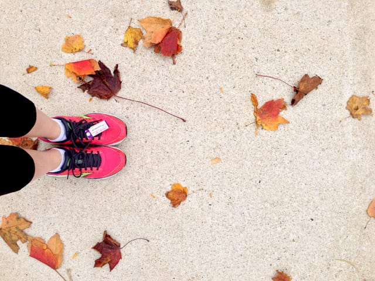
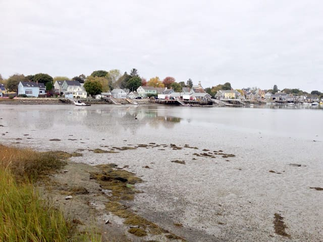
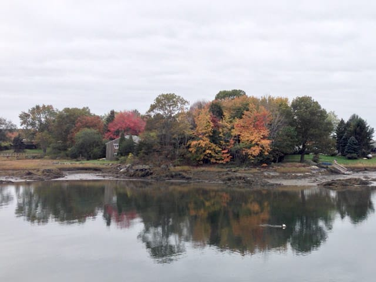

First 5k since July? Check. First 5k since I hurt my ankle last month? Double check. First time I've run more than 2 miles since September 17th? Yes. Triple check.

Today I ran the [Great Island 5k](https://www.greatisland5k.org) in New Castle, NH. Some of my training runs take place on the road from Portsmouth to New Castle, so I'm familiar with some of the roads through this tiny town.

I stressed out about this race today, because I only started running again last Sunday. I ran only twice this past week - Sunday and Tuesday, and I only ran about 20 minutes each day to ease back into running. So, yeah. Wasn't sure how today would go.

Of course, I was fine. I got to the race 10 minutes before start time, lined up, ran, finished. Enjoyed the beautiful ocean views and inhaled sweet salt air. I ran a very slow **34:22**, my slowest 5k time this year, but my ankle didn't bother me. That's what counts, and that's what rocked.

**What wasn't so great?** The walk to and from the race itself! I walked from my apartment to the start, and, well, it's a *3 mile* walk. So, yeah. 3 mile walk to the race, the 3.1 mile race, then another 3 mile walk back home. 9 miles may not be much for some people, but I, not having trained to travel 9 miles by foot, am feeling it now. Beer and knitting? To the rescue!

Though I wasn't exactly a speed demon today, I enjoyed this race so much. This is my first time running a race in the fall, before the leaves fall off the trees, so I appreciated the beauty as I ran. Plus, I always love seeing families running together! This race didn't feel super competitive, and I enjoyed taking it easy.

I'm happy about today.
