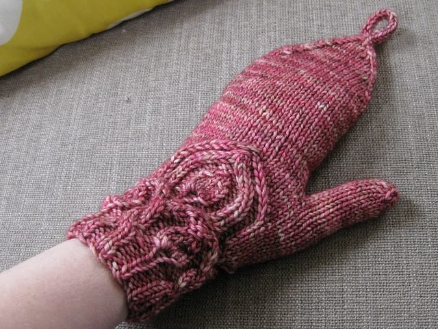
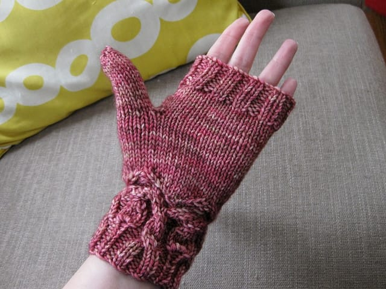
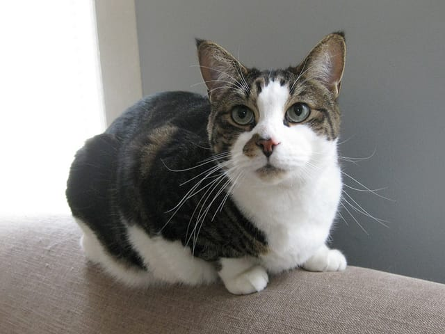

I should write about how I finished my first [Snapdragon flip top mitt](/posts/mitteney-goodness), right? Right. I'm only just a week late in posting it. But! I knit, and knit, and knit, and weaved in WAY TOO MANY loose ends, and here it is. Done.

Done!

To say I love how these look is grossly underestimating how I feel about these mitts so far. I loved my first pair, but I LOVE this pair so much more. They fit better, the stitches stand out more with the color I used this time... I could go on and on. I just can't wait to be done with the second so I can proudly wear my awesome pink mitts outside in the... uhh, warmish weather we're having up in New England.

Anyway.

What's a knitting post without a cute picture of a cat? Oh boy, I'm falling into the stereotype of being a knitter who posts pictures of her cats on her blog. I won't do it often, I promise.

This guy was very interested in my camera strap while taking pictures of my mitts. Of course, I had to take a picture of HIM, too. He didn't seem too pleased with that.

Until I finish the next mitt...
