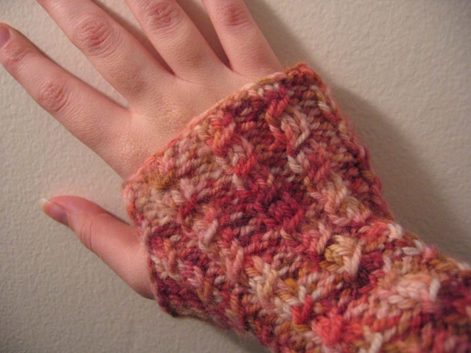
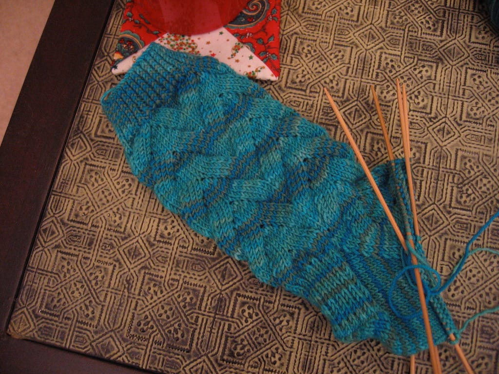
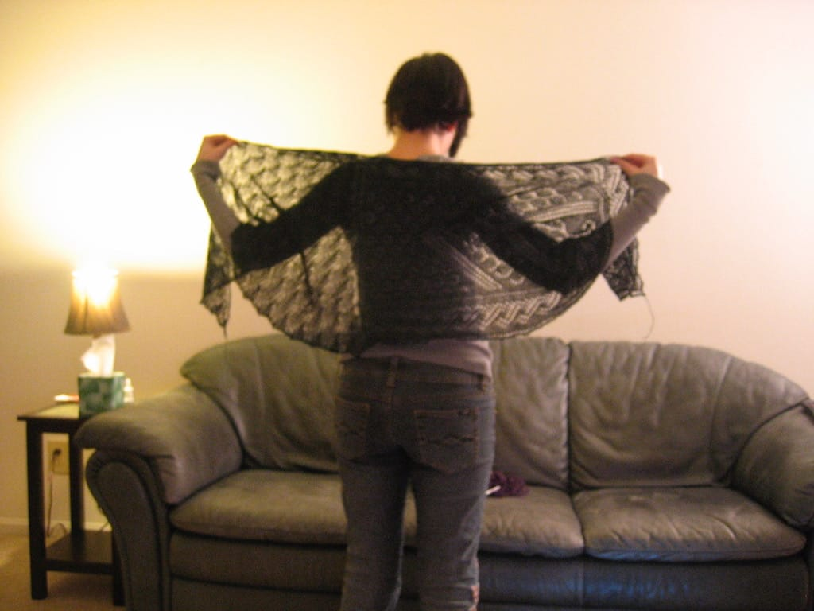

So, it's been awhile since I've posted any of my knitting here. Knitting has kept me sane the past few months when life has been nuts, and I'm grateful that I found a hobby that keeps my hands busy!

Sometime last month I finished a pair of [A Little Twist Wristwarmers](http://slumberland.org/wp/2006/02/16/pattern-a-little-twist-wristwarmers) after I saw one of my fellow NaNo-ers wearing them at a meeting sometime in November. I LOVE them. I used yarn I bought at Michigan Fiber Fest a few years ago; of course, I can't remember what it's called, but it reminds me of neopolitan ice cream, in a way. I love how these turned out and a few of my other friends have knit some for themselves, too!

I'm also knitting a pair of [No-Purl Monkeys](http://knitty.com/ISSUEwinter06/PATTmonkey.html) (It's this pattern, except you don't purl where it tells you to. Yes, be a rebel and DON'T follow the pattern!), and so far I'm loving this pattern too! I also love the yarn I picked for the project. I took it off my mom's hands last time I was home, so of course, I have no idea what the yarn is. (See a pattern here?) I'd love to get these done sometime soon, but I'll probably end up saving some of it for my flight home for Christmas. That would be nice. Either way, the Monkey socks are fun.

This is sort of a craptastic picture, but look, it's me sort of modeling my [Swan Lake](http://pinklemontwist.blogspot.com/2007/09/swan-lake.html) stole! I still have no idea where I'll wear this, but I still love how it came out. Maybe if I ever dress up and the dress happens to coordinate with the stole, I'll take it out with me. Maybe.

I've also picked up [Arisaig](http://www.knitty.com/ISSUEfall05/PATTarisaig.html) again; I put it away for a few months after knitting a sleeve and realizing it was way, way too big for me. Now that I've calmed down, I'm starting over, this time hopefully knitting a sleeve in the right size! And then a second sleeve in the right size! I'm apparently full of hope and optimism over this! But I do love the pattern.

So much knitting, so little time...
