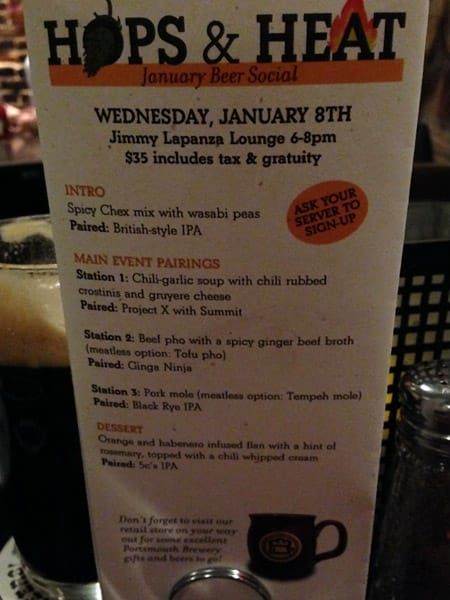
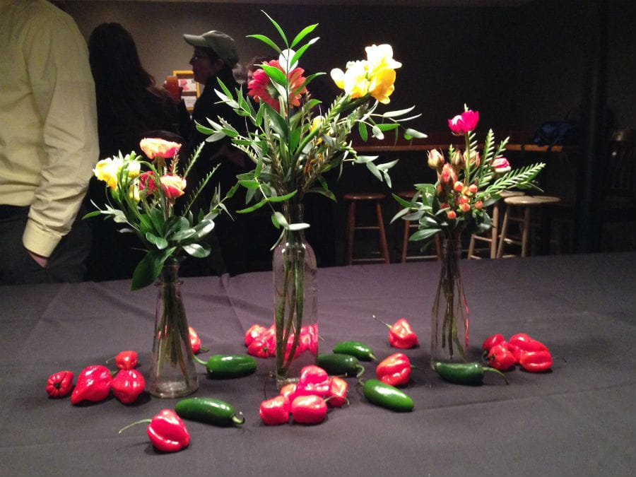
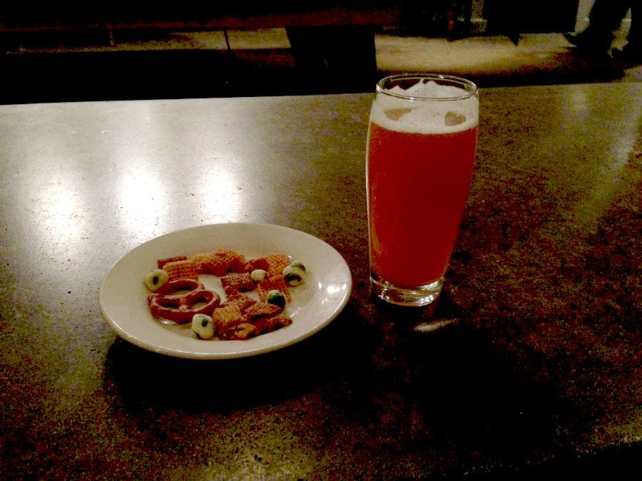
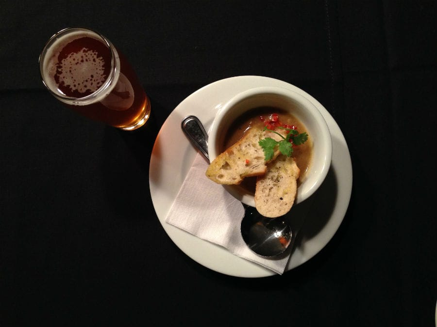
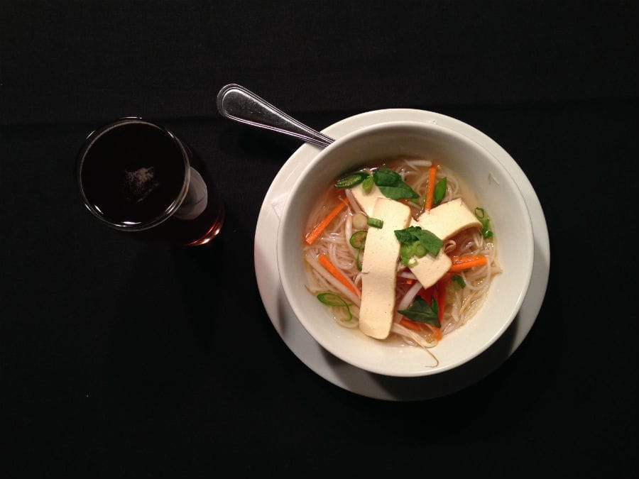
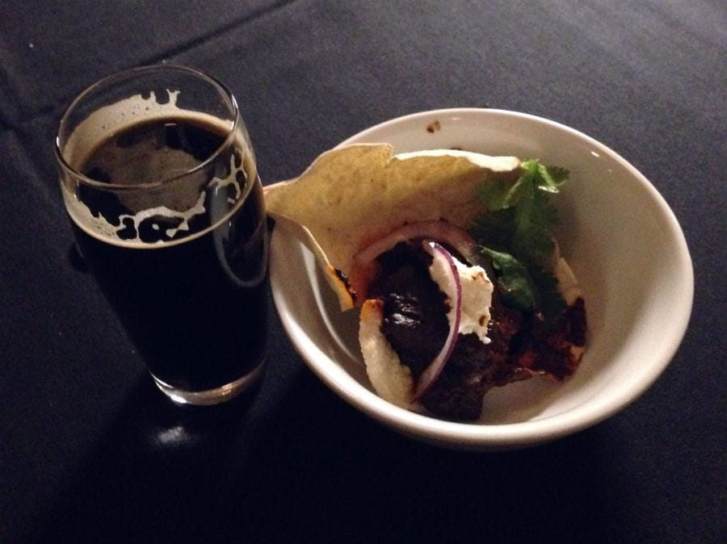
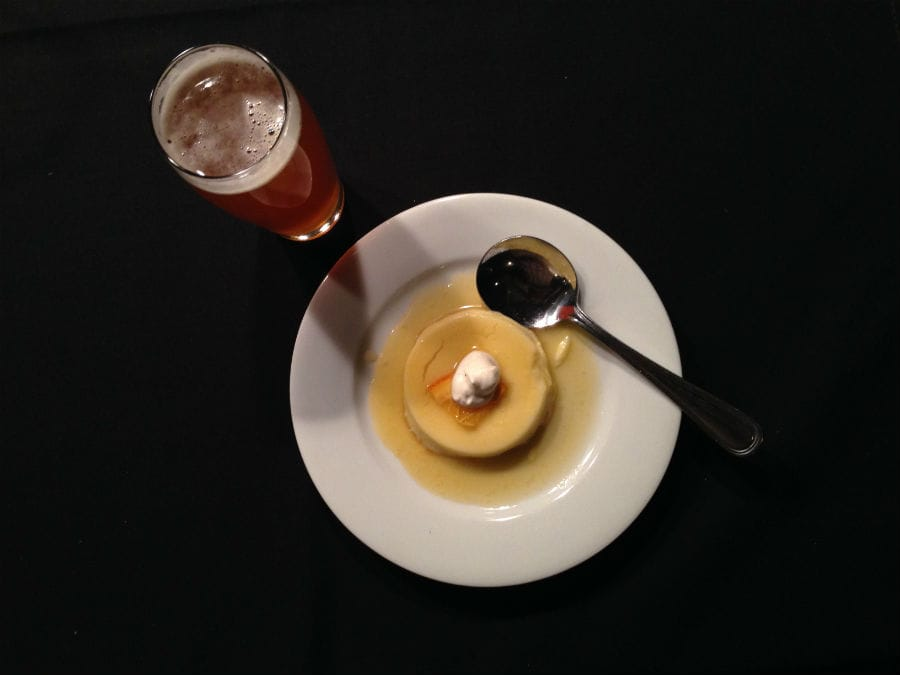

A week and a half ago, I attended the *Hops and Heat* beer social at the [Portsmouth Brewery](https://portsmouthbrewery.com) here in town.

This social paired spicy hot foods with hoppy beers, which go together nicely! I was excited to attend, especially since the dinner included vegetarian options!

I arrived promptly at 6pm, excited to begin the tasting! I situated myself at a big table in the center of the room, which featured a centerpiece of jalapenos and habaneros. Yes, let's get started!

I grabbed the **first pairing** - wasabi peas and chex mix (anyone who knows me well knows I LOVE LOVE LOVE both wasabi peas and Chex mix), paired with the brewery's [British IPA](https://beeradvocate.com/beer/profile/596/110095). The Chex mix and peas were delicious - the Chex mix contained just a hint of spice and the wasabi peas cleared my nasal passages! The IPA tasted how I expected, mild with a slight hoppy taste. I thought it went well with the more subtle spiciness of the Chex mix.

**Next up**, a spicy chili-garlic soup with chili-rubbed crostinis, paired with the [Project X with Summit hops](https://beeradvocate.com/beer/profile/596/110557). I've been a fan of Summit hops since [Earth Eagle](https://eartheaglebrewery.com) put out their own single hopped beer with Summit, so I was eager to try the Portsmouth Brewery's version. It didn't disappoint. This soup was a little more on the spicy side, so the IPA really helped neutralize the hotness!

**Third** on the menu was another soup - a tofu pho with a spicy ginger vegetable broth, paired with [Ginga Ninja](https://beeradvocate.com/beer/profile/596/70849). Now, this soup knocked my taste buds out of the water and I had to take breaks from eating it, because it was almost *too* hot and spicy! This beer went perfectly with this meal, with the spices in the pho complementing the gingery spices of the beer. I liked this pairing the best, though I couldn't actually finish my soup as I couldn't feel my lips or tongue anymore!

**The last main course** was a tempeh mole, paired with the [Night Nurse IPA](https://beeradvocate.com/beer/profile/596/110000). Night Nurse is a Black IPA, a style I only kind of enjoy (I am not a fan of stouts or dark beers in general), but I *loved* this one. I also incredibly loved the mole! Apparently the kitchen spent a few days making the mole, and I could tell. The flavor complexities were amazing. Another excellent pairing.

**Last but not least**, dessert! We were given orange and habanero infused flan with rosemary and chili whipped cream, paired with the [5 C's IPA](https://beeradvocate.com/beer/profile/596/44727) (the 5 C's being 5 varieties of hops beginning with C). I hadn't ever eaten flan before, and I can't say I'm its biggest fan. I did like the habanero flavors and I loved the 5 C's with it, but it's not a dessert I'd pick out on my own if I'm out.

***

All in all, a **great** beer social! The Portsmouth Brewery plans on holding a different beer social roughly once a month, with the next one being *Beers Around the World* on February 12th. If you're in the area, I highly recommend checking this out.
