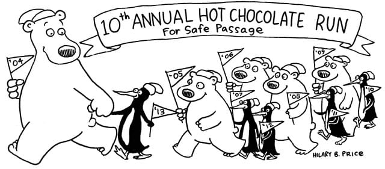
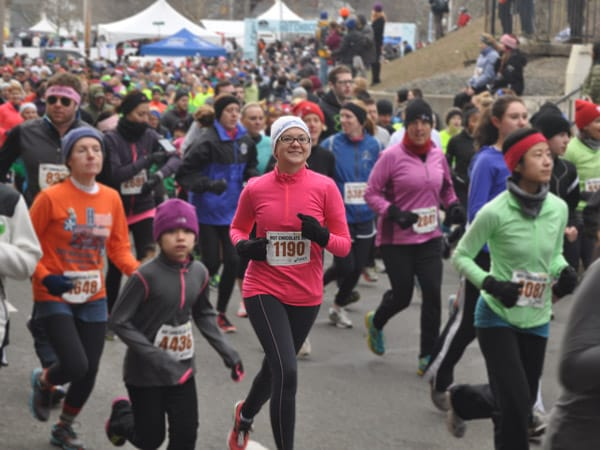
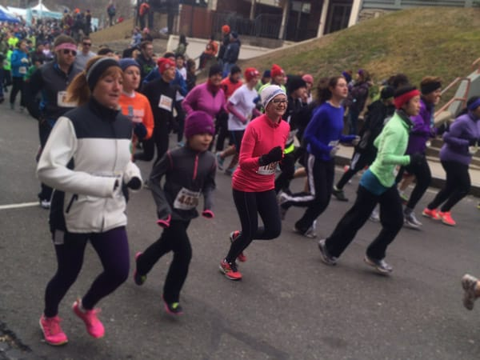

Yeah, it's been almost a month since I run this race, and I'm finally getting around to writing about it! This was seriously the best race I've ever run, both in terms of PR (yeah, I totally smashed my previous one) and in terms of sheer fun. I loved running this race [last year](/posts/hot-chocolate-run-2012-race-recap), but I think I love it even more after this year.

We arrived at the start an hour before the race began. Parked the car, hung out indoors, ate my dates. Dates = best fuel **ever** before a run. I haven't had a bad experience with them and they really, **really** help me. I felt good.

About 10 minutes before the start, I made my way to the corrals. Last year I lined up at the 11:45 marker; this year, I lined up at 9:15. Such a huge difference from last year! I wondered if I could beat my PR from the Jingle Bell Run a few weeks prior. I felt strong, felt good, so I decided to stick with my pacing and see what happened. I did remember a hill near the end, which caused me apprehension.

At 10, we started! I made sure to look for my family, and as I ran by, I noticed my sister brought her fancy camera and tripod to take pictures of me as I ran by! I beamed at them as I ran by. As I made my way up the first hill, I listened to bands playing, people cheering, and general encouragement from fellow runners around me. I love running with a ton of people, and more importantly, I love running at the same pace as the people around me!

As I ran, I thought about how quickly I'd finish this race. My family decided to wait indoors for me until the time they figured I'd finish, which they assumed would be around 30 minutes. Well, I wanted to show them! 30 minutes? Pshaw. I can do better than that. So, I picked up the pace. Oh, it sucked running much faster than usual up the two huge hills near the end of the race, but I knew I could do it.

Finally, I came to the last turn! I looked at my watch and saw 27:xx. I *really* picked it up then, just to see if I could finish under 28 minutes, which would have been a HUGE PR for me. Alas, sub 28 wasn't in the cards for me, but a pretty damn awesome time of 28:15 *was*.

Yeah, **28:15**. I totally smashed my [previous PR](/posts/jingle-bell-5k-race-recap) by almost a minute and a half. I couldn't believe it, and neither could my family! Apparently none of them expected I'd finish so quickly, so they didn't have time to take pictures! Oh well, I'm pretty happy with the ones taken at the start!

This is my favorite race. I love running it every year and I love that my family comes to watch! Plus, it doesn't hurt to run your best race ever, either...
